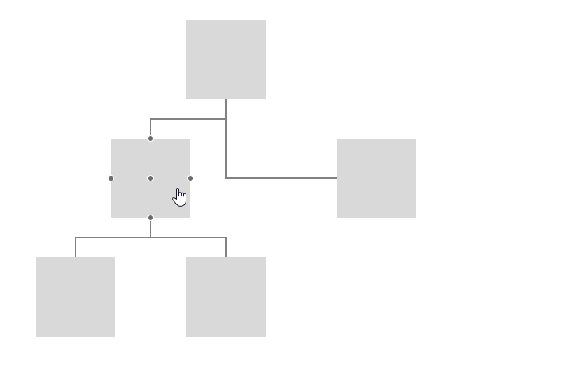

## Environment
<table>
	<tbody>
		<tr>
			<td>Product</td>
			<td>RadDiagram for ASP.NET AJAX</td>
		</tr>
	</tbody>
</table>


## Description
In this article you will see how to highlight all shapes connected to the currently clicked one. For this purpose you will need to:
1. Handle the client-side `OnClick` event of the Diagram to get the instance of the current shape.
2. Iterate the connections of the clicked shape and highlight the related shapes



## Solution

````ASP.NET
        <telerik:RadDiagram ID="RadDiagram1" runat="server">
            <ClientEvents OnClick="onClick" OnLoad="onLoad" />
            <LayoutSettings Enabled="true" Type="Tree" Subtype="Down"></LayoutSettings>
            <ShapesCollection>
                <telerik:DiagramShape Id="s1">
                </telerik:DiagramShape>
                <telerik:DiagramShape Id="s2">
                </telerik:DiagramShape>
                <telerik:DiagramShape Id="s3">
                </telerik:DiagramShape>
                <telerik:DiagramShape Id="s4">
                </telerik:DiagramShape>
                <telerik:DiagramShape Id="s5">
                </telerik:DiagramShape>
            </ShapesCollection>
            <ConnectionsCollection>
                <telerik:DiagramConnection>
                    <FromSettings ShapeId="s1" />
                    <ToSettings ShapeId="s2" />
                </telerik:DiagramConnection>
                <telerik:DiagramConnection>
                    <FromSettings ShapeId="s1" />
                    <ToSettings ShapeId="s3" />
                </telerik:DiagramConnection>
                <telerik:DiagramConnection>
                    <FromSettings ShapeId="s2" />
                    <ToSettings ShapeId="s4" />
                </telerik:DiagramConnection>
                <telerik:DiagramConnection>
                    <FromSettings ShapeId="s2" />
                    <ToSettings ShapeId="s5" />
                </telerik:DiagramConnection>
            </ConnectionsCollection>
        </telerik:RadDiagram>
        <script>
            var diagram;

            function onLoad(sender, args) {
                diagram = sender.get_kendoWidget();
            }

            function onClick(e) {
                ClearHighlights();

                if (e.item instanceof kendo.dataviz.diagram.Shape) {
                    var shape = e.item;
                    var conns = shape.connections();
                    for (var i = 0; i < conns.length; i++) {
                        debugger;
                        var targetShapeId = conns[i].to.id != shape.id ? conns[i].to.id : conns[i].from.id;
                        if (targetShapeId != shape.id) {
                            var targetShape = diagram.getShapeById(targetShapeId);
                            console.log(targetShapeId);
                            targetShape.options.fill.color = "#ff0000";
                            targetShape.redrawVisual();
                        }
                    }
                }
            }

            function ClearHighlights() {
                var shapes = diagram.shapes;
                for (var i = 0; i < shapes.length; i++) {
                    shapes[i].options.fill.color = "#d9d9d9";
                    shapes[i].redrawVisual();
                }
            }
        </script>
````


