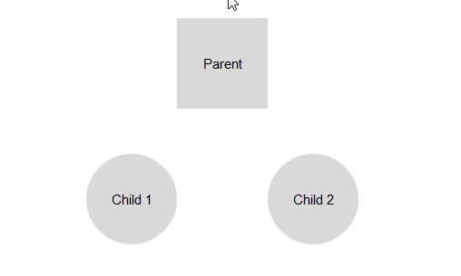

## Environment
<table>
	<tbody>
		<tr>
			<td>Product</td>
			<td>RadDiagram for ASP.NET AJAX</td>
		</tr>
	</tbody>
</table>


## Description
If project requires to specify the maximum number of allowed connections per shape, you can do like explained below:
1. Handle the client-side `OnMouseEnter` event of the Diagram to get the instance of the current shape.
2. Handle the client-side `OnMouseLeave` event of the Diagram to clear the saved current shape.
3. Handle the client-side `OnDragStart` and `OnDragEnd` events of the Diagram and cancel the event if the maximum allowed connections are hit

## Solution



````ASP.NET
        <script>
            var currShape = null;
            var allowedConnections = 1;
            function onMouseEnter(e) {
                var shape = e.item;
                if (shape instanceof kendo.dataviz.diagram.Shape) {
                    currShape = shape;
                }
            }

            function onMouseLeave(e) {
                currShape = null;
            }

            function onDragStartEnd(e) {
                var shapeConnections = currShape.connections().length;
                if (currShape.id != "p1" && shapeConnections > allowedConnections) {
                    alert("No more connections are allowed for this shape.");
                    e.preventDefault();
                }
            }
        </script>
        <telerik:RadDiagram ID="RadDiagram1" runat="server">
            <ClientEvents OnDragStart="onDragStartEnd" OnDragEnd="onDragStartEnd"
                OnMouseEnter="onMouseEnter" OnMouseLeave="onMouseLeave" />
            <ShapesCollection>
                <telerik:DiagramShape Id="p1" Type="rectangle" X="200" Y="50">
                    <ContentSettings Text="Parent" />
                </telerik:DiagramShape>
                <telerik:DiagramShape Id="c1" Type="circle" X="100" Y="200">
                    <ContentSettings Text="Child 1" />
                </telerik:DiagramShape>
                <telerik:DiagramShape Id="c2" Type="circle" X="300" Y="200">
                    <ContentSettings Text="Child 2" />
                </telerik:DiagramShape>
            </ShapesCollection>
        </telerik:RadDiagram>
        </script>
````


