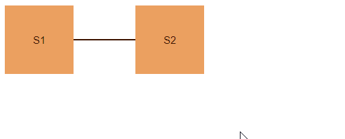

## Environment
<table>
	<tbody>
		<tr>
			<td>Product</td>
			<td>RadDiagram for ASP.NET AJAX</td>
		</tr>
	</tbody>
</table>


## Description
If project requires to move the shapes of the Diagram by pressing the arrow keys, you can achieve it by following the steps below:
1. Handle the client-side `Load` event of the Diagram and check whether the selected item is a shape.
2. If the clicked object is a shape, assign a handler to the standard `keyDown` event of the `window` object.
3. Use the `bounds()`` method of the Shape to move the shape depending on the pressed key,.

## Solution



````ASP.NET
        <telerik:RadDiagram ID="RadDiagram1" runat="server">
            <ClientEvents OnClick="attachHandlers" />
            <LayoutSettings Enabled="true" Type="Tree" Subtype="Right">
            </LayoutSettings>
            <ShapesCollection>
                <telerik:DiagramShape Id="s1">
                    <ContentSettings Text="S1" />
                </telerik:DiagramShape>
                <telerik:DiagramShape Id="s2">
                    <ContentSettings Text="S2" />
                </telerik:DiagramShape>
            </ShapesCollection>
            <ConnectionsCollection>
                <telerik:DiagramConnection>
                    <FromSettings ShapeId="s1" />
                    <ToSettings ShapeId="s2" />
                </telerik:DiagramConnection>
            </ConnectionsCollection>
        </telerik:RadDiagram>

        <script>
            var $ = $telerik.$;

            function attachHandlers(args) {
                var shape = args.item;

                if (shape instanceof kendo.dataviz.diagram.Shape) {
                    if (!shape.from) {
                        $(window).keydown(moveShape)
                    }
                }
            }

            function moveShape(event) {

                if (event.keyCode > 40 || event.keyCode < 37)
                    return;

                var diagram = $find("<%=RadDiagram1.ClientID%>").get_kendoWidget();
                var shapes = diagram.select();

                if (event.keyCode && shapes) {

                    for (var i = 0; i < shapes.length; i++) {
                        var bounds = shapes[i].bounds();

                        var x = bounds.x;
                        var y = bounds.y;
                        switch (event.keyCode) {
                            case 37:
                                bounds.x = bounds.x - 5;
                                break;
                            case 39:
                                bounds.x = bounds.x + 5;
                                break;
                            case 38:
                                bounds.y = bounds.y - 5;
                                break;
                            case 40:
                                bounds.y = bounds.y + 5;
                                break;
                        }
                        shapes[i].bounds(bounds);
                    }
                }
            }
        </script>
````

