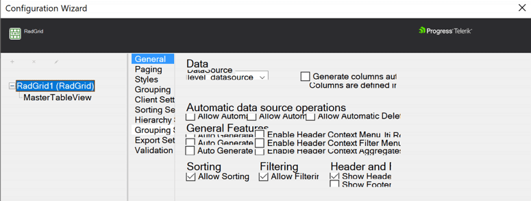
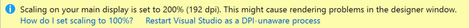

## Environment

<table>
	<tbody>
		<tr>
			<td>Product</td>
			<td>Progress® Telerik® UI for ASP.NET AJAX</td>
		</tr>
	</tbody>
</table>

## Description

When working with Telerik UI for ASP.NET AJAX, the appearance gets distorted when using the designer on HiDPI monitors.

## Error Messages

## Cause

The WebForms Designer in Visual Studio doesn't provide scaling support. Therefore, when scaling is enabled on a high-resolution setup, this lack of support can cause display issues with some forms in the Designer. For example, too small and difficult to click the **SmartTag** button, overlapping controls, truncated table rows, or Configuration Wizard appearance.

## Solution

The solution suggested by Microsoft for fixing this issue in WinForms Designer has proven helpful for solving it with WebForms Designer as well. For more information, refer to the [Disable DPI-awareness in Visual Studio](https://docs.microsoft.com/en-us/visualstudio/designers/disable-dpi-awareness) article.

Alternatively, to solve this issue, use any of the following approaches:

* Restart Visual Studio as a DPI-unaware process.

	When you open a form in the Designer in Visual Studio on an HDPI monitor, Visual Studio displays a yellow informational bar at the top of the designer:

	

	You can restart Visual Studio as a DPI-unaware process by selecting the option on the yellow informational bar. This is the preferred way of resolving the problem.

	Note that it's important to restart Visual Studio as a DPI-aware process when you're finished working in the Designer. When it's running as a DPI-unaware process, fonts can look blurry and you may see issues in other designers such as the XAML Designer. If you close and reopen Visual Studio when it's running in DPI-unaware mode, it becomes DPI-aware again. You can also select the **Restart Visual Studio as a DPI-aware process** option in the informational bar.

* Add a registry entry.

	You can mark Visual Studio as DPI-unaware by modifying the registry. Open the **Registry Editor** and add an entry to the `HKEY_CURRENT_USER\SOFTWARE\Microsoft\Windows NT\CurrentVersion\AppCompatFlags\Layers` subkey. Depending on whether you're using Visual Studio 2017 or 2019, use either of the following values:

	 * `C:\Program Files (x86)\Microsoft Visual Studio\2017\Community\Common7\IDE\devenv.exe`
	 * `C:\Program Files (x86)\Microsoft Visual Studio\2019\Community\Common7\IDE\devenv.exe`

	Note that if you're using the Professional or Enterprise edition of Visual Studio, you need to replace `Community` with `Professional` or `Enterprise` in the entry. Also, replace the drive letter as necessary.

		* `Type: REG_SZ`

		* `Value: DPIUNAWARE`

	Note that Visual Studio remains in DPI-unaware mode until you remove the registry entry.

* Set your display scaling setting to `100%`.

	To set your display scaling setting to 100% in Windows 10, type `display settings` in the task bar search box, and then select the **Change display settings** option. In the **Settings** window, set **Change the size of text, apps, and other items to 100%**.

	Note that setting your display scaling to 100% may be undesirable, because it can make the user interface too small to be usable.
