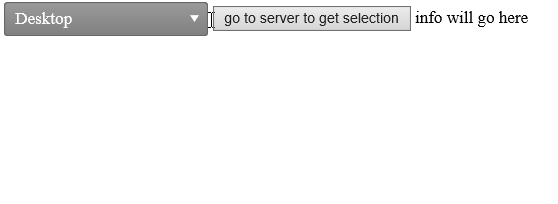

## Environment

<table>
	<tbody>
		<tr>
			<td>Product</td>
			<td>Telerik WebForms DropDownList for ASP.NET AJAX</td>
		</tr>
	</tbody>
</table>

## Description

A dropdown is usually a list of static options the user can choose from. In some cases, however, you want to have a option like "Other" where they can enter free text. In many forms this is accomplished by showing an appropriate row with JavaScript in case the list is a checkbox list or a radio button list. 

You can have similar functionality in a RadDropDownList by creating a template that will have a textbox and to use the client-side events of the textbox to transfer its text to the Value of the dropdownlist item. 

 

## Solution

* Defines a RadDropDownList named `rddl1`.
  * Adds a Button (`btn1`) and a Label (`Label1`) for interaction and display purposes.

````ASPX
<telerik:RadDropDownList runat="server" ID="rddl1" DataValueField="valueField" DataTextField="textField" OnItemDataBound="rddl1_ItemDataBound" />

<asp:Button Text="go to server to get selection" runat="server" ID="btn1" OnClick="btn1_Click" />
<asp:Label Text="info will go here" ID="Label1" runat="server" />
````

* **JavaScript Function `setItemValue(evt)`:**
  * This function is triggered on keypress events in the textbox (`theTextbox`) within the dropdown list.
  * It retrieves the RadDropDownList control and finds the item with the text "Other".
  * Then, it updates the value of the "Other" item with the current textbox value plus the key that was pressed.
  * Finally, it commits the changes to the dropdown list.

````JavaScript
function setItemValue(evt) {
    evt = (evt) ? evt : window.event;

    var ddl = $find("<%=rddl1.ClientID%>");
    var otherItem = ddl.findItemByText("Other")

    var tbValue = evt.currentTarget.value;

    ddl.trackChanges();

    otherItem.set_value(tbValue + evt.key);
    otherItem.set_selected(true);

    ddl.commitChanges();
}
````

* **C#:**
  * `Page_Init`: Sets a custom template for the items in the dropdown list, defined by the `myCustomTemplate` class.
  * `GetMyData`: Generates and returns a DataTable with sample data, including a special item marked by the "isSpecial" field.
  * `btn1_Click`: Handles the click event of `btn1` by displaying the selected value of `rddl1` in `Label1`.
  * `rddl1_ItemDataBound`: Handles the item data bound event of `rddl1` by making the textbox visible only for the item with the text "Other" and setting the text of a Label control.

````C#
protected void Page_Load(object sender, EventArgs e)
{
    if (!Page.IsPostBack)
    {
        rddl1.DataSource = GetMyData();
        rddl1.DataBind();
    }
}

protected void Page_Init(object sender, EventArgs e)
{
    rddl1.ItemTemplate = new myCustomTemplate();
}


protected DataTable GetMyData()
{
    DataTable tbl = new DataTable();

    tbl.Columns.Add(new DataColumn("isSpecial", typeof(bool)));    // An alternative is to use a field like that as a flag and use is as an Attribute
    tbl.Columns.Add(new DataColumn("textField", typeof(string))); // of the item if you need more complex logic. In this example, we will just check the text of the item
    tbl.Columns.Add(new DataColumn("valueField", typeof(int)));
    tbl.Columns.Add(new DataColumn("fourthField", typeof(string)));

    tbl.Rows.Add(new object[] { false, "Desktop", 1, "red" });
    tbl.Rows.Add(new object[] { false, "Laptop", 2, "green" });
    tbl.Rows.Add(new object[] { false, "Mobile", 3, "blue" });
    tbl.Rows.Add(new object[] { true, "Other", 0, "pink" });

    return tbl;
}

protected void btn1_Click(object sender, EventArgs e)
{
    Label1.Text = rddl1.SelectedValue;
}

protected void rddl1_ItemDataBound(object sender, DropDownListItemEventArgs e)
{
    e.Item.FindControl("theTextbox").Visible = e.Item.Text.Equals("Other");
    (e.Item.FindControl("theLiteral") as Label).Text = e.Item.Text;
}

public class myCustomTemplate : ITemplate
{
    protected Label lit;
    protected TextBox tb;
    public void InstantiateIn(Control container)
    {
        //we will create the controls that will hold text and a textbox for each
        //then the ItemDataBound will hide the unnecessary textboxes and will set the
        //text of the labels, that will be stored in the ViewState (hence, a Label and not a LiteralControl)

        lit = new Label();
        lit.ID = "theLiteral";
        container.Controls.Add(lit);

        tb = new TextBox();
        tb.ID = "theTextbox";
        tb.Attributes["onkeypress"] = "setItemValue(event)";//on the client we will transfer the text of the textbox to the Value of the item that holds it
        tb.Attributes["onclick"] = "$telerik.cancelRawEvent(event)";//prevent the dropdown from closing
        container.Controls.Add(tb);
    }
}
````


 