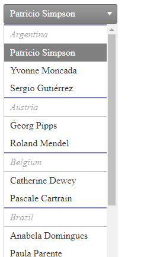

## How to 

Grouping of DropDownList similar to RadComboBox - [Grouping Items in RadComboBox]()  

 

## Solution

Sort the datasource by the GroupBy property(in the example below, the GroupBy property is Country using the Northwind database's Customers table);

1. In ItemDataBound event add the GroupBy property as an Attribute to the item;

1. Create a collection/hashset containing the used GroupBy Properties;

1. In DataBound event iterate dropdownlist.Items collection   
 - If the item's attribute exists in the used GroupBy properties:
     1. Add the property to the collection
     1. Add a new disabled DropDownList item as demonstrated below
     1. Increase "i" by 1

1. Style the disabled item as desired

````ASPX
<telerik:RadDropDownList ID="RadDropDownList1" runat="server" RenderMode="Lightweight"
    DataSourceID="SqlDataSource1" DataTextField="ContactName" DataValueField="CustomerID"
    OnDataBound="RadDropDownList1_DataBound" OnItemDataBound="RadDropDownList1_ItemDataBound">
</telerik:RadDropDownList>
 
<asp:SqlDataSource runat="server" ID="SqlDataSource1" ConnectionString="<%$ ConnectionStrings:NorthwindConnectionString %>"
    ProviderName="System.Data.SqlClient"
    SelectCommand="SELECT [CustomerID], [ContactName], [ContactTitle], [CompanyName], [Country] FROM [Customers] order by [Country]"></asp:SqlDataSource>
````

````CSS
.separator{
    font-style:italic;
    border-top:2px solid darkblue;
    border-bottom:1px solid grey;
}
````

````C#
// Country is our GroupBy property
// Countries is our used GroupBy properties collection
public List<string> Countries = new List<string>();
 
protected void RadDropDownList1_ItemDataBound(object sender, Telerik.Web.UI.DropDownListItemEventArgs e)
{
    var dataitem = e.Item.DataItem as DataRowView;
    if (dataitem != null)
    {
        if (dataitem["Country"] != DBNull.Value)
        {
            var country = dataitem["Country"].ToString();
            e.Item.Attributes.Add("Country", country);
        }
        else
        {
            e.Item.Attributes.Add("Country", "Unknown");
        }
    }
}
 
protected void RadDropDownList1_DataBound(object sender, EventArgs e)
{
    var allItems = RadDropDownList1.Items;
    for (int i = 0; i < RadDropDownList1.Items.Count; i++)
    {
        var item = RadDropDownList1.Items[i];
        var country = item.Attributes["Country"];
        if (!Countries.Contains(country))
        {
            Countries.Add(country);
            var separatorItem = new DropDownListItem() { Text = country, CssClass = "separator", Enabled = false };
            RadDropDownList1.Items.Insert(item.Index, separatorItem);
            i++;
        }
    }
}
````


 