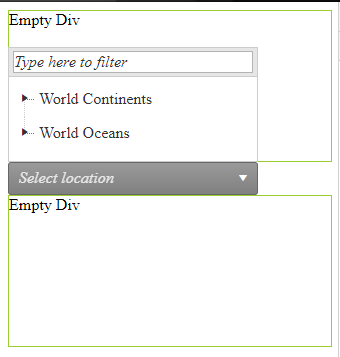

## How to

Configure DropDownTree to open in an upward direction, to "Drop up".

## Solution

Overriding the *openDropDown* function and setting the default Direction of the dropdown will achieve the following appearance. The provided override script should be placed after the ScriptManager of the page.   
  


````CSS
.empty-div {
    width: 100%;
    height: 150px;
    border: 1px solid yellowgreen;
}
````

````JavaScript
Telerik.Web.UI.RadDropDownTree.prototype.openDropDown = function (e) {
    this._dropDown.set_direction(Telerik.Web.UI.jSlideDirection.Up)
    this._dropDown.show();
}
````

````ASPX
<div class="empty-div">Empty Div  </div>
<telerik:RadDropDownTree RenderMode="Lightweight" ID="RadDropDownTree1" runat="server" Width="250px"
    DefaultMessage="Select location" ExpandNodeOnSingleClick="true"
    EnableFiltering="true" EnableDirectionDetection="true">
    <DropDownSettings OpenDropDownOnLoad="true" />
    <FilterSettings Highlight="Matches" EmptyMessage="Type here to filter" />
</telerik:RadDropDownTree>
<div class="empty-div">Empty Div  </div>
````

````C#
protected void Page_Load(object sender, EventArgs e)
{
    if (!IsPostBack)
    {
        RadDropDownTree1.DataFieldID = "ID";
        RadDropDownTree1.DataFieldParentID = "ParentID";
        RadDropDownTree1.DataValueField = "Value";
        RadDropDownTree1.DataTextField = "Text";
        RadDropDownTree1.DataSource = GetData();
        RadDropDownTree1.DataBind();
    }
 
}
 
public DataTable GetData()
{
    DataTable table = new DataTable();
    table.Columns.Add("ID");
    table.Columns.Add("ParentID");
    table.Columns.Add("Value");
    table.Columns.Add("Text");
 
    table.Rows.Add(new String[] { "1", null, "World_Continents", "World Continents" });
    table.Rows.Add(new String[] { "2", null, "World_Oceans", "World Oceans" });
 
    table.Rows.Add(new String[] { "3", "1", "Asia", "Asia" });
    table.Rows.Add(new String[] { "4", "1", "Africa", "Africa" });
    table.Rows.Add(new String[] { "5", "1", "Australia", "Australia" });
    table.Rows.Add(new String[] { "6", "1", "Europe", "Europe" });
    table.Rows.Add(new String[] { "7", "1", "North_America", "North America" });
    table.Rows.Add(new String[] { "8", "1", "South_America", "South America" });
 
    table.Rows.Add(new String[] { "9", "2", "Arctic_Ocean", "Arctic Ocean" });
    table.Rows.Add(new String[] { "10", "2", "Atlantic_Ocean", "Atlantic Ocean" });
    table.Rows.Add(new String[] { "11", "2", "Indian_Ocean", "Indian Ocean" });
    table.Rows.Add(new String[] { "12", "2", "Pacific_Ocean", "Pacific Ocean" });
    table.Rows.Add(new String[] { "13", "2", "South_Ocean", "South Ocean" });
 
    return table;
}
````

Related forum thread: [http://www.telerik.com/community/forums/need-a-'drop-up'-tree](/community/forums/need-a-'drop-up'-tree)


 