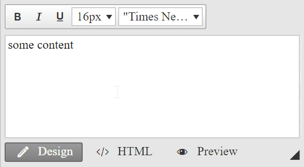

## Description

When the user starts editing the contents, the first line is on the top. But after he hits the enter key, the line will be moved down and shows a lot of top margin.



The observed behavior happens in Chrome, when the editor is configured to insert paragraphs on enter key (NewLineMode="P"). 

The browser injects the following Chrome specific styles for P elements, which shifts the paragraph tag because of the applied -webkit-margin-before style:

````CSS
p {
    display: block;
    -webkit-margin-before: 1em;
    -webkit-margin-after: 1em;
    -webkit-margin-start: 0px;
    -webkit-margin-end: 0px;
}
````

## Solution

The solution is to override the -webkit-margin-before style by importing your own Content.css file via the CssFiles property in the content area:

Default.aspx
````ASP.NET
<telerik:RadEditor runat="server" NewLineMode="P" ID="RadEditor1">
    <CssFiles>
        <telerik:EditorCssFile Value="~/Content.css" />
    </CssFiles>
    <Content>some content</Content>
</telerik:RadEditor>
````

The contents of the Content.css should be:

````CSS
p {
    -webkit-margin-before: 0 !important;
}

````

## Pro Tips
You can find more ways to customize the content area appearance in the following online resources:

* [Customize Content Area](https://demos.telerik.com/aspnet-ajax/editor/examples/settingcontentareadefaults/defaultcs.aspx) (demo)
* [Setting Default Styles](https://docs.telerik.com/devtools/aspnet-ajax/controls/editor/managing-content/content-area-appearance/set-defaults) (documentation)
* [External CSS Files](https://docs.telerik.com/devtools/aspnet-ajax/controls/editor/functionality/toolbars/dropdowns/external-css-files) (documentation


