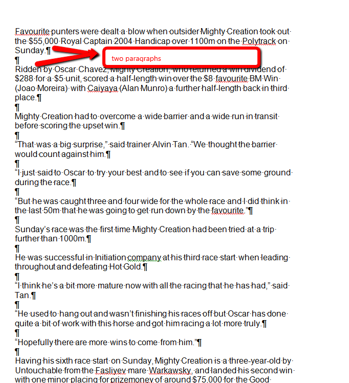

## PROBLEM
Appearance of extra lines when pasting from MS Word

## DESCRIPTION
All paragraphs available in MS Word are pasted as paragraph tags <p> in the content area of RadEditor. This often leads to unexpected blank spaces when these paragraph symbols from MS Word are converted to empty HTML paragraphs.



If some paragraph has an inline style with margin 0 (<p style="margin: 0in 0in 0pt;">), RadEditor will automatically strip the margin attribute during the paste operation. The stripping was implemented after multiple clients requests, because margin: 0in 0in 0pt; reduces the visible space between the different paragraph tags in the content area and it is not possible to distinguish the paragraphs <p></p> and the new lines <br/> in it.

Since the removal of style="margin: 0in 0in 0pt;" could lead to appearance problems (namely - unexpected whitespace), you can simply remove such empty paragraphs from the pasted content:

## SOLUTION

The OnClientPasteHtml event is used to clean the empty paragraphs with a loop that checks if they have content:

````ASP.NET
<telerik:RadEditor ID="RadEditor1" runat="server" OnClientPasteHtml="OnClientPasteHtml">
</telerik:RadEditor>
 
<script type="text/javascript">
    function OnClientPasteHtml(editor, args) {
        var html = args.get_value();
        var div = editor.get_document().createElement('div');
        div.innerHTML = html;
        var paragraphs = div.getElementsByTagName('p');
        for (var i = paragraphs.length - 1; i >= 0; i--) {
            var innerText = Telerik.Web.UI.Editor.Utils.getTextContent(paragraphs[i]);
            if (innerText.trim() == "") {
                $telerik.$(paragraphs[i]).remove();
            }
        }
        args.set_value(div.innerHTML);
    }
</script>
````

