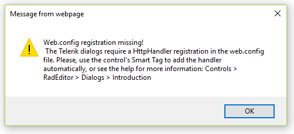

## Problem  
Error: Web.config registration missing! The Telerik dialogs require a HttpHandler registration in the web.config file.  
  
  
  
## Description
To enable the RadEditor dialog to work, you need to register their HttpHandler in the web.config file as shown in the [Mandatory Additions to the web.config](https://docs.telerik.com/devtools/aspnet-ajax/general-information/web-config-settings-overview#mandatory-additions-to-the-webconfig) article:

````XML
<httpHandlers>
    ...
    <add path="Telerik.Web.UI.DialogHandler.aspx" verb="*" type="Telerik.Web.UI.DialogHandler" validate="false" />
</httpHandlers>
...
<system.webServer>  
    <handlers>    
        ...    
        <add name="Telerik_Web_UI_DialogHandler_aspx" verb="*" preCondition="integratedMode" path="Telerik.Web.UI.DialogHandler.aspx" type="Telerik.Web.UI.DialogHandler" />  
    </handlers>
</system.webServer>
````

The use of an HttpHandler could lead to one of the following errors:  

* [The dialog handler is not registered in the web config](#The-dialog-handler-is-not-registered-in-the-web-config)
* [URL rewriter scenario](#URL-rewriter-scenario)
* [URL Routing](#URL-Routing)
* [Friendly Urls](#Friendly-Urls)
* [Another HTTP handler is intercepting the dialogs request](#another-HTTP-handler-is-intercepting-the-dialogs-request)
* [IIS 7 Integrated Mode](#IIS-7-Integrated-Mode)
* [Nested web config files](#nested-web-config-files)
* [The last resort solution](#the-last-resort-solution)


## Solutions

### The dialog handler is not registered in the web config

The dialog handler can be easily added automatically to the web.config file through the control's Smart Tag. You can see the help for more information: Controls &gt; Editor &gt; Dialogs see the help for more information: Controls &gt; Editor &gt; [Dialogs](https://docs.telerik.com/devtools/aspnet-ajax/introduction).

### URL rewriter scenario

In CMS scenarios, when some URL rewriter module overwrites the URLs of the editor's dialogs even if the dialog handler of the dialog is registered properly in the web.config file.
To fix the URL rewriter problem exclude the editor dialogs from the URL rewriting routine. To do this, simply add the Telerik.Web.UI.DialogHandler.aspx file to the if () statement that checks the request URL:   
  

````C#
if ((currentURL.Contains("/cms/")) && (currentURL.EndsWith(".aspx")) &&    
    !currentURL.EndsWith("Telerik.Web.UI.DialogHandler.aspx"))    
     ... 
````


This way the request for the dialog aspx will not be handled by your module and the dialog will load OK.  
  
*Note*: ISAPI Fiter such as MS URLScan (urlscan.dll) could mess up the url calls and cause this error too.   
  

### URL Routing

You have registered a RESTful WCF service and the RadEditor spell check functionality and dialogs are not working.

The requests for the Telerik HttpHandlers should be [excluded from the routing](https://msdn.microsoft.com/en-us/library/dd992982%28v=vs.110%29.aspx) that is added with the RESTful WCF service via the following code in **Global.asax**:


````C#
void Application_Start(object sender, EventArgs e)
{
    // Code that runs on application startup
    System.Web.Routing.RouteTable.Routes.Ignore("{*dialogs}", new { dialogs = @".*Telerik\.Web\.UI\.DialogHandler\.aspx.*" });
    System.Web.Routing.RouteTable.Routes.Ignore("{*allaxd}", new { allaxd = @".*\.axd(/.*)?" });
    System.Web.Routing.RouteTable.Routes.Add(new System.ServiceModel.Activation.ServiceRoute("", newSystem.ServiceModel.Activation.WebServiceHostFactory(),typeof(CacheService)));
}
````

### Friendly Urls

 If for some reason the [routes.Ignore method](https://msdn.microsoft.com/en-us/library/dd992982%28v=vs.110%29.aspx) does not work in your WebForms scenario with friendly URLs, you can use a custom class that inherits the [WebFormsFriendlyUrlResolver](https://msdn.microsoft.com/en-us/library/microsoft.aspnet.friendlyurls.resolvers.webformsfriendlyurlresolver%28v=vs.111%29.aspx) class. Inside this class you need to override [ConvertToFriendlyUrl method](https://msdn.microsoft.com/en-us/library/microsoft.aspnet.friendlyurls.resolvers.friendlyurlresolver.converttofriendlyurl%28v=vs.111%29.aspx) and return the original path for the handler rather than a friendly URL:  

*RegisterRoutes method using a custom class for friendly URLs*  

````C#
public static class RouteConfig
{
        public static void RegisterRoutes(RouteCollection routes)
        {
         
            var settings = new FriendlyUrlSettings();
            settings.AutoRedirectMode = RedirectMode.Permanent;
            routes.EnableFriendlyUrls(settings,
                                  new IFriendlyUrlResolver[] {
                                 new CustomFriendlyUrlResolver() });
         
        }
  }
````

  
*Custom WebForms Resolver code below*  

````C#
using System;
using System.Collections.Generic;
using System.Linq;
using System.Web;
 
using Microsoft.AspNet.FriendlyUrls.Resolvers;
 
public class CustomFriendlyUrlResolver : WebFormsFriendlyUrlResolver
{
    public CustomFriendlyUrlResolver() { }
 
    public override string ConvertToFriendlyUrl(string path)
    {
        if (!string.IsNullOrEmpty(path))
        {
            //how to ignore radeditor dialoghandler.aspx
            if (path.ToLower().Contains("telerik.web.ui.dialoghandler.aspx"))
            { // Here the filter code
                return path;
            }
            //how to ignore all aspx requests for url rewriting
            //if (path.ToLower().Contains(".aspx"))
            //{
            //    return path;
            //}
        }
        return base.ConvertToFriendlyUrl(path);
    }
}
````

### Another HTTP handler is intercepting the dialogs request

The order of the entries in the &lt;httpHandlers&gt; section matters. The section is parsed from top to bottom. Also, if you have multiple web.config files, the handlers in the one in the root application folder will be used before the handlers in the web.config of a child folder. When a matching handler is found, the search stops and the handlers below it will never be executed. For example, if you have the following entries in your web.config:  
  
````XML
<add path="*.aspx" verb="*" type="myHandler, myAssembly"/>
<add path="Telerik.Web.UI.WebResource.aspx" verb="*" type="Telerik.Web.UI.WebResource" validate="false"/>
````

When you make a request for an editor dialog, the first handler (\*.aspx) will always match it, because it matches all aspx files. This means that our handler, which is bellow, will never be executed. In this case, changing the positions of the two handlers will fix the problem. As a general rule, keep more specific handlers at the top of the list and more general handlers at the bottom.

### IIS 7 Integrated Mode
When a web site is running under **IIS7 Integrated mode**, the web server searches the HttpHandler registrations under the &lt;system.webServer&gt; configuration section instead of the standard &lt;system.web&gt; configuration section of the application configuration file.  
        
All you need to do is to manually register the HttpHandler for the IIS7 Integrated mode by copying the Telerik HttpHandler to the &lt;handlers&gt; section of the &lt;system.webServer&gt; section group, delete the validate attribute and give it a name, e.g.

````XML
<system.webServer>
   <handlers>
    … 
      <add name="Telerik.Web.UI.DialogHandler" path="Telerik.Web.UI.DialogHandler.aspx" verb="*" type="Telerik.Web.UI.DialogHandler" />
    … 
   </handlers>
</system.webServer>
````

### Nested web config files

In case there are more than one web.config files in the web app/site/project make sure that the required dialog handler registrations are available in the web.config file placed in the root of the app. For more information see this KB article: [Register Telerik HTTP handlers in nested web.config](https://www.telerik.com/support/kb/aspnet-ajax/details/register-telerik-http-handlers-in-nested-web-config).
 
### The last resort solution

In friendly URLs, URL rewriting or routing scenarios, in SharePoint and MVC environments, it is a pretty common problem to face issues with modified and incorrect paths to the handlers that end with the aspx extension.

So instead of modifying your URL rewriter, routing or other URL modification-related code, the last resort solution allows you to configure the RadEditor control to look for a handler with a different extension that will be not touched by the URL modification code. In the example below, the aspx extension is changed to axd, but you can change the extension to whatever string that works for your app.

Open the web.config file and replace Telerik.Web.UI.DialogHandler.aspx with Telerik.Web.UI.DialogHandler.axd
 
````XML
<system.web>
  <httpHandlers>
    <add path="Telerik.Web.UI.DialogHandler.axd" type="Telerik.Web.UI.DialogHandler" verb="*" validate="false"/>
  </httpHandlers>
</system.web>
<system.webServer>
  <validation validateIntegratedModeConfiguration="false"/>
  <handlers>
    <remove name="Telerik_Web_UI_DialogHandler_axd"/>
    <add name="Telerik_Web_UI_DialogHandler_axd" path="Telerik.Web.UI.DialogHandler.axd" type="Telerik.Web.UI.DialogHandler" verb="*" preCondition="integratedMode"/>
  </handlers>
</system.webServer>
````

Set the RadEditor's DialogHandlerUrl property to "~/Telerik.Web.UI.DialogHandler.axd", i.e.

````ASP.NET
<telerik:RadEditor ID="RadEditor1" DialogHandlerUrl="~/Telerik.Web.UI.DialogHandler.axd" runat="server"></telerik:RadEditor>
````

## Additional Resources

In this section, you will find solutions for other problems that you may experience with RadEditor dialogs:
* [Problems with Registering the HttpHandlers in a Web Site that Uses Authentication](https://docs.telerik.com/devtools/aspnet-ajax/controls/editor/troubleshooting/problems-with-registering-the-httphandlers-in-a-web-site-that-uses-authentication)
* [Broken File Browser Dialogs](https://docs.telerik.com/devtools/aspnet-ajax/controls/editor/troubleshooting/broken-file-browser-dialogs) and [Appearance Problems](https://docs.telerik.com/devtools/aspnet-ajax/general-information/troubleshooting/skins-troubleshooting#incorrect-or-distorted-appearance)
* [Blank Dialogs](https://docs.telerik.com/devtools/aspnet-ajax/controls/editor/troubleshooting/blank-dialogs-problem) and [Long Url Length Problems](https://www.telerik.com/forums/radeditor-dialog-window-errors)
* [500 server error with Microsoft OWIN and Telerik controls during a callback](https://www.telerik.com/support/kb/aspnet-ajax/window/details/500-server-error-with-microsoft-owin-and-radwindowmanager-during-a-callback)

# See Also

* [Problems with Registering the HttpHandlers in a Web Site that Uses Authentication](https://docs.telerik.com/devtools/aspnet-ajax/controls/editor/troubleshooting/problems-with-registering-the-httphandlers-in-a-web-site-that-uses-authentication)
* [Broken File Browser Dialogs](https://docs.telerik.com/devtools/aspnet-ajax/controls/editor/troubleshooting/broken-file-browser-dialogs)
* [Appearance Problems](https://docs.telerik.com/devtools/aspnet-ajax/general-information/troubleshooting/skins-troubleshooting#incorrect-or-distorted-appearance)
* [Blank Dialogs](https://docs.telerik.com/devtools/aspnet-ajax/controls/editor/troubleshooting/blank-dialogs-problem)
* [Long Url Length Problems](https://www.telerik.com/forums/radeditor-dialog-window-errors)
* [500 server error with Microsoft OWIN and Telerik controls during a callback](https://www.telerik.com/support/kb/aspnet-ajax/window/details/500-server-error-with-microsoft-owin-and-radwindowmanager-during-a-callback)

