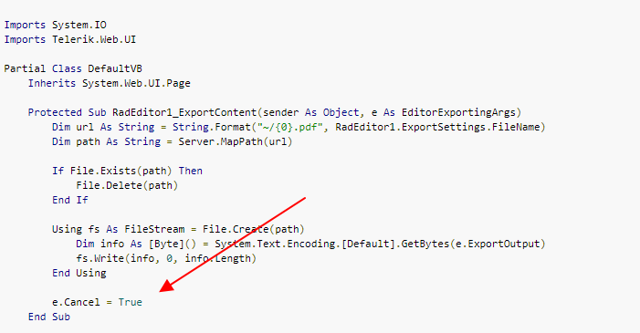

## How-To
Export RadEditor without redirecting to or opening a new page  

## Description
Can I export without redirecting or opening a new page when exporting RadEditor content to PDF, DOCX, or RTF format?

## Solution
To prevent the browser to load the exported file in the browser page, cancel the RadEditor1_ExportContent event with e.Cancel = True as shown in the [provided code snippet in Example 2](https://docs.telerik.com/devtools/aspnet-ajax/controls/editor/functionality/import-and-export/export-to-pdf#onexportcontent-event):




Aslo you can stop the "Save As" pop up window by setting the OpenInNewWindow property to false, e.g.

````ASPX
<telerik:RadEditor runat="server" ID="radEditor" Width="700px" Height="500px" SkinID="DefaultSetOfTools" OnExportContent="RadEditorExportContent">
        <ExportSettings OpenInNewWindow="false"></ExportSettings>
</telerik:RadEditor>
````

## See Also
* [PDF export and OnExportContent event](https://docs.telerik.com/devtools/aspnet-ajax/controls/editor/functionality/import-and-export/export-to-pdf#onexportcontent-event)
* [Server-side events: OnExportContent event](https://docs.telerik.com/devtools/aspnet-ajax/controls/editor/server-side-programming/events/onexportcontent)

 
