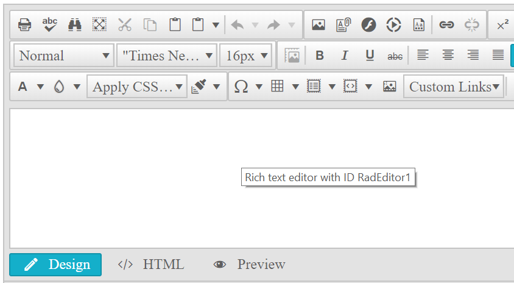

## How-To

* How do we prevent the tooltip from appearing in the RadEditor?
* Hide RadEditor Tooltip when ContentAreaMode is Div
* Hide the tooltip which displays RadEditor client ID?

## Description

The content area tooltip is enabled by default for the screen readers. The same title attribute is also applied to the iframe content area (ContentAreaMode="iframe"), but the browser does not display it because it's not a div but an iframe.



## Solution

The solution is to get reference to the DIV content area element and remove its title attribute:

````ASP.NET
<telerik:RadEditor ID="RadEditor1" runat="server" ContentAreaMode="Div"
    OnClientLoad="editorLoad">
</telerik:RadEditor>
<script type="text/javascript">
    function editorLoad(editor) {
        var contentAreaEl = editor.get_contentAreaElement();
        contentAreaEl.removeAttribute("title");
    }
</script>
````

