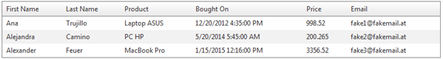
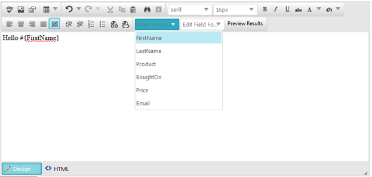
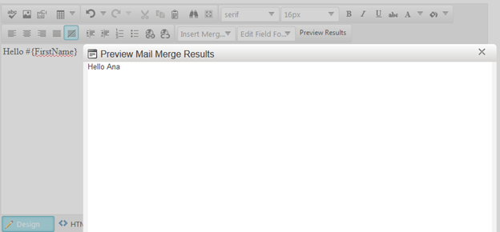

## Environment

<table>
	<tbody>
		<tr>
			<td>Product</td>
			<td>RadEditor for ASP.NET AJAX</td>
		</tr>
	</tbody>
</table>

## Description

The article demonstrates how to create a custom MailMerge functionality in RadEditor to edit the templates by using information from data source.  

In the example, a hard-coded DataTable is used as a data source. The server-side code that creates the actual MailMerge functionality is designed to work only with DataTable or DataRow collections. It can be easily adapted to work with various data sources.  

The server-side code to evaluate the fields is not related to the RadEditor control. Anyone interested in its implementation can download the attached project and examine it further

Example:







## Solution

[Custom commands](https://demos.telerik.com/aspnet-ajax/editor/examples/customtools/defaultcs.aspx) in the RadEditor control enable the end-users to easily add fields (from the data source), which are later evaluated according to the data.

Additionally, there are two other custom tools. One formats data types of a selected field (e.g., dates, time and currency). The other lets the user preview the result of the mail merge operation prior to sending or saving the resulting documents.

To get a better understanding of the scenario and the code, it is recommended to examine the explanations below together with the attached project.


**Server-side Functionality**

The server-side functionality is implemented in the separate MailMerge class, in the MyExtensions.MyMailMerge namespace. It relies on the existence of predefined values to match the fields - #{FieldName}. As a result, these fields are replaced via Regex in the content and evaluated to the indexes corresponding to the column names. Later, these indexes are processed with a simple String.Format operation to finalize the process. As it is a .NET powered feature, it is designed to provide custom format options for some value types (like DateTime, Decimal etc.). 


**Custom Tools**

The [Custom Content Filter](https://demos.telerik.com/aspnet-ajax/editor/examples/contentfilters/defaultcs.aspx) MailMergeFilter gathers all elements dedicated to the MailMerge and modifies them into proper MailMerge fields to be evaluated by the server code. 

MailMergeFilter

````JavaScript
MailMerge.MailMergeFilter = function () {
    MailMerge.MailMergeFilter.initializeBase(this);
    this.set_isDom(true);
    this.set_enabled(true);
    this.set_name("MailMergeFilter");
    this.set_description("Replaces the custom formatting attributes to provide proper fields as per to the server-size MailMerge functionality.");
};

MailMerge.MailMergeFilter.prototype = {
    getHtmlContent: function (content) {
        var newContent = content;
        var mailMergeFields = $(newContent).find("." + _MailMergeClass);

        for (var i = 0; i < mailMergeFields.length; i++) {
            var field = $(mailMergeFields[i]);
            var formattingValue = field.attr(_FormatValueAttr);

            if (!formattingValue) continue;

            field.removeAttr(_FormatValueAttr);

            var fieldText = field.text();
            var regexp = new RegExp(_StartingMatchString + "(.*)" + _EndingMatchString, "gi");
            var replaceString = _StartingMatchString + "$1:" + formattingValue + _EndingMatchString;

            fieldText = fieldText.replace(regexp, replaceString);
            field.text(fieldText);
        };

        return newContent;
    },

    getDesignContent: function (content) {
        var newContent = content;
        var mailMergeFields = $(newContent).find("." + _MailMergeClass);

        for (var i = 0; i < mailMergeFields.length; i++) {
            var field = $(mailMergeFields[i]);
            var fieldValue = field.text();
            var fieldOptions = fieldValue.split(":");

            if (fieldOptions.length <= 1) continue;

            var fieldText = fieldOptions[0] + "}";
            var formattingValue = fieldOptions[1].replace("}", "");

            field.attr(_FormatValueAttr, formattingValue);
            field.text(fieldText);
        }

        return newContent;
    }
};
````

The client-side functionality of the tools is implemented in the scripts.js file. The first tool is the MailMergeFields dropdown. 
It is an ordinary [custom dropdown](https://demos.telerik.com/aspnet-ajax/editor/examples/customdropdowns/defaultcs.aspx), and its items are populated in the code behind.

````C#
private void ConfigureMailMergeTools()
{
    EditorToolGroup mailMergeTools = new EditorToolGroup();

    EditorDropDown addFieldTool = new EditorDropDown("MailMergeFields");
    addFieldTool.Text = "Insert Merge Field";
    addFieldTool.ShowText = true;
    addFieldTool.ShowIcon = false;

    PopulateFieldsTool(addFieldTool);
    mailMergeTools.Tools.Add(addFieldTool);

    mailMergeTools.Tools.Add(previewTool);
    RadEditor1.Tools.Add(mailMergeTools);
}

private void PopulateFieldsTool(EditorDropDown addFieldTool)
{
    DataColumnCollection columns = GetDataSource().Columns;
    string start = MailMerge.StartMatchString;
    string end = MailMerge.EndMatchString;

    foreach (DataColumn column in columns)
    {
        EditorDropDownItem item = new EditorDropDownItem();
        item.Name = column.ColumnName;
        item.Value = start + column.ColumnName + end;

        addFieldTool.Items.Add(item);
    }
}
````

The value of each item uses the MailMerge’s StartMatchString and EndMatchString properties. They represent the string values used in the MailMerge to indicate that this is mailmerge-dedicated field. Subsequently, the client-side logic of the custom tool will insert the field name placeholder into the content via the arguments’ get_value() method.

**MailMergeFields tool**

````JavaScript
Telerik.Web.UI.Editor.CommandList["MailMergeFields"] = MailMerge.addField;

MailMerge.addField = function (commandName, editor, args) {
    editor.pasteHtml("<span class=" + _MailMergeClass + ">" + args.get_value() + "</span>");
}
````

The result of this code will add the following HTML into the content:

**MailMergeFields tool - HTML results**

````ASP.NET
<span class="reMailMerge">#{FieldName}</span>
````

**Edit Field Format Dropdown**

The optional formatting tool – EditFieldFormat, uses the span element to add a custom attribute representing a .NET format value. The following snippet shows how it is declared and created in the code behind.

**EditFieldFormat tool**

````C#
EditorDropDown editFieldFormat = new EditorDropDown("EditFieldFormat");
editFieldFormat.Text = "Edit Field Format";
editFieldFormat.ShowText = true;
editFieldFormat.ShowIcon = false;

// Generate DateTime formatting
EditorDropDownItem shortDateFormat = new EditorDropDownItem();
shortDateFormat.Name = String.Format("Date & Time - <strong>{0:d}</strong>", new DateTime(2012, 11, 15)); // Description with example
shortDateFormat.Value = "d"; // Modifier

editFieldFormat.Items.Add(shortDateFormat);
mailMergeTools.Tools.Add(editFieldFormat);
````

And here is the client-side functionality.

**EditFieldFormat tool**

````JavaScript
Telerik.Web.UI.Editor.CommandList["EditFieldFormat"] = MailMerge.editFormat;

MailMerge.editFormat = function (commandName, editor, args) {
    var selElm = $(editor.getSelectedElement());

    if (!selElm.is("." + _MailMergeClass)) return;

    selElm.attr(_FormatValueAttr, args.get_value());
}
````

**Preview Window**

The preview tool is not a RadEditor dialog instance. It is a [RadWindow control with ContentTemplate](https://demos.telerik.com/aspnet-ajax/window/examples/internalcontent/defaultcs.aspx). This way we preserve the controls used in the same page where the RadEditor exists, which enables us to use the same code behind.   

The design of the Preview dialog is quite simple. Executing the MailMerge functionality with the template created (i.e., calling the MailMerge instance’s GetMergedHtmlDocs(DataTable dataSource) method)  returns a collection of string values. These values are bound to a [RadDataForm control](https://demos.telerik.com/aspnet-ajax/dataform/overview/defaultcs.aspx), which is added inside the content template of the RadWindow.

````ASP.NET
<telerik:RadWindow runat="server" ID="PreviewDialog" Modal="true" Width="720px" Height="500px" Skin="Silk"
    Behaviors="Close, Move, Resize" Title="Preview Mail Merge Results" VisibleStatusbar="false" ShowContentDuringLoad="false">
    <ContentTemplate>
        <telerik:RadAjaxPanel runat="server" ID="RadAjaxPanel1" OnAjaxRequest="RadAjaxPanel1_AjaxRequest">
            <telerik:RadDataForm runat="server" ID="PreviewDocuments" OnNeedDataSource="PreviewDocuments_NeedDataSource">
                <ItemTemplate>
                    <%# Container.DataItem%>
                </ItemTemplate>
                <LayoutTemplate>
                    <div style="width: 700px; height: 423px;">
                        <div id="itemPlaceholder" runat="server">
                        </div>
                    </div>
                    <div class="PreviewPager">
                        <span>
                            <asp:Button ID="btnFirst" runat="server" CommandArgument="First" CommandName="Page" ToolTip="First" Text="First" />
                            <asp:Button ID="btnPrev" runat="server" CommandArgument="Prev" CommandName="Page" ToolTip="Previous" Text="Previous" />
                        </span>
                        <span>
                            <asp:Button ID="btnNext" runat="server" CommandArgument="Next" CommandName="Page" ToolTip="Next" Text="Next" />
                            <asp:Button ID="btnLast" runat="server" CommandArgument="Last" CommandName="Page" ToolTip="Last" Text="Last" />
                        </span>
                    </div>
                </LayoutTemplate>
            </telerik:RadDataForm>
        </telerik:RadAjaxPanel>
    </ContentTemplate>
</telerik:RadWindow>
````

````C#
protected void PreviewDocuments_NeedDataSource(object sender, RadDataFormNeedDataSourceEventArgs e)
{
    MailMerge mailMerge = new MailMerge(RadEditor1.Content);
    string[] documents = mailMerge.GetMergedHtmlDocs(GetDataSource()).ToArray<string>();

    PreviewDocuments.DataSource = documents;
}
````

As you can see, the RadDataForm is AJAX-enabled via a RadAjaxPanel control. This is to prevent the RadWindow from closing on going to next or previous document. Further, we need to implement the RadEditor button to cause an AJAX request to rebind the RadDataForm and show content processed by the currently used template.

**AJAX setup of the Preview Dialog**

````C#
protected void RadAjaxPanel1_AjaxRequest(object sender, AjaxRequestEventArgs e)
{
    PreviewDocuments_NeedDataSource(PreviewDocuments, new RadDataFormNeedDataSourceEventArgs(RadDataFormRebindReason.NotSpecified));
}
````

**Custom Preview Button**

````C#
EditorTool previewTool = new EditorTool("PreviewMailMerge");
previewTool.Text = "Preview Results";
previewTool.ShowText = true;
previewTool.ShowIcon = false;

mailMergeTools.Tools.Add(previewTool);
````

````JavaScript
Telerik.Web.UI.Editor.CommandList["PreviewMailMerge"] = MailMerge.previewDialog;

MailMerge.previewDialog = function (commandName, editor, args) {
    _ajaxPanel.ajaxRequest();
    _previewWindow.show();
}
````

Finally, this will add up to a preview dialog which opens with the press of a custom button in the toolbar of the RadEditor. Upon opening, an AJAX request is performed to bind the RadDataForm and show the content processed by the MailMerge.

[Download sample](files/editor-how-to-mailmerge.zip)

  

   