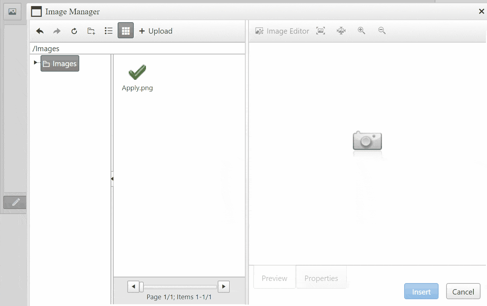

## How-to

When inserting Images in the RadEditor by ImageManger, I want to use src="data:image/png;base64,xxxxxxxxxxx" instead of the Image URL src="../../images/xxx.png".



## Solution

You can convert the src of inserted via the Image Manager images to base64 string using the [OnClientPasteHtml event](https://docs.telerik.com/devtools/aspnet-ajax/controls/editor/client-side-programming/events/onclientpastehtml) and the solution provided in [How to convert image into base64 string using javascript](https://stackoverflow.com/questions/6150289/how-can-i-convert-an-image-into-base64-string-using-javascript/45266377#45266377), i.e.

````ASP.NET
<script type="text/javascript">  
<script>
    function OnClientPasteHtml(editor, args) {
        var commandName = args.get_commandName();
        var value = args.get_value();
 
        if (commandName == "ImageManager") {
            var div = document.createElement("DIV");
            Telerik.Web.UI.Editor.Utils.setElementInnerHtml(div, value);
            var img = div.firstChild;
            img.setAttribute("onload", "window.parent.workWithCanvas(this);");
            args.set_value(div.innerHTML);
        }
    }
 
    function workWithCanvas(img) {
        var c = document.createElement('canvas');
        c.height = img.naturalHeight;
        c.width = img.naturalWidth;
        var ctx = c.getContext('2d');
 
        ctx.drawImage(img, 0, 0, c.width, c.height, 0, 0, c.width, c.height);
        var base64String = c.toDataURL();
        img.setAttribute("src", base64String);
        img.removeAttribute("onload");
    }
</script>
<telerik:RadEditor runat="server" ID="RadEditor1" OnClientPasteHtml="OnClientPasteHtml">
    <ImageManager ViewPaths="~/Images" UploadPaths="~/Images"></ImageManager>
</telerik:RadEditor>
````

## Pro Tips
Please note that the use of data:image/png;base64 images could:

* Produce a large amount of data that may slow down the browser.
* Overload your server when saving this huge content
