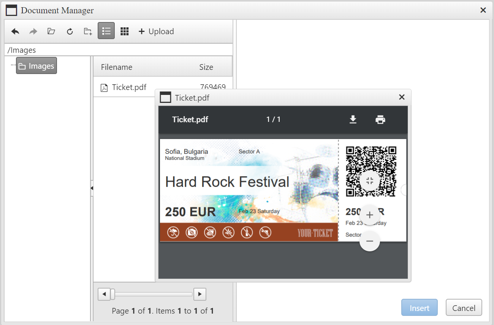

## Environment
<table>
	<tbody>
		<tr>
			<td>Product</td>
			<td>RadEditor for ASP.NET AJAX</td>
		</tr>
	</tbody>
</table>


## Description
You can see below how to configure RadEditor's Document manager to enable the PDF File Preview on double click.



## Solution
To achieve the double click preview feature, do the following:

* Register the external dialogs of RadEditor:

````ASP.NET
<telerik:RadEditor ID="RadEditor1" runat="server" ExternalDialogsPath="~/EditorDialogs">
    <DocumentManager ViewPaths="~/Docs" UploadPaths="~/Docs" />
</telerik:RadEditor>
````

* Copy the EditorDialogs folder from the installation and put it in the root of the application. See this demo for more information about registering the external dialogs: [Customize Built-in Dialogs](https://demos.telerik.com/aspnet-ajax/editor/examples/externaldialogspath/defaultcs.aspx).

2) Open the FileBrowser.ascx file, locate the RadFileExplorer declaration and set the EnableOpenFile property to true.

````ASP.NET
<telerik:RadFileExplorer ID="RadFileExplorer1" Height="400px" Width="400px" TreePaneWidth="150px" runat="Server" EnableOpenFile="true" AllowPaging="true" PageSize="100" />
````

3) To disable the file insertion on double click put this JS code under the RadFileExplorer declaration:

````JavaScript
<script>
Telerik.Web.UI.Widgets.FileManager.prototype._browserDoubleClickHandler = function () { }
</script>
````


