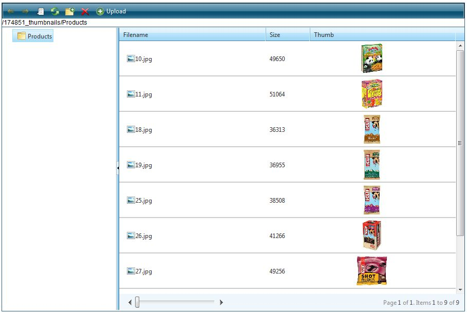

   
## HOW TO  
This article describes the steps in order to show thumbnail previews inside the RadGrid embedded in RadFileExplorer control.  
   
   
## DESCRIPTION  

The thumbnail images are shown in a custom column added to the Grid, embedded in RadFileExplorer. More detailed description about adding a custom columns can be found in [this online demo](http://demos.telerik.com/aspnet-ajax/fileexplorer/examples/applicationscenarios/customgridcolumns/defaultcs.aspx).  
    
## SOLUTION

A custom FileBrowserContentProvider needs to be implemented in order to achieve the desired result. Only the behavior of the *ResolveDirectory* method needs to be changed and the easiest way to do this is to subclass the default provider ([Telerik.Web.UI.Widgets.FileSystemContentProvider]()  and override that method only. In the overridden method, a HTML content (a &lt;img&gt; tag) needs to be added to the *Attributes* collection of the image files only:  
   
````C#
using System;
using System.Collections.Generic;
using System.Linq;
using System.Web;
using System.Web.UI;
using System.Web.UI.WebControls;
using Telerik.Web.UI.Widgets;
using Telerik.Web.UI;
using System.IO;

namespace Telerik.Web.Examples.FileExplorer.CustomGridColumns
{
	public partial class Default : System.Web.UI.Page
	{
		protected void Page_Load(object sender, EventArgs e)
		{
			if (!IsPostBack)
			{
				RadFileExplorer1.Configuration.ContentProviderTypeName = typeof(CustomColumnsContentProvider).AssemblyQualifiedName;

				string[] paths = new string[] { "~/Products" };
				RadFileExplorer1.Configuration.ViewPaths = paths;
				RadFileExplorer1.Configuration.UploadPaths = paths;
				RadFileExplorer1.Configuration.DeletePaths = paths;
			}
			AddThumbnailColumn();
		}

		private void AddGridColumn(string name, string uniqueName, bool sortable)
		{
			RemoveGridColumn(uniqueName);
			GridTemplateColumn gridTemplateColumn1 = new GridTemplateColumn();
			gridTemplateColumn1.HeaderText = name;
			if (sortable)
			{
				gridTemplateColumn1.SortExpression = uniqueName;
			}
			gridTemplateColumn1.UniqueName = uniqueName;
			gridTemplateColumn1.DataField = uniqueName;
			RadFileExplorer1.Grid.Columns.Add(gridTemplateColumn1);
		}
		private void RemoveGridColumn(string uniqueName)
		{
			if (!Object.Equals(RadFileExplorer1.Grid.Columns.FindByUniqueNameSafe(uniqueName), null))
			{
				RadFileExplorer1.Grid.Columns.Remove(RadFileExplorer1.Grid.Columns.FindByUniqueNameSafe(uniqueName));
			}
		}

		private void AddThumbnailColumn()
		{
			AddGridColumn("Thumb", "Thumb", false);
		}

		public class CustomColumnsContentProvider : Telerik.Web.UI.Widgets.FileSystemContentProvider
		{
			public CustomColumnsContentProvider(HttpContext context, string[] searchPatterns, string[] viewPaths, string[] uploadPaths, string[] deletePaths, string selectedUrl, string selectedItemTag)
				: base(context, searchPatterns, viewPaths, uploadPaths, deletePaths, selectedUrl, selectedItemTag)
			{
			}

			public override DirectoryItem ResolveDirectory(string path)
			{
				DirectoryItem oldItem = base.ResolveDirectory(path);
				foreach (FileItem fileItem in oldItem.Files)
				{
					string[] imageExtensios = new string[] { ".jpg", ".gif", ".png" };// Images extensios

					if (imageExtensios.Contains(fileItem.Extension))
					{//Show thumbnails for images only
						string pathToFile = fileItem.Location;
						string htmlText = "";
						fileItem.Attributes.Add("Thumb", htmlText);
					}
				}
				return oldItem;
			}
		}
	}
}


````
   

Please note that the attribute name (*Thumb* in the demo) should mach the *UniqueName* set to the added custom column.   

The *scr* attribute of the image should be set to the FileItem's Location property. A CSS class named *thumbImages*is applied to the added *img* element in order to control the appearance of the images. The CSS class needs to be placed on the page where the **RadFileExplorer** control is declared  

  
 ## RESULT  
    
   
   

 ***Note:***  
 The designed behavior of **RadGrid** is to suppress the standard RadGrid events for the following HTML elements: **input**, **textarea**, **label**, **img**, **select**, **option**, **button**. This is to avoid interfering with the functionality of the standard elements. This implies that double-clicking on the thumbnail will not open the preview dialog. To enable this functionality you need to override the following RadGrid functions:  
 
````ASP.NET
<telerik:RadCodeBlock ID="RadCodeBlock1" runat="server">
    <script type="text/javascript">
        var origCanRiseRowEvent = Telerik.Web.UI.RadGrid.prototype._canRiseRowEvent;
        Telerik.Web.UI.RadGrid.prototype._canRiseRowEvent = function (e)
        {
            return origCanRiseRowEvent.apply(this, arguments) || Telerik.Web.UI.Grid.GetCurrentElement(e).tagName.toLowerCase() == "img";
        }
 
        var origShouldRaiseRowEvent = Telerik.Web.UI.GridSelection.prototype._shouldRaiseRowEvent;
        Telerik.Web.UI.GridSelection.prototype._shouldRaiseRowEvent = function (el)
        {
            return origShouldRaiseRowEvent.apply(this, arguments) || el.tagName.toLowerCase() == "img";
        }
    </script>
</telerik:RadCodeBlock>
````

   