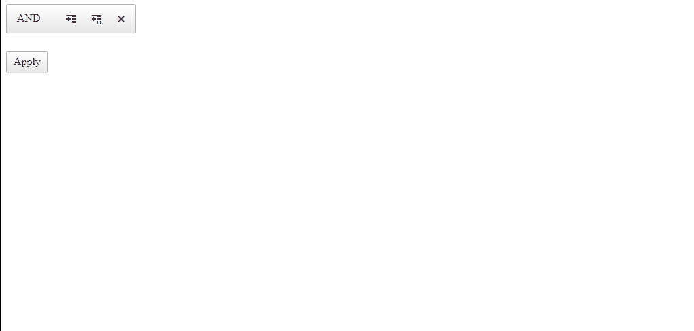

## Environment

<table>
	<tbody>
		<tr>
			<td>Product</td>
			<td>RadFilter for ASP.NET AJAX</td>
		</tr>
	</tbody>
</table>

## Description

Sometimes, one might want to apply filters first, and then display the Grid based on those filters.



## Solution

To achieve the desired result, you could utilize an approach that initially has the Grid loaded on the page, but not visible, and after the user clicks the "Apply" filter button, the Grid becomes visible with the selected filters. 

- Add the `NotVisible` CSS class to the Grid.

````ASPX
<telerik:RadGrid CssClass="NotVisible" RenderMode="Lightweight" runat="server" ID="RadGrid1" AutoGenerateColumns="false" AllowPaging="true" AllowSorting="true" DataSourceID="SqlDataSource1">
    <MasterTableView>
        <Columns>
            <telerik:GridBoundColumn DataField="OrderID" HeaderText="OrderID" DataType="System.Int32">
            </telerik:GridBoundColumn>
            <telerik:GridDateTimeColumn DataField="OrderDate" HeaderText="OrderDate">
            </telerik:GridDateTimeColumn>
            <telerik:GridBoundColumn DataField="ShipCity" HeaderText="ShipCity">
            </telerik:GridBoundColumn>
            <telerik:GridBoundColumn DataField="ShipCountry" HeaderText="ShipCountry">
            </telerik:GridBoundColumn>
            <telerik:GridBoundColumn DataField="ShipName" HeaderText="ShipName">
            </telerik:GridBoundColumn>
        </Columns>
    </MasterTableView>
</telerik:RadGrid>

<asp:SqlDataSource runat="server" ID="SqlDataSource1" ConnectionString="<%$ ConnectionStrings:northwind %>"
    SelectCommand="Select OrderID, OrderDate, ShipVia, ShipName, ShipAddress, ShipCity, ShipCountry FROM Orders" />
````
````CSS
<style>
    .NotVisible {
        display: none;
    }
</style>
````

- Attach the [ApplyExpressions]() server-side event of the **RadFilter** and remove the `NotVisible` CSS class when the ***Apply*** button is first pressed.

````ASPX
<telerik:RadFilter RenderMode="Lightweight" runat="server" ID="RadFilter1" FilterContainerID="RadGrid1" OnApplyExpressions="RadFilter1_ApplyExpressions" />
````

````C#
protected void RadFilter1_ApplyExpressions(object sender, RadFilterApplyExpressionsEventArgs e)
{
    RadGrid1.CssClass = RadGrid1.CssClass.Replace("NotVisible", "").Trim();
}
````
````VB
Protected Sub RadFilter1_ApplyExpressions(ByVal sender As Object, ByVal e As RadFilterApplyExpressionsEventArgs)
    RadGrid1.CssClass = RadGrid1.CssClass.Replace("NotVisible", "").Trim()
End Sub
````

 