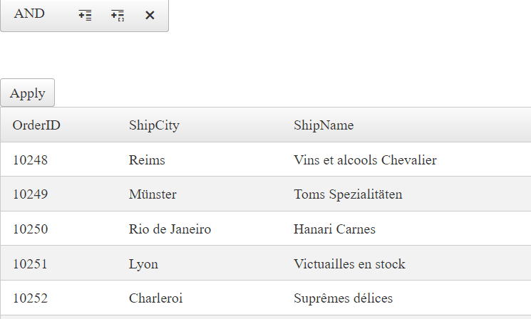

## Environment

<table>
	<tbody>
		<tr>
			<td>Product</td>
			<td>RadFilter for ASP.NET AJAX</td>
		</tr>
	</tbody>
</table>



## Description


Sometimes, one might want to save the filter expressions (the text that comes from the filter after the **ExpressionPreviewPosition** property has been set) for a specific use.

## Solution

You can save the filter expression by using the [ItemCommand]() event and getting the corresponding **FieldName**, **FilterExpression**, and **Value** properties.

````ASP.NET
<telerik:radfilter runat="server" id="RadFilter1" filtercontainerid="RadGrid1"
    expressionpreviewposition="Bottom" onitemcommand="RadFilter1_ItemCommand" />

<asp:Label Text="" ID="Label1" runat="server" />

<telerik:radgrid runat="server" id="RadGrid1" autogeneratecolumns="false" width="600px" allowpaging="true" allowsorting="true" datasourceid="SqlDataSource1">
    <mastertableview>
        <columns>
            <telerik:gridboundcolumn datafield="OrderID" headertext="OrderID" datatype="System.Int32" />
            <telerik:gridboundcolumn datafield="ShipCity" headertext="ShipCity" />
            <telerik:gridboundcolumn datafield="ShipName" headertext="ShipName" />
        </columns>
    </mastertableview>
</telerik:radgrid>
<asp:SqlDataSource runat="server" ID="SqlDataSource1"
    ConnectionString="<%$ ConnectionStrings:NorthwindConnectionString %>"
    SelectCommand="Select OrderID, ShipName, ShipCity FROM Orders"></asp:SqlDataSource>
````
````C#
protected void RadFilter1_ItemCommand(object sender, RadFilterCommandEventArgs e)
{
    RadFilter filter = (RadFilter)sender;

    if (e.CommandName == RadFilter.ApplyCommandName)
    {
        List<RadFilterExpressionItem> filterExpressionList = filter.GetAllExpressionItems();

        for (int i = 0; i < filterExpressionList.Count; i++)
        {
            RadFilterSingleExpressionItem filterExpression = filterExpressionList[i] as RadFilterSingleExpressionItem;
            string expressionGroup = (filterExpressionList[0] as RadFilterGroupExpressionItem).Expression.GroupOperation.ToString();

            if (filterExpression != null)
            {
                string fieldName = filterExpression.Expression.FieldName;
                string expression = filterExpression.Expression.FilterFunction.ToString();
                int value = ((RadFilterSingleValueExpression<int>)filterExpression.Expression).Value;

                string text = fieldName + " " +  expression + " " + value.ToString() + expressionGroup;
                Label1.Text += text;
            }
        }
    }
}
````
````VB
````

 