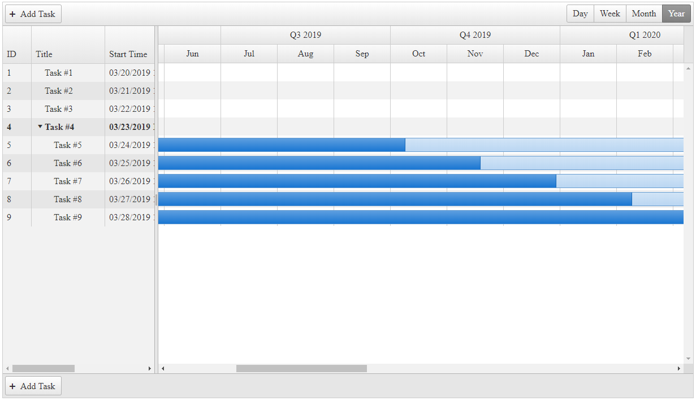

## Description

In this article you will learn how to configure the `YearView` of the Gantt so that it shows `Quarters`.
)

## Solution

In the OnClientDataBound event, if the selected view is the year, we will use JavaScript to change the year header cell text and multiply the number of cells.

````JavaScript
<script type="text/javascript">
    function OnClientDataBound(sender, args) {
        var $ = $ || $telerik.$;
        var gantt = sender;
        if (gantt.get_selectedView() == Telerik.Web.UI.GanttViewType.Year) {
            var $headerWrap = $(gantt.get_element()).find(".rgtTimelineWrapper .radGridHeaderWrap");
            var $yearRow = $headerWrap.find("tbody tr").eq(0);
            var $headers = $yearRow.find("td[colspan=12]");
/* // for versions prior R1 2020 https://www.telerik.com/support/whats-new/aspnet-ajax/release-history/ui-for-asp-net-ajax-r1-2020-(version-2020-1-114)
            var $headerWrap = $(gantt.get_element()).find(".rgtTimelineWrapper .radGridHeaderWrap");
            var $yearRow = $headerWrap.find("thead tr").eq(0);
            var $headers = $yearRow.find("th[colspan=12]");
*/
            for (var headerIndex = 0; headerIndex < $headers.length; headerIndex++) {
                var $header = $headers.eq(headerIndex)
                var year = $header.text();
                $header.text("Q1 " + year)
                $header.prop("colspan", "3");
                var insertAfter = $header;
                for (var quarterIndex = 2; quarterIndex <= 4; quarterIndex++) {
                    var $newHeader = $header.clone();
                    $newHeader.text("Q" + quarterIndex + " " + year);
                    $newHeader.insertAfter(insertAfter)
                    insertAfter = $newHeader;
                }
            }
        }
    }
</script>
````

````ASP.NET
<telerik:RadGantt runat="server" ID="RadGantt1" OnClientDataBound="OnClientDataBound"
    SnapToGrid="false" SelectedView="YearView" YearView-UserSelectable="true">
    <DataBindings>
        <TasksDataBindings IdField="ID" TitleField="Title" StartField="Start" EndField="End"
            PercentCompleteField="PercentComplete" OrderIdField="OrderID" SummaryField="Summary" ParentIdField="ParentID" />
        <DependenciesDataBindings IdField="ID" PredecessorIdField="PredecessorID"
            SuccessorIdField="SuccessorID" TypeField="Type" />
    </DataBindings>
</telerik:RadGantt>
````

````C#
protected void Page_Load(object sender, EventArgs e)
{
    RadGantt1.DataSource = GetGanttTasksSource();
}
     
private DataTable GetGanttTasksSource()
{
    DataTable dataTable = new DataTable();
 
    dataTable.Columns.Add(new DataColumn("ID", typeof(int)));
    dataTable.Columns.Add(new DataColumn("ParentID", typeof(int)) { AllowDBNull = true });
    dataTable.Columns.Add(new DataColumn("OrderID", typeof(int)));
    dataTable.Columns.Add(new DataColumn("Title", typeof(string)));
    dataTable.Columns.Add(new DataColumn("Start", typeof(DateTime)));
    dataTable.Columns.Add(new DataColumn("End", typeof(DateTime)));
    dataTable.Columns.Add(new DataColumn("PercentComplete", typeof(decimal)));
    dataTable.Columns.Add(new DataColumn("Expanded", typeof(bool)) { AllowDBNull = true });
    dataTable.Columns.Add(new DataColumn("Summary", typeof(bool)));
 
    dataTable.PrimaryKey = new DataColumn[] { dataTable.Columns["ID"] };
 
    int parentsCount = 4;
 
    for (int i = 1; i <= parentsCount; i++)
    {
        DataRow row = dataTable.NewRow();
        row["ID"] = i;
        row["ParentID"] = DBNull.Value;
        row["OrderID"] = i;
        row["Title"] = "Task #" + (i);
        row["Start"] = DateTime.Now.AddDays(i - 1);
        row["End"] = DateTime.Now.AddDays(i * 10);
        row["PercentComplete"] = 0.2M;
 
        if (i == parentsCount)
        {
            row["Expanded"] = false;
        }
        else
        {
            row["Expanded"] = DBNull.Value;
        }
 
        row["Summary"] = i == parentsCount; // last task is a parent/summary
 
        dataTable.Rows.Add(row);
    }
 
    for (int i = parentsCount + 1; i <= parentsCount + 5; i++)
    {
        DataRow row = dataTable.NewRow();
        row["ID"] = i;
        row["ParentID"] = parentsCount;
        row["OrderID"] = i;
        row["Title"] = "Task #" + (i);
        row["Start"] = DateTime.Now.AddDays(i - 1);
        row["End"] = DateTime.Now.AddDays(i * 100);
        row["PercentComplete"] = 0.4M;
        row["Expanded"] = DBNull.Value;
        row["Summary"] = false;
 
        dataTable.Rows.Add(row);
    }
 
    return dataTable;
}
````
````VB
Protected Sub Page_Load(ByVal sender As Object, ByVal e As EventArgs)
    RadGantt1.DataSource = GetGanttTasksSource()
End Sub

Private Function GetGanttTasksSource() As DataTable
    Dim dataTable As DataTable = New DataTable()
    dataTable.Columns.Add(New DataColumn("ID", GetType(Integer)))
    dataTable.Columns.Add(New DataColumn("ParentID", GetType(Integer)) With {
        .AllowDBNull = True
    })
    dataTable.Columns.Add(New DataColumn("OrderID", GetType(Integer)))
    dataTable.Columns.Add(New DataColumn("Title", GetType(String)))
    dataTable.Columns.Add(New DataColumn("Start", GetType(DateTime)))
    dataTable.Columns.Add(New DataColumn("End", GetType(DateTime)))
    dataTable.Columns.Add(New DataColumn("PercentComplete", GetType(Decimal)))
    dataTable.Columns.Add(New DataColumn("Expanded", GetType(Boolean)) With {
        .AllowDBNull = True
    })
    dataTable.Columns.Add(New DataColumn("Summary", GetType(Boolean)))
    dataTable.PrimaryKey = New DataColumn() {dataTable.Columns("ID")}
    Dim parentsCount As Integer = 4

    For i As Integer = 1 To parentsCount
        Dim row As DataRow = dataTable.NewRow()
        row("ID") = i
        row("ParentID") = DBNull.Value
        row("OrderID") = i
        row("Title") = "Task #" & (i)
        row("Start") = DateTime.Now.AddDays(i - 1)
        row("End") = DateTime.Now.AddDays(i * 10)
        row("PercentComplete") = 0.2D

        If i = parentsCount Then
            row("Expanded") = False
        Else
            row("Expanded") = DBNull.Value
        End If

        row("Summary") = i = parentsCount
        dataTable.Rows.Add(row)
    Next

    For i As Integer = parentsCount + 1 To parentsCount + 5
        Dim row As DataRow = dataTable.NewRow()
        row("ID") = i
        row("ParentID") = parentsCount
        row("OrderID") = i
        row("Title") = "Task #" & (i)
        row("Start") = DateTime.Now.AddDays(i - 1)
        row("End") = DateTime.Now.AddDays(i * 100)
        row("PercentComplete") = 0.4D
        row("Expanded") = DBNull.Value
        row("Summary") = False
        dataTable.Rows.Add(row)
    Next

    Return dataTable
End Function
````


