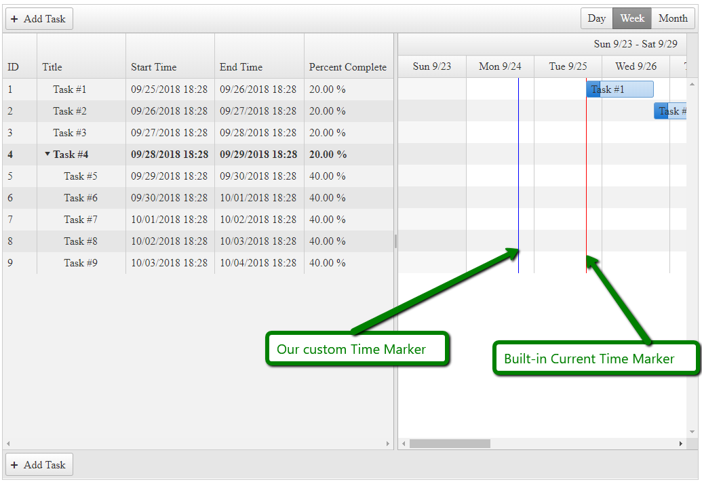

## HOW-TO

Create a custom Time Marker similar to the Current Time Marker in the [Gantt - Current Time Marker](https://demos.telerik.com/aspnet-ajax/gantt/examples/functionality/currenttimemarker/defaultcs.aspx) demo.  



## SOLUTION

We will use an implementation similar to the one the Gantt uses internally for the Current Time Marker. Once we create the renderLine function, we should call it in the OnClientDataBound event of the Gantt. 

In the following example, we use the CSS class .k-status-line for the new line element, and use this class to style it. 

````ASP.NET
<style>
    .RadGantt .k-status-time {
        background-color: blue;
        position: absolute;
    }
</style>
<script type="text/javascript">
    function OnClientDataBound(sender, args) {
        //https://stackoverflow.com/a/563442
        // implement addDays method for demonstration purposes
        Date.prototype.addDays = function (days) {
            var date = new Date(this.valueOf());
            date.setDate(date.getDate() + days);
            return date;
        }
 
        var statusLineDate = new Date().addDays(-1);
        renderLine(sender, statusLineDate)
    }
 
    function renderLine(gantt, date) {
        var ganttView = gantt._widget.view();
        var currentTime = date;
        var timeOffset = ganttView._offset(currentTime);
        var element = $('<div class=\'k-status-time\'></div>');
        var viewStyles = kendo.ui.GanttView.styles;
        var tablesWrap = $("." + viewStyles.tasksWrapper);
        var tasksTable = $("." + viewStyles.tasksTable);
        var slot;
        if (!ganttView.content || !ganttView._timeSlots().length) {
            return;
        }
        ganttView.content.find('.k-status-time').remove();
        slot = ganttView._timeSlots()[ganttView._slotIndex('start', currentTime)];
        if (currentTime < slot.start || currentTime > slot.end) {
            return;
        }
        if (tablesWrap.length && tasksTable.length) {
            timeOffset += tasksTable.offset().left - tablesWrap.offset().left;
        }
        element.css({
            left: timeOffset + 'px',
            top: '0px',
            width: '1px',
            height: ganttView._contentHeight + 'px'
        }).appendTo(ganttView.content);
    }
</script>
<telerik:RadGantt runat="server" ID="RadGantt1" OnClientDataBound="OnClientDataBound"
    SnapToGrid="false" SelectedView="WeekView">
    <DataBindings>
        <TasksDataBindings IdField="ID" TitleField="Title" StartField="Start" EndField="End"
            PercentCompleteField="PercentComplete" OrderIdField="OrderID" SummaryField="Summary" ParentIdField="ParentID" />
        <DependenciesDataBindings IdField="ID" PredecessorIdField="PredecessorID"
            SuccessorIdField="SuccessorID" TypeField="Type" />
    </DataBindings>
</telerik:RadGantt>
````

````C#
protected void Page_Load(object sender, EventArgs e)
{
    RadGantt1.DataSource = GetGanttTasksSource();
}
 
private DataTable GetGanttTasksSource()
{
    DataTable dataTable = new DataTable();
 
    dataTable.Columns.Add(new DataColumn("ID", typeof(int)));
    dataTable.Columns.Add(new DataColumn("ParentID", typeof(int)));
    dataTable.Columns.Add(new DataColumn("OrderID", typeof(int)));
    dataTable.Columns.Add(new DataColumn("Title", typeof(string)));
 
    dataTable.Columns.Add(new DataColumn("Start", typeof(DateTime)));
    dataTable.Columns.Add(new DataColumn("End", typeof(DateTime)));
    dataTable.Columns.Add(new DataColumn("PercentComplete", typeof(decimal)));
 
    dataTable.Columns.Add(new DataColumn("Expanded", typeof(bool)));
    dataTable.Columns.Add(new DataColumn("Summary", typeof(bool)));
 
    dataTable.PrimaryKey = new DataColumn[] { dataTable.Columns["ID"] };
 
    int parentsCount = 4;
 
 
    for (int i = 1; i <= parentsCount; i++)
    {
        DataRow row = dataTable.NewRow();
        row["ID"] = i;
        row["ParentID"] = DBNull.Value;
        row["OrderID"] = i;
        row["Title"] = "Task #" + (i);
        row["Start"] = DateTime.Now.AddDays(i - 1);
        row["End"] = DateTime.Now.AddDays(i);
        row["PercentComplete"] = 0.2M;
 
        if (i == parentsCount)
        {
            row["Expanded"] = false;
        }
        else
        {
            row["Expanded"] = DBNull.Value;
        }
 
        row["Summary"] = i == parentsCount; // last task is a parent/summary
 
        dataTable.Rows.Add(row);
    }
 
    for (int i = parentsCount + 1; i <= parentsCount + 5; i++)
    {
        DataRow row = dataTable.NewRow();
        row["ID"] = i;
        row["ParentID"] = parentsCount;
        row["OrderID"] = i;
        row["Title"] = "Task #" + (i);
        row["Start"] = DateTime.Now.AddDays(i - 1);
        row["End"] = DateTime.Now.AddDays(i);
        row["PercentComplete"] = 0.4M;
        row["Expanded"] = DBNull.Value;
        row["Summary"] = false;
 
        dataTable.Rows.Add(row);
    }
 
    return dataTable;
}
````

 