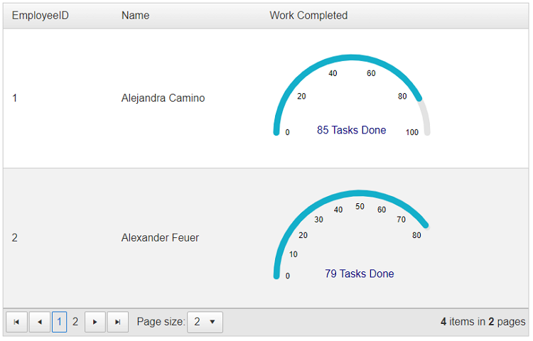

## How To

Are you looking to enhance your data management experience by seamlessly integrating a [`RadArcGauge`]() component within a [`RadGrid`]() control? This article is tailored to guide you through the process, enabling you to display and manage data with precision and style. By combining the power of `RadGrid` and `RadArcGauge`, you can create a dynamic and informative user interface



## Description

To do the integration of a `RadArcGauge` within a `RadGrid` control, follow these straightforward steps:

1. Bind your `RadGrid` declaratively to a DataSource control or programmatically via its `NeedDataSource` event.

    This enables you to populate the grid with data from your chosen source, facilitating dynamic content display.

1. Define Data Source Fields for ArcGauge Properties.

    Use the data source fields to configure specific properties of the `RadArcGauge`. These properties can include attributes like the gauge value, which can dynamically display the data presented in the grid.

For a hands-on understanding, we provide you with a sample project that showcases the integration of `RadArcGauge` within a `RadGrid` control. In this example, the `RadGrid` is bound to a DataTable containing fake data. This setup can be adapted to use a `SqlDataSource` for more robust data binding.

````ASPX
<telerik:RadGrid ID="RadGrid1" runat="server" AllowPaging="True" Width="800px" PageSize="2" OnNeedDataSource="RadGrid1_NeedDataSource">
    <MasterTableView AutoGenerateColumns="false" DataKeyNames="EmployeeID">
        <Columns>
            <telerik:GridBoundColumn DataField="EmployeeID" DataType="System.Int32"
                FilterControlAltText="Filter EmployeeID column" HeaderText="EmployeeID"
                ReadOnly="True" SortExpression="EmployeeID" UniqueName="EmployeeID">
            </telerik:GridBoundColumn>
            <telerik:GridBoundColumn DataField="Name"
                FilterControlAltText="Filter Name column" HeaderText="Name"
                SortExpression="Name" UniqueName="Name">
            </telerik:GridBoundColumn>
            <telerik:GridTemplateColumn DataField="TargetTasks"
                FilterControlAltText="Filter TargetTasks column" HeaderText="Work Completed"
                SortExpression="TargetTasks" UniqueName="TargetTasks">
                <ItemTemplate>
                    <telerik:RadArcGauge runat="server" ID="RadArcGauge1"
                        Width="250px"
                        ForeColor="navy"
                        Color="#14afca"
                        Value='<%# Double.Parse(Eval("TasksDone").ToString()) %>'
                        Scale-Max='<%# Double.Parse(Eval("TargetTasks").ToString()) %>'
                        Scale-EndAngle='<%# 180*Double.Parse(Eval("TargetTasks").ToString()) / 100 %>'>
                        <CenterTemplate>
                            #: value # Tasks Done
                        </CenterTemplate>
                        <Scale Labels-Visible="true"></Scale>
                    </telerik:RadArcGauge>
                </ItemTemplate>
            </telerik:GridTemplateColumn>
        </Columns>
    </MasterTableView>
</telerik:RadGrid>
````

````C#
protected void RadGrid1_NeedDataSource(object sender, Telerik.Web.UI.GridNeedDataSourceEventArgs e)
{
    (sender as RadGrid).DataSource = EmployeesTable();
}

private DataTable EmployeesTable()
{
    DataTable dt = new DataTable();

    dt.Columns.Add(new DataColumn("EmployeeID", typeof(int)));
    dt.Columns.Add(new DataColumn("Name", typeof(string)));
    dt.Columns.Add(new DataColumn("TargetTasks", typeof(int)));
    dt.Columns.Add(new DataColumn("TasksDone", typeof(int)));

    dt.PrimaryKey = new DataColumn[] { dt.Columns["EmployeeID"] };

    dt.Rows.Add(1, "Alejandra Camino", 100, 85);
    dt.Rows.Add(2, "Alexander Feuer", 80, 79);
    dt.Rows.Add(3, "Ana Trujillo", 80, 25);
    dt.Rows.Add(4, "Anabela Domingues", 70, 65);

    return dt;
}
````

This integration opens up a world of possibilities for visually representing data, making your data management experience both informative and visually engaging.

