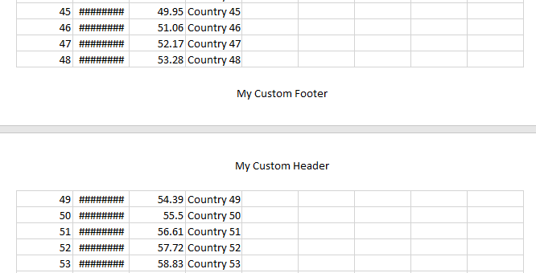

## DESCRIPTION

Add Document Header and Footer to Exported Excel XLSX File



## SOLUTION

 This KB demonstrates how to add document header and/or footer to exported file when exporting RadGrid into excel format XLSX by using the telerik [Document Processing Library](https://docs.telerik.com/devtools/document-processing/introduction#introduction), precisely [RadSpreadProcessing](https://docs.telerik.com/devtools/document-processing/libraries/radspreadprocessing/overview#overview).  
  

**Requirements**

The RadSpreadProcessing library requires the following [Assembly References](https://docs.telerik.com/devtools/document-processing/libraries/radspreadprocessing/getting-started#assembly-references).  
  

Consider the following RadGid wired up with **OnGridExporting **server-event to be used to format the Excel document before it is finally saved.  

````XML
<telerik:RadGrid ID="RadGrid1" runat="server" AllowPaging="True" OnNeedDataSource="RadGrid1_NeedDataSource" OnGridExporting="RadGrid1_GridExporting">
    <ExportSettings HideStructureColumns="true" ExportOnlyData="true" IgnorePaging="true" OpenInNewWindow="false"
        Excel-Format="Xlsx">
    </ExportSettings>
    <MasterTableView AutoGenerateColumns="False" DataKeyNames="OrderID" CommandItemDisplay="Top">
        <ColumnGroups>
            <telerik:GridColumnGroup HeaderText="Details" Name="Details" HeaderStyle-HorizontalAlign="Center"></telerik:GridColumnGroup>
        </ColumnGroups>
        <CommandItemTemplate>
            <telerik:RadToolBar ID="RadToolBar1" runat="server" AutoPostBack="true">
                <Items>
                    <telerik:RadToolBarButton Text="Export to Excel" CommandName="ExportToExcel"></telerik:RadToolBarButton>
                </Items>
            </telerik:RadToolBar>
        </CommandItemTemplate>
        <Columns>
            <telerik:GridBoundColumn DataField="OrderID" DataType="System.Int32"
                FilterControlAltText="Filter OrderID column" HeaderText="OrderID"
                ReadOnly="True" SortExpression="OrderID" UniqueName="OrderID">
            </telerik:GridBoundColumn>
            <telerik:GridDateTimeColumn DataField="OrderDate" DataType="System.DateTime"
                FilterControlAltText="Filter OrderDate column" HeaderText="OrderDate"
                SortExpression="OrderDate" UniqueName="OrderDate" ColumnGroupName="Details">
            </telerik:GridDateTimeColumn>
            <telerik:GridNumericColumn DataField="Freight" DataType="System.Decimal"
                FilterControlAltText="Filter Freight column" HeaderText="Freight"
                SortExpression="Freight" UniqueName="Freight" ColumnGroupName="Details">
            </telerik:GridNumericColumn>
            <telerik:GridBoundColumn DataField="ShipCountry"
                FilterControlAltText="Filter ShipCountry column" HeaderText="ShipCountry"
                SortExpression="ShipCountry" UniqueName="ShipCountry" ColumnGroupName="Details">
            </telerik:GridBoundColumn>
        </Columns>
    </MasterTableView>
</telerik:RadGrid>
````


Code behind

````C#
protected void RadGrid1_GridExporting(object sender, GridExportingArgs e)
{
    Byte[] GridExportedFile = System.Text.Encoding.Default.GetBytes(e.ExportOutput);
    XlsxFormatProvider provider = new XlsxFormatProvider();
    var workbook = provider.Import(GridExportedFile);
    HeaderFooterSettings settings = workbook.Worksheets.First().WorksheetPageSetup.HeaderFooterSettings;
    string header = "Custom Header";
    string footer = "Custom Footer";
    settings.Header.CenterSection.Text = header;
    settings.Footer.CenterSection.Text = footer;
    GridExportedFile = provider.Export(workbook);
    Response.BinaryWrite(GridExportedFile);
}
````

Visit the following link to find out more information on formatting the [Headers and Footers](https://docs.telerik.com/devtools/document-processing/libraries/radspreadprocessing/features/headers-and-footers).
 

