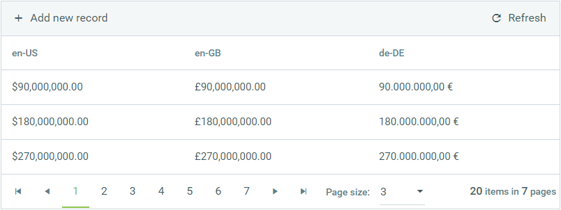

## DESCRIPTION

This articles describes how to apply different culturual Numbering format to GridNumericColumn without changing the culture of RadGrid or the Page itself.



## SOLUTION

**DOWNLOAD** the sample: [apply_culture_specific_format_numeric_column.zip](files/apply_culture_specific_format_numeric_column.zip)

**OR** use the code below

- Create a GridNumericColumn and set its DataType property either to Decimal or Double, both will work. (the example below has three columns for the demo)
- Subscribe the grid to its ItemDataBound event (the right event which is fired right after data is bound to grid, thus allow executing conditions based on the data)
- Finally, access the GridDataItems and apply the Number formatting using Culture.

RadGrid markup (Please note that the code below only displays the related properties and tags.) 

````XML
<telerik:RadGrid ID="RadGrid1" runat="server"
    ...
    OnItemDataBound="RadGrid1_ItemDataBound">
    <MasterTableView ...>
        <Columns>
            ...
            <telerik:GridNumericColumn UniqueName="CultureUS" DataField="NumericData" DataType="System.Decimal" HeaderText="en-US" />
            <telerik:GridNumericColumn UniqueName="CultureGB" DataField="NumericData" DataType="System.Decimal" HeaderText="en-GB" />
            <telerik:GridNumericColumn UniqueName="CultureDE" DataField="NumericData" DataType="System.Decimal" HeaderText="de-DE" />
        </Columns>
    </MasterTableView>
</telerik:RadGrid>
````

ItemDatabound event handler

````C#
protected void RadGrid1_ItemDataBound(object sender, GridItemEventArgs e)
{
    if(e.Item is GridDataItem)
    {
        var dataItem = (GridDataItem)e.Item;
 
        decimal value = DataBinder.Eval(dataItem.DataItem, "NumericData") as decimal? ?? 0;
        dataItem["CultureUS"].Text = string.Format((new System.Globalization.CultureInfo("en-US")).NumberFormat, "{0:C}", value);
 
        value = DataBinder.Eval(dataItem.DataItem, "NumericData") as decimal? ?? 0;
        dataItem["CultureGB"].Text = string.Format((new System.Globalization.CultureInfo("en-GB")).NumberFormat, "{0:C}", value);
 
        value = DataBinder.Eval(dataItem.DataItem, "NumericData") as decimal? ?? 0;
        dataItem["CultureDE"].Text = string.Format((new System.Globalization.CultureInfo("en-DE")).NumberFormat, "{0:C}", value);
    }
}
````
 
