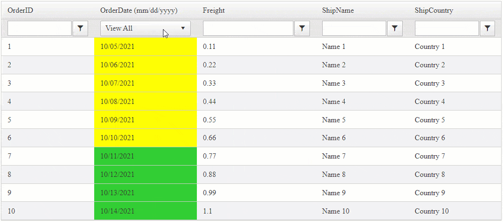

## Environment
<table>
	<tbody>
		<tr>
			<td>Product</td>
			<td>RadGrid for ASP.NET AJAX</td>
		</tr>
	</tbody>
</table>


## Solution

Example that uses a RadComboBox to Filter on a GridDateTimeColumn showing only records later or equal to today's date.





The markup definition

````ASPNET(C#)
<telerik:RadGrid ID="RadGrid1" runat="server" AllowPaging="True" Width="800px" AllowFilteringByColumn="true"
    OnItemDataBound="RadGrid1_ItemDataBound"
    OnNeedDataSource="RadGrid1_NeedDataSource">
    <MasterTableView AutoGenerateColumns="False" DataKeyNames="OrderID">
        <Columns>
            <telerik:GridBoundColumn DataField="OrderID" DataType="System.Int32"
                FilterControlAltText="Filter OrderID column" HeaderText="OrderID"
                ReadOnly="True" SortExpression="OrderID" UniqueName="OrderID">
            </telerik:GridBoundColumn>
            <telerik:GridDateTimeColumn DataField="OrderDate" DataType="System.DateTime"
                DataFormatString="{0:MM/dd/yyyy}" EnableTimeIndependentFiltering="true"
                FilterControlAltText="Filter OrderDate column" HeaderText="OrderDate (mm/dd/yyyy)"
                SortExpression="OrderDate" UniqueName="OrderDate" FilterControlWidth="160px">

                <FilterTemplate>
                    <telerik:RadDatePicker ID="RadDatePicker1" runat="server" Visible="false">
                    </telerik:RadDatePicker>

                    <telerik:RadComboBox ID="RadComboBox1" runat="server" AutoPostBack="false"
                        EmptyMessage="Select a date"
                        OnDataBinding="RadComboBox1_DataBinding"
                        OnClientSelectedIndexChanged="OnClientSelectedIndexChanged"
                        SelectedValue='<%# ((GridItem)Container).OwnerTableView.GetColumn("OrderDate").CurrentFilterValue %>'>
                        <Items>
                            <telerik:RadComboBoxItem Text="View All" />
                            <telerik:RadComboBoxItem Text="Current Term" />
                        </Items>
                    </telerik:RadComboBox>

                    <telerik:RadScriptBlock ID="RadScriptBlock1" runat="server">
                        <script>
                            function OnClientSelectedIndexChanged(sender, args) {
                                // Get reference to the Grid's TableView Object
                                var tableView = $find('<%# ((GridItem)Container).OwnerTableView.ClientID %>');

                                // Get the Combo's selected value
                                var selectedValue = args.get_item().get_value();

                                // Condition to check if the Value exists
                                if (!selectedValue) {
                                    // If false, apply the "NoFilter" with Empty values
                                    tableView.filter('OrderDate', "", "NoFilter");
                                } else {
                                    // If true, appl a Filter Function with the Selected Value
                                    tableView.filter('OrderDate', selectedValue, "GreaterThanOrEqualTo");
                                }
                            }
                        </script>
                    </telerik:RadScriptBlock>
                </FilterTemplate>
            </telerik:GridDateTimeColumn>
            <telerik:GridNumericColumn DataField="Freight" DataType="System.Decimal"
                FilterControlAltText="Filter Freight column" HeaderText="Freight"
                SortExpression="Freight" UniqueName="Freight">
            </telerik:GridNumericColumn>
            <telerik:GridBoundColumn DataField="ShipName"
                FilterControlAltText="Filter ShipName column" HeaderText="ShipName"
                SortExpression="ShipName" UniqueName="ShipName">
            </telerik:GridBoundColumn>
            <telerik:GridBoundColumn DataField="ShipCountry"
                FilterControlAltText="Filter ShipCountry column" HeaderText="ShipCountry"
                SortExpression="ShipCountry" UniqueName="ShipCountry">
            </telerik:GridBoundColumn>
        </Columns>
    </MasterTableView>
</telerik:RadGrid>
````
````ASPNET(VB)
<telerik:RadGrid ID="RadGrid1" runat="server" AllowPaging="True" Width="800px" AllowFilteringByColumn="true"
    OnItemDataBound="RadGrid1_ItemDataBound"
    OnNeedDataSource="RadGrid1_NeedDataSource">
    <MasterTableView AutoGenerateColumns="False" DataKeyNames="OrderID">
        <Columns>
            <telerik:GridBoundColumn DataField="OrderID" DataType="System.Int32"
                FilterControlAltText="Filter OrderID column" HeaderText="OrderID"
                ReadOnly="True" SortExpression="OrderID" UniqueName="OrderID">
            </telerik:GridBoundColumn>
            <telerik:GridDateTimeColumn DataField="OrderDate" DataType="System.DateTime"
                DataFormatString="{0:MM/dd/yyyy}" EnableTimeIndependentFiltering="true"
                FilterControlAltText="Filter OrderDate column" HeaderText="OrderDate (mm/dd/yyyy)"
                SortExpression="OrderDate" UniqueName="OrderDate" FilterControlWidth="160px">

                <FilterTemplate>
                    <telerik:RadDatePicker ID="RadDatePicker1" runat="server" Visible="false">
                    </telerik:RadDatePicker>

                    <telerik:RadComboBox ID="RadComboBox1" runat="server" AutoPostBack="false"
                        EmptyMessage="Select a date"
                        OnDataBinding="RadComboBox1_DataBinding"
                        OnClientSelectedIndexChanged="OnClientSelectedIndexChanged"
                        SelectedValue='<%# CType(Container, GridItem).OwnerTableView.GetColumn("OrderDate").CurrentFilterValue %>'>
                        <Items>
                            <telerik:RadComboBoxItem Text="View All" />
                            <telerik:RadComboBoxItem Text="Current Term" />
                        </Items>
                    </telerik:RadComboBox>

                    <telerik:RadScriptBlock ID="RadScriptBlock1" runat="server">
                        <script>
                            function OnClientSelectedIndexChanged(sender, args) {
                                // Get reference to the Grid's TableView Object
                                var tableView = $find('<%# CType(Container, GridItem).OwnerTableView.ClientID %>');

                                // Get the Combo's selected value
                                var selectedValue = args.get_item().get_value();

                                // Condition to check if the Value exists
                                if (!selectedValue) {
                                    // If false, apply the "NoFilter" with Empty values
                                    tableView.filter('OrderDate', "", "NoFilter");
                                } else {
                                    // If true, appl a Filter Function with the Selected Value
                                    tableView.filter('OrderDate', selectedValue, "GreaterThanOrEqualTo");
                                }
                            }
                        </script>
                    </telerik:RadScriptBlock>
                </FilterTemplate>
            </telerik:GridDateTimeColumn>
            <telerik:GridNumericColumn DataField="Freight" DataType="System.Decimal"
                FilterControlAltText="Filter Freight column" HeaderText="Freight"
                SortExpression="Freight" UniqueName="Freight">
            </telerik:GridNumericColumn>
            <telerik:GridBoundColumn DataField="ShipName"
                FilterControlAltText="Filter ShipName column" HeaderText="ShipName"
                SortExpression="ShipName" UniqueName="ShipName">
            </telerik:GridBoundColumn>
            <telerik:GridBoundColumn DataField="ShipCountry"
                FilterControlAltText="Filter ShipCountry column" HeaderText="ShipCountry"
                SortExpression="ShipCountry" UniqueName="ShipCountry">
            </telerik:GridBoundColumn>
        </Columns>
    </MasterTableView>
</telerik:RadGrid>
````

Code behind Code for data binding and dynamic operations

````C#
protected void RadGrid1_NeedDataSource(object sender, GridNeedDataSourceEventArgs e)
{
    (sender as RadGrid).DataSource = OrdersTable();
}

// This event is Only Used to paint the Cells to Yellow and Green based on the Cell value
protected void RadGrid1_ItemDataBound(object sender, GridItemEventArgs e)
{
    var dataItem = (e.Item as GridDataItem);

    // If it's a GridDataItem
    if (dataItem != null)
    {
        // Access the Cell
        var dateCell = dataItem["OrderDate"];

        if (DateTime.ParseExact(dateCell.Text, "MM/dd/yyyy", CultureInfo.GetCultureInfo("en-US")) < DateTime.Now.Date)
        {
            dateCell.BackColor = System.Drawing.Color.Yellow;
        }
        else
        {
            dateCell.BackColor = System.Drawing.Color.LimeGreen;
        }
    }
}

protected void RadComboBox1_DataBinding(object sender, EventArgs e)
{
    var combo = (sender as RadComboBox);
    // Find the ComboBoxItem by "Current Term" text and set it's Value to Today's Date
    combo.FindItemByText("Current Term").Value = DateTime.Now.Date.ToShortDateString();
}

private DataTable OrdersTable()
{
    DataTable dt = new DataTable();

    dt.Columns.Add(new DataColumn("OrderID", typeof(int)));
    dt.Columns.Add(new DataColumn("OrderDate", typeof(DateTime)));
    dt.Columns.Add(new DataColumn("Freight", typeof(decimal)));
    dt.Columns.Add(new DataColumn("ShipName", typeof(string)));
    dt.Columns.Add(new DataColumn("ShipCountry", typeof(string)));

    dt.PrimaryKey = new DataColumn[] { dt.Columns["OrderID"] };

    for (int i = 0; i < 10; i++)
    {
        int index = i + 1;

        DataRow row = dt.NewRow();

        row["OrderID"] = index;
        row["OrderDate"] = DateTime.Now.Date.AddDays(-7).AddDays(index);
        row["Freight"] = index * 0.1 + index * 0.01;
        row["ShipName"] = "Name " + index;
        row["ShipCountry"] = "Country " + index;

        dt.Rows.Add(row);
    }

    return dt;
}
````
````VB
Protected Sub RadGrid1_NeedDataSource(ByVal sender As Object, ByVal e As GridNeedDataSourceEventArgs)
    CType(sender, RadGrid).DataSource = OrdersTable()
End Sub

Protected Sub RadGrid1_ItemDataBound(ByVal sender As Object, ByVal e As GridItemEventArgs)
    Dim dataItem = TryCast(e.Item, GridDataItem)

    If dataItem IsNot Nothing Then
        Dim dateCell = dataItem("OrderDate")

        If DateTime.ParseExact(dateCell.Text, "MM/dd/yyyy", CultureInfo.GetCultureInfo("en-US")) < DateTime.Now.Date Then
            dateCell.BackColor = System.Drawing.Color.Yellow
        Else
            dateCell.BackColor = System.Drawing.Color.LimeGreen
        End If
    End If
End Sub

Protected Sub RadComboBox1_DataBinding(ByVal sender As Object, ByVal e As EventArgs)
    Dim combo = CType(sender, RadComboBox)
    combo.FindItemByText("Current Term").Value = DateTime.Now.Date.ToShortDateString()
End Sub

Private Function OrdersTable() As DataTable
    Dim dt As DataTable = New DataTable()
    dt.Columns.Add(New DataColumn("OrderID", GetType(Integer)))
    dt.Columns.Add(New DataColumn("OrderDate", GetType(DateTime)))
    dt.Columns.Add(New DataColumn("Freight", GetType(Decimal)))
    dt.Columns.Add(New DataColumn("ShipName", GetType(String)))
    dt.Columns.Add(New DataColumn("ShipCountry", GetType(String)))
    dt.PrimaryKey = New DataColumn() {dt.Columns("OrderID")}

    For i As Integer = 0 To 10 - 1
        Dim index As Integer = i + 1
        Dim row As DataRow = dt.NewRow()
        row("OrderID") = index
        row("OrderDate") = DateTime.Now.Date.AddDays(-7).AddDays(index)
        row("Freight") = index * 0.1 + index * 0.01
        row("ShipName") = "Name " & index
        row("ShipCountry") = "Country " & index
        dt.Rows.Add(row)
    Next

    Return dt
End Function
````
  
 
