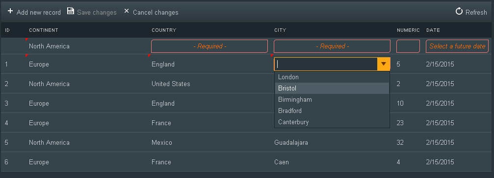

## Environment

<table>
	<tbody>
		<tr>
			<td>Product</td>
			<td>Telerik WebForms Grid for ASP.NET AJAX</td>
		</tr>
	</tbody>
</table>

## Description

This Code Library provides an extension for the RadGrid Batch Editing functionality, which allows you to implement related RadComboBoxes functionality between column and to set Batch Validation. Each of the functionalities is easily integrated with RadGrid in Batch edit mode through separate managers.



**Related RadComboBoxesManager**

Due to the way that Batch Editing is implemented, having related drop down controls with enabled LoadOnDemand functionality is almost impossible to be achieved or will require a ton of custom JavaScript. In the attached BatchExtensions object in this Code Library, the RelatedComboBoxesManager simulates such functionality by displaying a RadToolTip with RadComboBox control over the currently edited cell. 

The only thing that you need to do to enable the related RadComboBox functionality is to set the grid object, specify the RadToolTip containing the RadComboBox control, set the columns relationships and handle the server-side OnItemsRequested event of the RadComboBox to provided the data. Everything else will be handled by the manager.

## Solution

Before you start the integration of the RelatedComboBoxesManager, you need to include the batchManagerExtensions.js and batchManagerExtensions.css files in your project. After including those files, you will have to follow the steps below:

Copy and paste the following RadToolTip within the same container as the RadGrid (especially when you are using RadAjax):

````ASP.NET
<telerik:RadToolTip runat="server" ID="RelatedComboBoxesToolTip" OffsetY="0" RenderInPageRoot="false"
    HideEvent="FromCode" AutoCloseDelay="0" RelativeTo="Element" CssClass="RelatedCombosToolTip"
    ShowEvent="FromCode" Position="Center" Skin="Default">
    <telerik:RadComboBox runat="server" Width="100%" EnableLoadOnDemand="true" OnItemsRequested="RadComboBox1_ItemsRequested">
    </telerik:RadComboBox>
    <telerik:RadToolTip runat="server" Skin="Metro" OffsetY="0" EnableShadow="false" ShowEvent="FromCode" Position="TopCenter"></telerik:RadToolTip>
</telerik:RadToolTip>
````

Add the server-side handler for the OnItemsRequested event of the RadComboBox. Within that event you will have access to the column name and the related cell value, which should be enough for getting the items that should be displayed in a particular cell:

````C#
protected void RadComboBox1_ItemsRequested(object sender, RadComboBoxItemsRequestedEventArgs e)
{
    RadComboBox comboBox = sender as RadComboBox;
    string columnName = e.Context["ColumnName"].ToString();
    string relatedValue = e.Context["RelatedValue"] != null ? e.Context["RelatedValue"].ToString() : "";
    
    // Get the data and create Items for the RadComboBox
}
````

The next step is to attach event handler for the client-side OnGridCreated event, where we will initialize the RelatedComboBoxesManager:

````JavaScript
function gridCreated(sender, args) {
    var relatedComboBoxesManager = new BatchExtensions.RelatedComboBoxesManager().init({
        grid: sender,
        toolTipID: "<%=RelatedComboBoxesToolTip.ClientID%>",
        relations: [
            {
                columnName: "Continent"
            },
            {
                columnName: "Country",
                relatedTo: "Continent"
            },
            {
                columnName: "City",
                relatedTo: "Country"
            }
        ]
    });
}
````

Important Note

The RelatedComboBoxesManagers will work with bound columns and GridTemplateColumn with the following ItemTemplate:

````ASP.NET
<ItemTemplate>
    <%# Eval("City") %>
</ItemTemplate>
````

You should also have in mind that RelatedComboBoxesManager will work only with Cell edit mode.


**Batch Validation - ValidationManager**

Although that Batch Editing supports standard Validatiors, they do not provide a great user experience in the context of Batch Editing, because the user will not be able to leave the cell until the values is valid. Furthermore, the error messages will be displayed besides the editor, which could lead to distorted layout of the grid. 

The ValidationManager from the BatchExtensions is created to handle the validation with Batch Editing in very user-friendly manner, where the error messages is displayed in the cells (in normal mode) and the user will still be able to perform other operations, even if there is failed validation. 

***Integration***

Before you start the integration of the ValidationManager, you need to include the batchManagerExtensions.js and batchManagerExtensions.css files in your project. After including those files, you will have to follow the steps below:

Attach event handler for the client-side OnGridCreated event of your RadGrid:

````ASP.NET
<ClientSettings>
    <ClientEvents OnGridCreated="gridCreated" />
</ClientSettings>
````

Within the handler for the OnGridCreated event, initialize a new ValidationManager for the grid and set your validators for the column that you need to validate:

````JavaScript
function gridCreated(sender, args) {
    grid1Validator = new BatchExtensions.ValidationManager().init({
        grid: sender,
        validators: [
            {
                columnName: "Continent",
                errorMessage: "- Required -"
            },
            {
                columnName: "Country",
                errorMessage: "- Required -"
            },
            {
                columnName: "City",
                errorMessage: "- Required -"
            },
            {
                columnName: "Numeric",
                errorMessage: "",
                toolTipMessage: "Select a positive number",
                validationFunction: function (value) {
                    return value >= 0;
                }
            },
            {
                columnName: "Date",
                errorMessage: "Select a future date",
                validationFunction: function (value) {
                    return !(Date.parseInvariant(value) < new Date().setHours(0, 0, 0, 0));
                }
            }
        ]
    });
}
````

As you can notice, each validator accepts the columnName (required) and the following optional properties:

- errorMessage - The message that will be displayed within the cell on failed validation;
- toolTipMessage - The message that will be displayed on hovering over a cell with failed validation;
- validationFunction - Custom validation function that has the current value as an argument and defines on what conditions the value is valid.


ValidationManager Methods 

`add_validator({...})` - adds new validator to the ValidationManager:

````JavaScript
grid1Validator.add_validator(
    {
        columnName: "Continent",
        errorMessage: "- Required -"
    }
);
````

`add_elementToDisable(element)` - adds an element that will be disabled when RadGrid is invalid and has cells with failed validation. By default, the Save Changes button of RadGrid is included in this collection of elements and the user will not be able to save the changes, unless all cells are valid:

````JavaScript
grid1Validator.add_elementToDisable(document.getElementById("<%= Button1.ClientID %>"));
````

`isValid()` - this method will return true if all the cells in the grid are valid (this method could be useful within the client-side OnUserAction event of the grid, where you can prevent paging, sorting, filtering, etc., if there is failed validation): 

````JavaScript
function userAction(sender, args) {
    if (!grid1Validator.isValid()) {
        args.set_cancel(true);
    }
}
````

[DOWNLOAD the sample](files/grid-batch-editing-extensions-related-radcomboboxes-and-validation.zip)
 
 