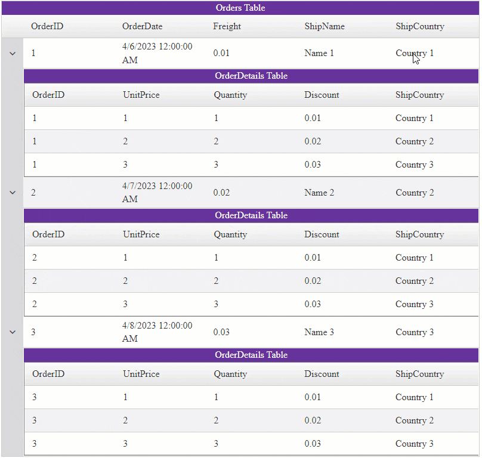

## Description

Implement Cascading ComboBoxes with BatchEditing (EditMode="**Batch**") and Master/Detail Hierarchy using the Grid and BatchEditing Client-Side APIs.

### Scenarios

- Change the ComboBox selection in the Parent Item to cascade the changes down to the Child Items
- Change the ComboBox selection in the Child Item to cascade the changes up to the Parent Item as well as to the sibling Child Items

### DEMO



## Solution

To implement the cascading functionalities, write a JavaScript logic using the combination of [RadGrid]() and [BatchEditing]() client-side APIs within the [OnBatchEditCellValueChanged]() client-side event.


>caption JavaScript code for the Cascading functionality

````JavaScript
<script type="text/javascript">
    function OnBatchEditCellValueChanged(sender, args) {
        // Use timeout only to execute logic in an order
        // Note: it is required to ensure the cascading changes do not happen before the BatchEditing finishes the action selected by user
        setTimeout(function () {
            var grid = sender;
            // Get reference to BatchEditing Manager
            var batchManager = grid.get_batchEditingManager();
            // Get the new value from the Editor Control (in this case, the ComboBox)
            var newValue = args.get_editorValue();
            // Get reference to the TableView of the row that is being Changed
            var currentTableView = args.get_tableView();
            // Get the TableView's name
            var tableViewName = currentTableView.get_name();
            // Get reference to the row element (TR)
            var currentRowElement = args.get_row();

            // Call the TableView's get_dataItem() function to instantiate its Telerik.Web.UI.GridDataItems.
            // Note: this is required to be able to cast a row element (<tr>) to Telerik.Web.UI.GridDataItem Object.
            currentTableView.get_dataItems();

            // Check if the row element exists and it has a property called "control"
            if (currentRowElement && currentRowElement.control) {
                // Cast the row element (TR) to Telerik.Web.UI.GridDataItem Object
                var dataItem = currentRowElement.control;

                // Condition to check which TableView's row is being changed
                if (tableViewName == "Orders") { // if changes are made to the MasterTable (Orders)

                    // Get the DetailTables collection
                    var detailTables = dataItem.get_nestedViews();

                    // Iterate through the DetailTables
                    for (var detailTableIndex = 0; detailTableIndex < detailTables.length; detailTableIndex++) {
                        // Reference the Current DetailTable by index
                        var detailTable = detailTables[detailTableIndex];
                        // Get reference to the DetailTable's items
                        var childItems = detailTable.get_dataItems();
                        // Iterate through the DetailTable's Items
                        for (var childItemIndex = 0; childItemIndex < childItems.length; childItemIndex++) {
                            var childItem = childItems[childItemIndex];
                            // Get reference to the Child Item's Country Cell
                            var childItemCountryCell = childItem.get_cell("ShipCountry");
                            // Change the Cell's Value to the value coming from the Paren item's ComboBox
                            batchManager.changeCellValue(childItemCountryCell, newValue)
                        }
                    }
                } else if (tableViewName == "OrderDetails") { // if changes are made to the DetailTable (OrderDetailss)
                    var masterTableView = currentTableView.get_parent();
                    // Call the Master TableView's get_dataItem() function to instantiate its Telerik.Web.UI.GridDataItems.
                    // Note: this is required to be able to cast a row element (<tr>) to Telerik.Web.UI.GridDataItem Object.
                    masterTableView.get_dataItems();

                    // Access the Parent row element (TR)
                    var parentRowElement = currentTableView.get_parentRow();

                    // Check if the row element exists and it has a property called "control"
                    if (parentRowElement && parentRowElement.control) {
                        // Cast the row element (TR) to Telerik.Web.UI.GridDataItem Object
                        var parentDataItem = parentRowElement.control;
                        // Get reference to the Parent Item's Country Cell
                        var parentCountryCell = parentDataItem.get_cell("ShipCountry");
                        // Change the Cell's Value to the value coming from the Child item's ComboBox
                        batchManager.changeCellValue(parentCountryCell, newValue)
                    }
                }
            }
        }, 15)
    }
</script>
````

>important The JavaScript code from above was designed for the following Grid structure. You may need to adjust the code according to the structure in your app.

>caption RadGrid structure

````ASP.NET
<telerik:RadGrid ID="RadGrid1" runat="server" AllowPaging="True" Width="800px"
    OnNeedDataSource="RadGrid1_NeedDataSource"
    OnDetailTableDataBind="RadGrid1_DetailTableDataBind" OnPreRender="RadGrid1_PreRender">
    <MasterTableView Name="Orders" AutoGenerateColumns="False" DataKeyNames="OrderID" EditMode="Batch" HierarchyDefaultExpanded="true" Caption="Orders Table">
        <BatchEditingSettings EditType="Cell" />
        <Columns>
            <telerik:GridNumericColumn DataField="OrderID" DataType="System.Int32"
                FilterControlAltText="Filter OrderID column" HeaderText="OrderID"
                ReadOnly="True" SortExpression="OrderID" UniqueName="OrderID">
            </telerik:GridNumericColumn>
            <telerik:GridDateTimeColumn DataField="OrderDate" DataType="System.DateTime"
                FilterControlAltText="Filter OrderDate column" HeaderText="OrderDate"
                SortExpression="OrderDate" UniqueName="OrderDate">
            </telerik:GridDateTimeColumn>
            <telerik:GridNumericColumn DataField="Freight" DataType="System.Decimal"
                FilterControlAltText="Filter Freight column" HeaderText="Freight"
                SortExpression="Freight" UniqueName="Freight">
            </telerik:GridNumericColumn>
            <telerik:GridBoundColumn DataField="ShipName"
                FilterControlAltText="Filter ShipName column" HeaderText="ShipName"
                SortExpression="ShipName" UniqueName="ShipName">
            </telerik:GridBoundColumn>
            <telerik:GridTemplateColumn DataField="ShipCountry"
                FilterControlAltText="Filter ShipCountry column" HeaderText="ShipCountry"
                SortExpression="ShipCountry" UniqueName="ShipCountry">
                <ItemTemplate>
                    <%# Eval("ShipCountry") %>
                </ItemTemplate>
                <EditItemTemplate>
                    <telerik:RadComboBox ID="MasterComboBox" runat="server" RenderMode="Lightweight" DataTextField="ShipCountry" DataValueField="ShipCountry">
                    </telerik:RadComboBox>
                </EditItemTemplate>
            </telerik:GridTemplateColumn>
        </Columns>
        <DetailTables>
            <telerik:GridTableView Name="OrderDetails" AutoGenerateColumns="false" EditMode="Batch" Caption="OrderDetails Table">
                <BatchEditingSettings EditType="Cell" />
                <Columns>
                    <telerik:GridNumericColumn DataField="OrderID" DataType="System.Int32"
                        FilterControlAltText="Filter OrderID column" HeaderText="OrderID"
                        ReadOnly="True" SortExpression="OrderID" UniqueName="OrderID">
                    </telerik:GridNumericColumn>
                    <telerik:GridNumericColumn DataField="UnitPrice" DataType="System.Decimal"
                        FilterControlAltText="Filter UnitPrice column" HeaderText="UnitPrice"
                        SortExpression="UnitPrice" UniqueName="UnitPrice">
                    </telerik:GridNumericColumn>
                    <telerik:GridNumericColumn DataField="Quantity" DataType="System.Int32"
                        FilterControlAltText="Filter Quantity column" HeaderText="Quantity"
                        SortExpression="Quantity" UniqueName="Quantity">
                    </telerik:GridNumericColumn>
                    <telerik:GridNumericColumn DataField="Discount" DataType="System.Decimal"
                        FilterControlAltText="Filter Discount column" HeaderText="Discount"
                        SortExpression="Discount" UniqueName="Discount">
                    </telerik:GridNumericColumn>
                    <telerik:GridTemplateColumn DataField="ShipCountry"
                        FilterControlAltText="Filter ShipCountry column" HeaderText="ShipCountry"
                        SortExpression="ShipCountry" UniqueName="ShipCountry">
                        <ItemTemplate>
                            <%# Eval("ShipCountry") %>
                        </ItemTemplate>
                        <EditItemTemplate>
                            <telerik:RadComboBox ID="ChildComboBox" runat="server" RenderMode="Lightweight" DataTextField="ShipCountry" DataValueField="ShipCountry">
                            </telerik:RadComboBox>
                        </EditItemTemplate>
                    </telerik:GridTemplateColumn>
                </Columns>
            </telerik:GridTableView>
        </DetailTables>
    </MasterTableView>
    <ClientSettings>
        <ClientEvents OnBatchEditCellValueChanged="OnBatchEditCellValueChanged" />
    </ClientSettings>
</telerik:RadGrid>
````

>caption CodeBehind (backend) code for data binding.

````C#
protected void RadGrid1_NeedDataSource(object sender, GridNeedDataSourceEventArgs e)
{
    (sender as RadGrid).DataSource = OrdersTable();
}

protected void RadGrid1_DetailTableDataBind(object sender, GridDetailTableDataBindEventArgs e)
{
    if (e.DetailTableView.Name == "OrderDetails")
    {
        GridDataItem parentItem = e.DetailTableView.ParentItem;

        int orderId = (int)parentItem.GetDataKeyValue("OrderID");

        e.DetailTableView.DataSource = OrderDetailsTable().Select(string.Format("OrderID = '{0}'", orderId));
    }
}

private DataTable OrdersTable()
{
    DataTable dt = new DataTable();

    dt.Columns.Add(new DataColumn("OrderID", typeof(int)));
    dt.Columns.Add(new DataColumn("OrderDate", typeof(DateTime)));
    dt.Columns.Add(new DataColumn("Freight", typeof(double)));
    dt.Columns.Add(new DataColumn("ShipName", typeof(string)));
    dt.Columns.Add(new DataColumn("ShipCountry", typeof(string)));

    dt.PrimaryKey = new DataColumn[] { dt.Columns["OrderID"] };

    for (int i = 0; i < 3; i++)
    {
        int index = i + 1;

        DataRow row = dt.NewRow();

        row["OrderID"] = index;
        row["OrderDate"] = DateTime.Now.Date.AddDays(index);
        row["Freight"] = index * 0.01;
        row["ShipName"] = "Name " + index;
        row["ShipCountry"] = "Country " + index;

        dt.Rows.Add(row);
    }

    return dt;
}
private DataTable OrderDetailsTable()
{
    DataTable dt = new DataTable();

    dt.Columns.Add(new DataColumn("OrderID", typeof(int)));
    dt.Columns.Add(new DataColumn("UnitPrice", typeof(decimal)));
    dt.Columns.Add(new DataColumn("Quantity", typeof(int)));
    dt.Columns.Add(new DataColumn("Discount", typeof(decimal)));
    dt.Columns.Add(new DataColumn("ShipCountry", typeof(string)));

    var orders = OrdersTable();

    int itemsPerOrder = 3;

    for (int rowIndex = 0; rowIndex < orders.Rows.Count; rowIndex++)
    {
        DataRow currentOrder = orders.Rows[rowIndex];

        for (int j = 0; j < itemsPerOrder; j++)
        {
            int index = j + 1;

            DataRow row = dt.NewRow();

            row["OrderID"] = currentOrder["OrderID"];

            row["UnitPrice"] = index;
            row["Quantity"] = index;
            row["Discount"] = index * 0.01;
            row["ShipCountry"] = "Country " + index;

            dt.Rows.Add(row);
        }
    }
    return dt;
}


protected void RadGrid1_PreRender(object sender, EventArgs e)
{
    RadGrid grid = (RadGrid)sender;
    GridTableView masterTable = grid.MasterTableView;

    RadComboBox combo = masterTable.GetBatchEditorContainer("ShipCountry").FindControl("MasterComboBox") as RadComboBox;
    combo.DataSource = OrdersTable();
    combo.DataBind();

    foreach (GridDataItem masterItem in masterTable.Items)
    {
        if (masterItem.HasChildItems)
        {
            GridNestedViewItem nestedItem = masterItem.ChildItem;

            foreach (GridTableView childTableView in nestedItem.NestedTableViews)
            {
                Panel batchEditorContainer = childTableView.GetBatchEditorContainer("ShipCountry");

                if(batchEditorContainer != null)
                {
                    RadComboBox childCombo = batchEditorContainer.FindControl("ChildComboBox") as RadComboBox;
                    childCombo.DataSource = OrdersTable();
                    childCombo.DataBind();
                }
            }
        }
    }
}
````
````VB
Protected Sub RadGrid1_NeedDataSource(ByVal sender As Object, ByVal e As GridNeedDataSourceEventArgs)
    CType(sender, RadGrid).DataSource = OrdersTable()
End Sub

Protected Sub RadGrid1_DetailTableDataBind(ByVal sender As Object, ByVal e As GridDetailTableDataBindEventArgs)
    If e.DetailTableView.Name = "OrderDetails" Then
        Dim parentItem As GridDataItem = e.DetailTableView.ParentItem
        Dim orderId As Integer = CInt(parentItem.GetDataKeyValue("OrderID"))
        e.DetailTableView.DataSource = OrderDetailsTable().[Select](String.Format("OrderID = '{0}'", orderId))
    End If
End Sub

Private Function OrdersTable() As DataTable
    Dim dt As DataTable = New DataTable()
    dt.Columns.Add(New DataColumn("OrderID", GetType(Integer)))
    dt.Columns.Add(New DataColumn("OrderDate", GetType(DateTime)))
    dt.Columns.Add(New DataColumn("Freight", GetType(Double)))
    dt.Columns.Add(New DataColumn("ShipName", GetType(String)))
    dt.Columns.Add(New DataColumn("ShipCountry", GetType(String)))
    dt.PrimaryKey = New DataColumn() {dt.Columns("OrderID")}

    For i As Integer = 0 To 3 - 1
        Dim index As Integer = i + 1
        Dim row As DataRow = dt.NewRow()
        row("OrderID") = index
        row("OrderDate") = DateTime.Now.Date.AddDays(index)
        row("Freight") = index * 0.01
        row("ShipName") = "Name " & index
        row("ShipCountry") = "Country " & index
        dt.Rows.Add(row)
    Next

    Return dt
End Function

Private Function OrderDetailsTable() As DataTable
    Dim dt As DataTable = New DataTable()
    dt.Columns.Add(New DataColumn("OrderID", GetType(Integer)))
    dt.Columns.Add(New DataColumn("UnitPrice", GetType(Decimal)))
    dt.Columns.Add(New DataColumn("Quantity", GetType(Integer)))
    dt.Columns.Add(New DataColumn("Discount", GetType(Decimal)))
    dt.Columns.Add(New DataColumn("ShipCountry", GetType(String)))
    Dim orders = OrdersTable()
    Dim itemsPerOrder As Integer = 3

    For rowIndex As Integer = 0 To orders.Rows.Count - 1
        Dim currentOrder As DataRow = orders.Rows(rowIndex)

        For j As Integer = 0 To itemsPerOrder - 1
            Dim index As Integer = j + 1
            Dim row As DataRow = dt.NewRow()
            row("OrderID") = currentOrder("OrderID")
            row("UnitPrice") = index
            row("Quantity") = index
            row("Discount") = index * 0.01
            row("ShipCountry") = "Country " & index
            dt.Rows.Add(row)
        Next
    Next

    Return dt
End Function

Protected Sub RadGrid1_PreRender(ByVal sender As Object, ByVal e As EventArgs)
    Dim grid As RadGrid = CType(sender, RadGrid)
    Dim masterTable As GridTableView = grid.MasterTableView
    Dim combo As RadComboBox = TryCast(masterTable.GetBatchEditorContainer("ShipCountry").FindControl("MasterComboBox"), RadComboBox)
    combo.DataSource = OrdersTable()
    combo.DataBind()

    For Each masterItem As GridDataItem In masterTable.Items

        If masterItem.HasChildItems Then
            Dim nestedItem As GridNestedViewItem = masterItem.ChildItem

            For Each childTableView As GridTableView In nestedItem.NestedTableViews
                Dim batchEditorContainer As Panel = childTableView.GetBatchEditorContainer("ShipCountry")

                If batchEditorContainer IsNot Nothing Then
                    Dim childCombo As RadComboBox = TryCast(batchEditorContainer.FindControl("ChildComboBox"), RadComboBox)
                    childCombo.DataSource = OrdersTable()
                    childCombo.DataBind()
                End If
            Next
        End If
    Next
End Sub
````

>important This CodeBehind code is only for demonstration purposes. You may use this to test the current example.
 
