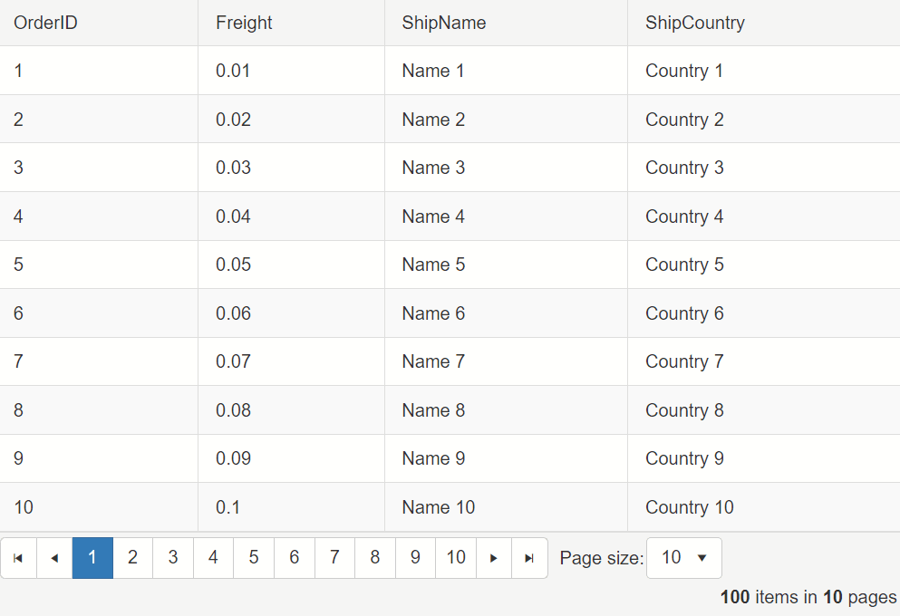

## Description

Sometimes one might want to highlight the row and column of the currently hovered Grid cell.



## Solution

1. Create the custom `hovered` CSS class.
1. Add the class to the currently hovered cell's row and column with the `mouseover` event.

Example

````CSS
<style>
    .hovered,
    .hovered td {
        background-color: #C7C7C7;
    }
</style>
````

````JS
<script>
    $(document).on('mouseover', '.RadGrid .rgMasterTable > tbody > tr > td', function (e) {
        var targetCell = e.target;
        var cellIndex = targetCell.cellIndex;

        $(targetCell).closest('tr').addClass('hovered');

        $(e.target).closest('tbody').find('> tr').each(function () {
            var targetCell = this.cells[cellIndex];

            $(targetCell).addClass('hovered');
        })
    }).on('mouseout', '.RadGrid .rgMasterTable > tbody > tr > td', function (e) {
        $(this).closest('tbody').find('td.hovered, tr.hovered').removeClass('hovered');
    })
</script>
````

 