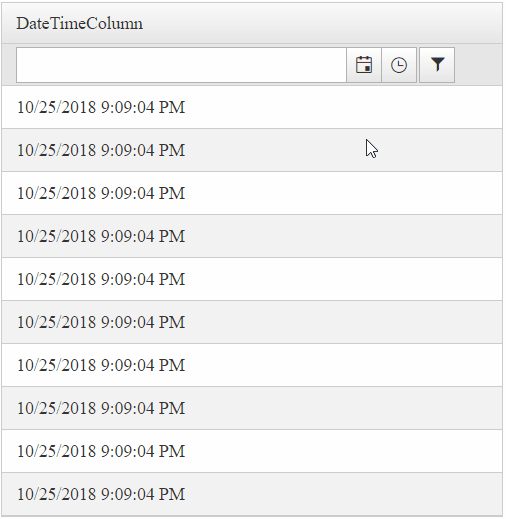
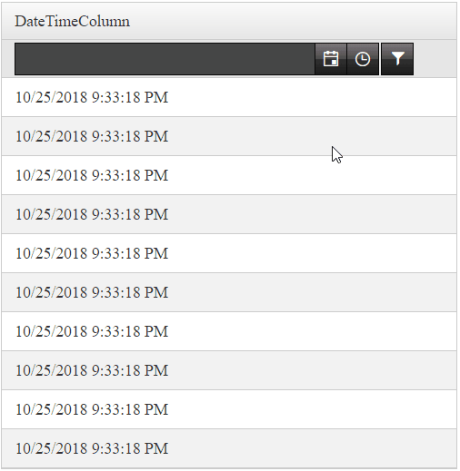
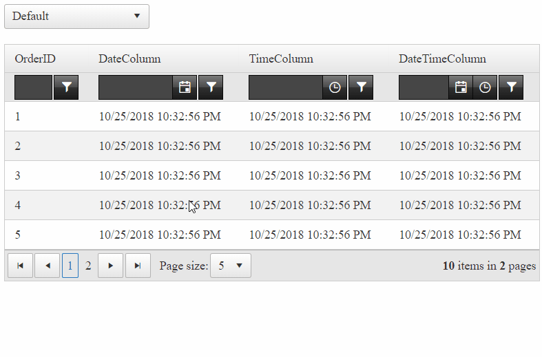

## How to

Change the skin of built-in filter controls of RadGrid, so that they will look different from the grid.

>caption Before



>caption After



## Solution

Generally, this can be easily achieved by using templates.  For example, defining a FilterTemplate:

````ASPX
<telerik:GridDateTimeColumn UniqueName="OrderDate" HeaderText="OrderDate" DataField="OrderDate">
    <FilterTemplate>
        <telerik:RadDateTimePicker ID="RadDateTimePicker1" runat="server" Skin="Black"></telerik:RadDateTimePicker>
    </FilterTemplate>
</telerik:GridDateTimeColumn>
````

In some cases, however, one would like to apply different skins to the built-in controls instead. It is no straight forward, since controls inside RadGrid inherit the grid's Skin and they will be styled in accordance to that.  
  
Here is how it's done:  
  
RadGrid defines the skin/styling to controls in the PreRender event, therefore, we will be overriding that using the Page\_PreRenderComplete event.  
  
>caption Page\_PreRenderComplete event handler

````C#
protected void Page_PreRenderComplete(object sender, EventArgs e)
{
    ////Execute logic only if Filtering is enabled and Filter type is Classic or Combined. These two options have FilterItem.
    if (RadGrid1.AllowFilteringByColumn && RadGrid1.FilterType == GridFilterType.Classic || RadGrid1.FilterType == GridFilterType.Combined)
    {
        // Access the Filtermenu and apply the skin on it
        RadGrid1.FilterMenu.Skin = "Black";
 
        // Reference to the filterItem
        GridFilteringItem filterItem = RadGrid1.MasterTableView.GetItems(GridItemType.FilteringItem)[0] as GridFilteringItem;
 
        // Loop through all the columns (that are to be rendered) of RadGrid
        foreach (GridColumn col in RadGrid1.MasterTableView.RenderColumns)
        {
            if (col is GridNumericColumn) // checking if the column is of type GridNumericColumn
            {
                RadNumericTextBox numericTextBox = filterItem[col.UniqueName].Controls[0] as RadNumericTextBox;
                numericTextBox.Skin = "Black";
            }
            else if (col is GridDateTimeColumn) // checking if the column is of type GridDateTimeColumn
            {
                // DateTime columns might have different controls depending on the column's PickerType property
 
                // if its DatePicker
                RadDatePicker datePicker = filterItem[col.UniqueName].Controls[0] as RadDatePicker;
                if (datePicker != null)
                {
                    datePicker.Skin = "Black"; // sets the Picker button's skin to Black
                    datePicker.DateInput.Skin = "Black"; // sets the Input/Textbox's skin to Black
                    datePicker.SharedCalendar.Skin = "Black"; // sets the Calendar's skin to Black
                }
 
                // if its DateTimePicker
                RadDateTimePicker dateTimePicker = filterItem[col.UniqueName].Controls[0] as RadDateTimePicker;
                if (dateTimePicker != null)
                {
                    dateTimePicker.Skin = "Black"; // sets the Picker button's skin to Black
                    dateTimePicker.DateInput.Skin = "Black"; // sets the Input/Textbox's skin to Black
                    dateTimePicker.SharedCalendar.Skin = "Black"; // sets the Calendar's skin to Black
 
                    /*
                     TimeView is a little different, we will replace the built-in with an custom one
                     */
 
                    // Create a TimeView
                    RadTimeView newTimeView = new RadTimeView()
                    {
                        TimeFormat = "HH:mm:ss",
                        StartTime = new TimeSpan(0, 0, 0),
                        EndTime = new TimeSpan(24, 0, 0),
                        Interval = new TimeSpan(1, 0, 0),
                        Skin = "Black"
                    };
                    // Add the TimeView control to the Cell's controls collection
                    dateTimePicker.Parent.Controls.Add(newTimeView);
                    // Set the shared TimeViewID to the new one
                    dateTimePicker.SharedTimeViewID = newTimeView.ID;
                    // set the SharedTimeView of the picker to be the new one
                    dateTimePicker.SharedTimeView = newTimeView;
                }
 
                // if its TimePicker
                RadTimePicker timePicker = filterItem[col.UniqueName].Controls[0] as RadTimePicker;
                if (timePicker != null)
                {
                    timePicker.Skin = "Black"; // sets the Picker button's skin to Black
                    timePicker.DateInput.Skin = "Black"; // sets the Input/Textbox's skin to Black
                    // Create a TimeView
                    RadTimeView newTimeView = new RadTimeView()
                    {
                        TimeFormat = "HH:mm:ss",
                        StartTime = new TimeSpan(0, 0, 0),
                        EndTime = new TimeSpan(24, 0, 0),
                        Interval = new TimeSpan(1, 0, 0),
                        Skin = "Black"
 
                    };
                    // Add the TimeView control to the Cell's controls collection
                    timePicker.Parent.Controls.Add(newTimeView);
                    // Set the shared TimeViewID to the new one
                    timePicker.SharedTimeViewID = newTimeView.ID;
                    // set the SharedTimeView of the picker to be the new one
                    timePicker.SharedTimeView = newTimeView;
                }
            }
        }
    }
}
````
````VB
Protected Sub Page_PreRenderComplete(ByVal sender As Object, ByVal e As EventArgs) Handles Me.PreRenderComplete
 
     'Execute logic only if Filtering is enabled and Filter type is Classic or Combined. These two options have FilterItem.
     If RadGrid1.AllowFilteringByColumn AndAlso RadGrid1.FilterType = GridFilterType.Classic OrElse RadGrid1.FilterType = GridFilterType.Combined Then
 
         'Access the Filtermenu and apply the skin on it
         RadGrid1.FilterMenu.Skin = "Black"
 
         'Reference to the filterItem
         Dim filterItem As GridFilteringItem = TryCast(RadGrid1.MasterTableView.GetItems(GridItemType.FilteringItem)(0), GridFilteringItem)
 
         'Loop through all the columns (that are to be rendered) of RadGrid
         For Each col As GridColumn In RadGrid1.MasterTableView.RenderColumns
 
             If TypeOf col Is GridNumericColumn Then 'checking if the column is of type GridNumericColumn
                 Dim numericTextBox As RadNumericTextBox = TryCast(filterItem(col.UniqueName).Controls(0), RadNumericTextBox)
                 numericTextBox.Skin = "Black"
             ElseIf TypeOf col Is GridDateTimeColumn Then 'checking if the column is of type GridDateTimeColumn
 
                 'DateTime columns might have different controls depending on the column's PickerType property
 
                 'if its DatePicker
                 Dim datePicker As RadDatePicker = TryCast(filterItem(col.UniqueName).Controls(0), RadDatePicker)
 
                 If datePicker IsNot Nothing Then
                     datePicker.Skin = "Black" 'sets the Picker button's skin to Black
                     datePicker.DateInput.Skin = "Black" 'sets the Input/Textbox's skin to Black
                     datePicker.SharedCalendar.Skin = "Black" 'sets the Calendar's skin to Black
                 End If
 
                 'if its DateTimePicker
                 Dim dateTimePicker As RadDateTimePicker = TryCast(filterItem(col.UniqueName).Controls(0), RadDateTimePicker)
 
                 If dateTimePicker IsNot Nothing Then
                     dateTimePicker.Skin = "Black" 'sets the Picker button's skin to Black
                     dateTimePicker.DateInput.Skin = "Black" 'sets the Input/Textbox's skin to Black
                     dateTimePicker.SharedCalendar.Skin = "Black" 'sets the Calendar's skin to Black
 
                     'TimeView is a little different, we will replace the built-in with an custom one
 
                     'Create a TimeView
                     Dim newTimeView As RadTimeView = New RadTimeView() With {
                         .TimeFormat = "HH:mm:ss",
                         .StartTime = New TimeSpan(0, 0, 0),
                         .EndTime = New TimeSpan(24, 0, 0),
                         .Interval = New TimeSpan(1, 0, 0),
                         .Skin = "Black"
                     }
 
                     'Add the TimeView control to the Cell's controls collection
                     dateTimePicker.Parent.Controls.Add(newTimeView)
                     'Set the shared TimeViewID to the new one
                     dateTimePicker.SharedTimeViewID = newTimeView.ID
                     'set the SharedTimeView of the picker to be the new one
                     dateTimePicker.SharedTimeView = newTimeView
                 End If
 
                 'if its TimePicker
                 Dim timePicker As RadTimePicker = TryCast(filterItem(col.UniqueName).Controls(0), RadTimePicker)
 
                 If timePicker IsNot Nothing Then
                     timePicker.Skin = "Black" 'sets the Picker button's skin to Black
                     timePicker.DateInput.Skin = "Black" 'sets the Input/Textbox's skin to Black
 
                     'Create a TimeView
                     Dim newTimeView As RadTimeView = New RadTimeView() With {
                         .TimeFormat = "HH:mm:ss",
                         .StartTime = New TimeSpan(0, 0, 0),
                         .EndTime = New TimeSpan(24, 0, 0),
                         .Interval = New TimeSpan(1, 0, 0),
                         .Skin = "Black"
                     }
                     'Add the TimeView control to the Cell's controls collection
                     timePicker.Parent.Controls.Add(newTimeView)
                     'Set the shared TimeViewID to the new one
                     timePicker.SharedTimeViewID = newTimeView.ID
                     'Set the SharedTimeView of the picker to be the new one
                     timePicker.SharedTimeView = newTimeView
                 End If
             End If
         Next
     End If
End Sub
````

It is not done yet, though! Assuming that, RadGrid will request the CSS Stylesheets for the Default Skin.Our controls will not have black unless we register them individually. For that purpose, we will request the necessary styles using RadStyleSheetManager.

````ASPX
<telerik:RadStyleSheetManager EnableStyleSheetCombine="false" runat="server">
    <StyleSheets>
        <%--Black Skin for the Input controls (RadInput)--%>
        <telerik:StyleSheetReference Assembly="Telerik.Web.UI.Skins" Name="Telerik.Web.UI.Skins.BlackLite.Input.Black.css" />
 
        <%--Black Skin for the RadGrid FilterMenu (RadMenu) control--%>
        <telerik:StyleSheetReference Assembly="Telerik.Web.UI.Skins" Name="Telerik.Web.UI.Skins.BlackLite.Menu.Black.css" />
    </StyleSheets>
</telerik:RadStyleSheetManager>
````

Well done! The RadTimePicker, RadDatePicker and RadDateTimePickers controls now have the Black Skin. 

There is one last thing we need to style. That is the Filter button residing next to the FilterControl. This button is a Web Control of type ElasticButton has no Skin property to assign one. RadGrid will style that by default, but, if you want to change the Style, you will need to override some of the CSS classes. To complete our scenario, we will be styling them same as in the Black skin. We've used some of the CSS rules that come with the RadGrid_Black stylesheet when the Grid's Skin is set to Black.

````CSS
/*
    style the buttons near the filter controls
    The rules from below have been taken from the "RadGrid_Black" CSS file
*/
.RadGrid .rgFilterRow .rgFilter:hover,
.RadGrid .rgFilterRow .rgFilter:focus {
    border-color: black;
    color: #fff;
    background-color: #020202;
    background-image: linear-gradient(#5c5c5c,#2a2a2c 50%,#060606 50%,#020202);
    box-shadow: none;
}

.RadGrid .rgFilterRow .rgFilter {
    border: 1px solid;
    border-color: #080808;
    color: #fff;
    background-color: #1b1b1b;
    background-image: linear-gradient(#7b7b7b,#4a4a4a 50%,#313131 50%,#1b1b1b);
    box-shadow: none;
}

.RadGrid .rgFilterRow button.rgActionButton {
    color: white;
}

.RadGrid .rgFilterRow .rgFilterActive,
.RadGrid .rgFilterRow .rgFilterActive:hover,
.RadGrid .rgFilterRow .rgFilterActive:focus {
    border-color: #070707;
    color: #9eda29;
    background-color: #202020;
    background-image: linear-gradient(#6e6e6e,#2b2b2d 50%,#050505 50%,#202020);
    box-shadow: inset 0 0 6px rgba(165,165,165,0.5);
}
````

#### Congratulations!

You've successfully changed the skins of the Built-in FilterControls in RadGrid. It wasn't that difficult after all, was it?



