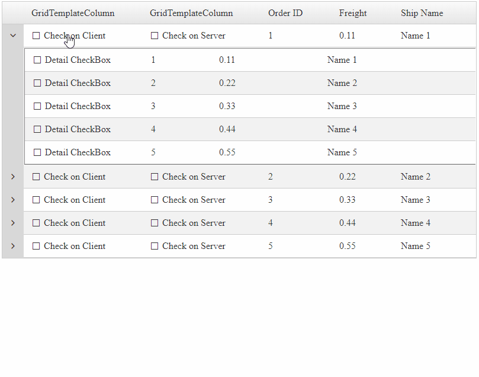

## DESCRIPTION

Check CheckBoxes of DetailTables using the CheckBox from the MasterTable row.



## SOLUTION

DOWNLOAD the sample: [grid-check-checkboxes-in-detailtables-from-mastertable-row-sample.zip](files/grid-check-checkboxes-in-detailtables-from-mastertable-row-sample.zip)

OR copy the code from below

HTM Markup:

````XML
<telerik:RadAjaxManager ID="RadAjaxManager1" runat="server">
    <AjaxSettings>
        <telerik:AjaxSetting AjaxControlID="RadGrid1">
            <UpdatedControls>
                <telerik:AjaxUpdatedControl ControlID="RadGrid1" LoadingPanelID="RadAjaxLoadingPanel1" />
            </UpdatedControls>
        </telerik:AjaxSetting>
    </AjaxSettings>
</telerik:RadAjaxManager>
 
<telerik:RadAjaxLoadingPanel ID="RadAjaxLoadingPanel1" runat="server" Skin="Default"></telerik:RadAjaxLoadingPanel>
 
<telerik:RadGrid ID="RadGrid1" runat="server" Width="800px"
    OnPreRender="RadGrid1_PreRender"
    OnNeedDataSource="RadGrid1_NeedDataSource"
    OnDetailTableDataBind="RadGrid1_DetailTableDataBind">
    <MasterTableView Name="MasterTable" AutoGenerateColumns="true" HierarchyLoadMode="Client">
        <Columns>
            <telerik:GridTemplateColumn UniqueName="TempalteColumn1" HeaderText="GridTemplateColumn">
                <HeaderStyle Width="200px" />
                <ItemTemplate>
                    <telerik:RadCheckBox ID="RadCheckBox1" runat="server" Text="Check on Client" AutoPostBack="false" OnClientCheckedChanged="OnClientCheckedChanged">
                    </telerik:RadCheckBox>
                </ItemTemplate>
            </telerik:GridTemplateColumn>
            <telerik:GridTemplateColumn UniqueName="TempalteColumn2" HeaderText="GridTemplateColumn">
                <HeaderStyle Width="200px" />
                <ItemTemplate>
                    <telerik:RadCheckBox ID="RadCheckBox2" runat="server" Text="Check on Server" OnCheckedChanged="RadCheckBox2_CheckedChanged"></telerik:RadCheckBox>
                </ItemTemplate>
            </telerik:GridTemplateColumn>
        </Columns>
        <DetailTables>
            <telerik:GridTableView Name="ChildTable" ShowHeader="false">
                <Columns>
                    <telerik:GridTemplateColumn UniqueName="TempalteColumn3" HeaderText="GridTemplateColumn">
                        <HeaderStyle Width="200px" />
                        <ItemTemplate>
                            <telerik:RadCheckBox ID="RadCheckBox3" runat="server" Text="Detail CheckBox"></telerik:RadCheckBox>
                        </ItemTemplate>
                    </telerik:GridTemplateColumn>
                </Columns>
            </telerik:GridTableView>
        </DetailTables>
    </MasterTableView>
</telerik:RadGrid>
````

JavaScript APIs to check the checkboxes on client-side.

````JavaScript
<script type="text/javascript">
    function OnClientCheckedChanged(sender, args) {
        // RadCheckBox element of MasterTable
        var masterCheckBox = sender.get_element();
        // checkbox checked value
        var isChecked = args.get_checked();
        // RadGrid element
        var gridElement = $(masterCheckBox).closest('.RadGrid')[0];
        // verify that the element exists and it has a property called control
        if (gridElement && gridElement.control) {
            // cast the grid element to RadGrid object
            var grid = gridElement.control;
            // Instantiate a GridDataItem class by calling the get_dataItems() method of MasterTable.
            grid.get_masterTableView().get_dataItems();
            // get reference to the current Master row element
            var rowElement = $(masterCheckBox).closest('tr')[0];
            // verify that the element exists and it has a property called control
            if (rowElement && rowElement.control) {
                // cast the row element to GridDataItem object
                var dataItem = rowElement.control;
                // get reference to the DetailTable of this item
                var detailTable = dataItem.get_nestedViews()[0];
                // get reference to DetailTable items collection
                var detailItems = detailTable.get_dataItems();
                // loop through each item
                for (var i = 0; i < detailItems.length; i++) {
                    var item = detailItems[i];
                    // find the RadCheckBox control
                    var detailCheckBox = $telerik.findControl(item.get_cell("TempalteColumn3"), "RadCheckBox3");
                    // Check the checkbox based on the Checked value
                    detailCheckBox.set_checked(isChecked);
                }
            }
        }
    }
</script>
````

Code behind

````C#
protected void RadGrid1_NeedDataSource(object sender, GridNeedDataSourceEventArgs e)
{
    RadGrid1.DataSource = OrdersTable();
}
protected void RadGrid1_DetailTableDataBind(object sender, Telerik.Web.UI.GridDetailTableDataBindEventArgs e)
{
    e.DetailTableView.DataSource = OrdersTable();
}
private DataTable OrdersTable()
{
    DataTable dt = new DataTable();
 
    dt.Columns.Add(new DataColumn("OrderID", typeof(int)));
    dt.Columns.Add(new DataColumn("Freight", typeof(decimal)));
    dt.Columns.Add(new DataColumn("ShipName", typeof(string)));
 
    dt.PrimaryKey = new DataColumn[] { dt.Columns["OrderID"] };
 
    for (int i = 0; i < 5; i++)
    {
        int index = i + 1;
 
        DataRow row = dt.NewRow();
 
        row["OrderID"] = index;
        row["Freight"] = index * 0.1 + index * 0.01;
        row["ShipName"] = "Name " + index;
 
        dt.Rows.Add(row);
    }
 
    return dt;
}
protected void RadGrid1_PreRender(object sender, EventArgs e)
{
    RadGrid1.MasterTableView.Items.OfType<GridDataItem>().First().Expanded = true;
}
protected void RadCheckBox2_CheckedChanged(object sender, EventArgs e)
{
    // cast sender to RadCheckBox control
    RadCheckBox masterCheckBox = (RadCheckBox)sender;
    // get reference to the current MasterTable item
    GridDataItem dataItem = masterCheckBox.NamingContainer as GridDataItem;
    // check whether it has child items/detail tables
    if (dataItem.HasChildItems)
    {
        // reference the DetailTable
        GridTableView detailTable = dataItem.ChildItem.NestedTableViews.First();
        // llop through the detailtable items
        foreach (GridDataItem item in detailTable.Items)
        {
            // find the checkbox of the item
            RadCheckBox detailCheckBox = item["TempalteColumn3"].FindControl("RadCheckBox3") as RadCheckBox;
            // check the checkbox based on the MasterCheckbox checked state
            detailCheckBox.Checked = masterCheckBox.Checked;
        }
    }
}
````
````VB
Protected Sub RadGrid1_NeedDataSource(ByVal sender As Object, ByVal e As GridNeedDataSourceEventArgs)
    RadGrid1.DataSource = OrdersTable()
End Sub
 
Protected Sub RadGrid1_DetailTableDataBind(ByVal sender As Object, ByVal e As Telerik.Web.UI.GridDetailTableDataBindEventArgs)
    e.DetailTableView.DataSource = OrdersTable()
End Sub
 
Private Function OrdersTable() As DataTable
    Dim dt As DataTable = New DataTable()
    dt.Columns.Add(New DataColumn("OrderID", GetType(Integer)))
    dt.Columns.Add(New DataColumn("Freight", GetType(Decimal)))
    dt.Columns.Add(New DataColumn("ShipName", GetType(String)))
    dt.PrimaryKey = New DataColumn() {dt.Columns("OrderID")}
 
    For i As Integer = 0 To 5 - 1
        Dim index As Integer = i + 1
        Dim row As DataRow = dt.NewRow()
        row("OrderID") = index
        row("Freight") = index * 0.1 + index * 0.01
        row("ShipName") = "Name " & index
        dt.Rows.Add(row)
    Next
 
    Return dt
End Function
 
Protected Sub RadGrid1_PreRender(ByVal sender As Object, ByVal e As EventArgs)
    RadGrid1.MasterTableView.Items.OfType(Of GridDataItem)().First().Expanded = True
End Sub
 
Protected Sub RadCheckBox2_CheckedChanged(ByVal sender As Object, ByVal e As EventArgs)
    Dim masterCheckBox As RadCheckBox = CType(sender, RadCheckBox)
    Dim dataItem As GridDataItem = TryCast(masterCheckBox.NamingContainer, GridDataItem)
 
    If dataItem.HasChildItems Then
        Dim detailTable As GridTableView = dataItem.ChildItem.NestedTableViews.First()
 
        For Each item As GridDataItem In detailTable.Items
            Dim detailCheckBox As RadCheckBox = TryCast(item("TempalteColumn3").FindControl("RadCheckBox3"), RadCheckBox)
            detailCheckBox.Checked = masterCheckBox.Checked
        Next
    End If
End Sub
````
 
