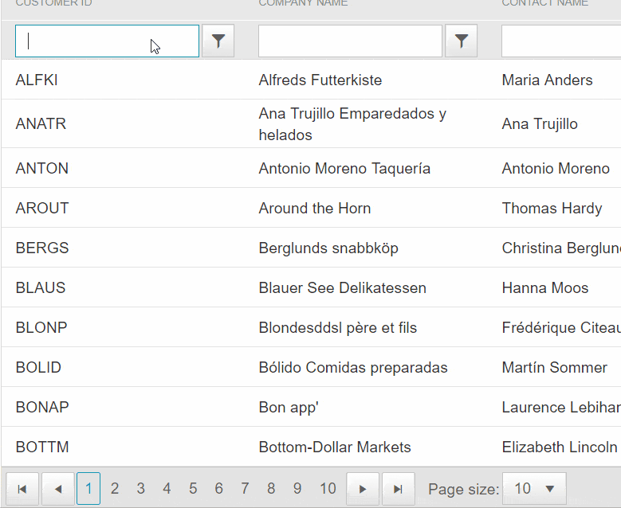

## Problem

On Radgrid with client side binding - if you filter the grid and find no records, then remove the filter to have data back, the paging is not recreated.

Repro steps:

1. go to the RadClientDataSource binding demo: [Binding to Telerik ClientDataSource](https://demos.telerik.com/aspnet-ajax/grid/examples/data-binding/client-side/client-data-source-binding/defaultcs.aspx)
2. filter a column so there is no data in the grid
3. remove the filter


**Actual**: the pager is gone

**Expected**: the pager is there

Visualization of the problem:



## Solution

Add a handler to the [OnCommand client-side event]() of the grid and show the pager:

````ASPX
<script>
    function OnCommandHandler(sender, args) {
        if (args.get_commandName() == "Filter") {
            $telerik.$(sender.get_element()).find(".rgPager").show();
        }
    }
</script>
<telerik:RadGrid RenderMode="Lightweight" ID="RadGrid1" runat="server">
    <ClientSettings>
        <ClientEvents OnCommand="OnCommandHandler" />
    </ClientSettings>
</telerik:RadGrid>
````

## See Also

 - [ClientDataSource binding and batch editing: page is reset to 1 after deleting a record]()


