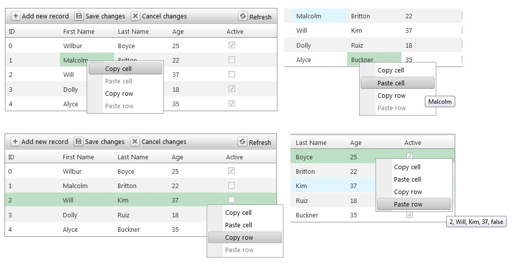

## Environment

<table>
	<tbody>
		<tr>
			<td>Product</td>
			<td>Telerik WebForms Grid for ASP.NET AJAX</td>
		</tr>
	</tbody>
</table>

## Description

This article demonstrates how to implement Copy-Paste functionality for cells and rows for the **Grid**, utilizing Batch Edit Mode with **ContextMenu**.



## Solution

For implementing this functionality we need a **RadContextMenu** control, which will be used for displaying the options for copy-pasting cell/row data. The ContextMenu must be manually shown within the client-side [`OnRowContextMenu`]() client-side event of the Grid.

By default, ”Paste Cell” and “Paste Row” options are disabled and will be enabled only after a cell or a row is copied.

For highlighting the target and copied cell/row, custom CSS classes are added to the elements when hovering over the “Copy Row”, (“Copy Cell”), “Paste Cell” and “Paste Row” items in the **RadContextMenu**. The cell/row from which the data is going to be pasted is also highlighted.

Below are the 2 different versions of such implementation.

**Version 1**

In the first version, the user is allowed to copy individual cell and paste the value in any cell. The RadContextMenu exposes the following options:

- Copy cell
- Paste cell
- Copy row
- Paste row

````ASP.NET
<telerik:RadContextMenu runat="server" ID="RadContextMenu1" OnClientMouseOver="demo.mouseOver" OnClientHidden="demo.hidden"
    OnClientMouseOut="demo.mouseOut" OnClientItemClicked="demo.itemClicked">
    <Items>
        <telerik:RadMenuItem Text="Copy cell" Value="CopyCell"></telerik:RadMenuItem>
        <telerik:RadMenuItem Text="Paste cell" Value="PasteCell" Enabled="false"></telerik:RadMenuItem>
        <telerik:RadMenuItem Text="Copy row" Value="CopyRow"></telerik:RadMenuItem>
        <telerik:RadMenuItem Text="Paste row" Value="PasteRow" Enabled="false"></telerik:RadMenuItem>
    </Items>
</telerik:RadContextMenu>

<telerik:RadGrid runat="server" ID="RadGrid1" OnNeedDataSource="RadGrid1_NeedDataSource" Width="500px">
    <MasterTableView EditMode="Batch" CommandItemDisplay="Top">
        <BatchEditingSettings EditType="Row" />
    </MasterTableView>
    <ClientSettings>
        <ClientEvents OnRowContextMenu="demo.rowContextMenu" />
    </ClientSettings>
</telerik:RadGrid>
````

````JavaScript
var demo = (function () {
    var copiedCell = null;
    var copiedCellValue;
    var copiedDataItem = null;
    var currentTargetCell;
    var currentTargetCellValue;
    var currentTargetDataItem;
    var batchManager;
    var applyHoverStyles;

    window.pageLoad = function () {
        batchManager = $find("<%=RadGrid1.ClientID%>").get_batchEditingManager();
    }

    // creates a string representation of the copied row, which will be displayed as a tooltip for the "Paste Row" item
    function createRowItemToolTip(row) {
        var content = [];
        for (var i = 0; i < row.cells.length; i++) {
            content.push(batchManager.getCellValue(row.cells[i]));
        }

        return content.join(", ");
    }

    // clears all custom styles added to cells/rows
    function clearStyles() {
        if (copiedCell != null) {
            copiedCell.className = copiedCell.className.replace("toPasteFrom", "");
        }

        if (copiedDataItem != null) {
            copiedDataItem.get_element().className = copiedDataItem.get_element().className.replace("toPasteFrom", "");
        }

        currentTargetDataItem.get_element().className = currentTargetDataItem.get_element().className.replace("toBeCopied", "");
        currentTargetCell.className = currentTargetCell.className.replace("toBeCopied", "");
    }

    return {
        rowContextMenu: function (sender, args) {
            applyHoverStyles = true;
            var contextMenu = $find("<%=RadContextMenu1.ClientID%>");
            contextMenu.show(args.get_domEvent());
            currentTargetCell = Telerik.Web.UI.Grid.GetFirstParentByTagName(args.get_domEvent().target, "TD");
            currentTargetCellValue = batchManager.getCellValue(currentTargetCell);
            currentTargetDataItem = args.get_gridDataItem();
        },

        itemClicked: function (sender, args) {
            applyHoverStyles = false;
            var clickedValue = args.get_item().get_value();
            if (clickedValue == "CopyCell") {
                copiedCell = currentTargetCell;
                copiedCellValue = currentTargetCellValue;
                sender.get_items().getItem(1).set_enabled(true);
                sender.get_items().getItem(1).get_element().setAttribute("title", copiedCellValue);
            } else if (clickedValue == "PasteCell") {
                batchManager.changeCellValue(currentTargetCell, copiedCellValue);
            } else if (clickedValue == "CopyRow") {
                copiedDataItem = currentTargetDataItem;
                sender.get_items().getItem(3).set_enabled(true);
                sender.get_items().getItem(3).get_element().setAttribute("title", createRowItemToolTip(copiedDataItem.get_element())
            } else {
                var copiedRow = copiedDataItem.get_element();
                var currentRow = currentTargetDataItem.get_element();
                for (var i = 0; i < copiedRow.cells.length; i++) {
                    batchManager.changeCellValue(currentRow.cells[i], batchManager.getCellValue(copiedRow.cells[i]));
                }
            }

            clearStyles();
        },

        //used for changing the style for the target cell
        mouseOver: function (sender, args) {
            if (applyHoverStyles) {
                var hoverValue = args.get_item().get_value();
                if (hoverValue == "CopyCell") {
                    currentTargetCell.className += " toBeCopied";
                } else if (hoverValue == "PasteCell") {
                    currentTargetCell.className += " toBeCopied";
                    copiedCell.className += " toPasteFrom";
                } else if (hoverValue == "CopyRow") {
                    currentTargetDataItem.get_element().className += " toBeCopied";
                } else if (hoverValue == "PasteRow") {
                    copiedDataItem.get_element().className += " toPasteFrom";
                    currentTargetDataItem.get_element().className += " toBeCopied";
                }
            }
        },

        mouseOut: function (sender, args) {
            clearStyles();
        },

        hidden: function () {
            clearStyles();
        }
    }
})();
````

**Version 2**

The second version is more strict and will allow the user to copy and paste cell values only from the same column. In this version, the user will have the listed below options:

- Copy
- Paste cell
- Paste row

````ASP.NET
<telerik:RadContextMenu runat="server" ID="RadContextMenu1" OnClientMouseOver="demo.mouseOver" OnClientHidden="demo.hidden"
    OnClientMouseOut="demo.mouseOut" OnClientItemClicked="demo.itemClicked">
    <Items>
        <telerik:RadMenuItem Text="Copy" Value="CopyRow"></telerik:RadMenuItem>
        <telerik:RadMenuItem Text="Paste Cell" Value="PasteCell" Enabled="false"></telerik:RadMenuItem>
        <telerik:RadMenuItem Text="Paste Row" Value="PasteRow" Enabled="false"></telerik:RadMenuItem>
    </Items>
</telerik:RadContextMenu>

<telerik:RadGrid runat="server" ID="RadGrid1" OnNeedDataSource="RadGrid1_NeedDataSource" Width="500px">
    <MasterTableView EditMode="Batch" CommandItemDisplay="Top">
        <BatchEditingSettings EditType="Row" />
    </MasterTableView>
    <ClientSettings>
        <ClientEvents OnRowContextMenu="demo.rowContextMenu" />
    </ClientSettings>
</telerik:RadGrid>
````

````JavaScript
var demo = (function () {
    var copiedCell = null;
    var copiedCellValue;
    var copiedItem = null;
    var targetCell;
    var targetCellIndex;
    var targetDataItem;
    var batchManager;
    var applyHoverStyles;

    window.pageLoad = function () {
        batchManager = $find("<%=RadGrid1.ClientID%>").get_batchEditingManager();
                }

                // creates a string representation of the copied row, which will be displayed as a tooltip for the "Paste Row" item
                function createTooltip(row) {
                    var content = [];
                    for (var i = 0; i < row.cells.length; i++) {
                        content.push(batchManager.getCellValue(row.cells[i]));
                    }

                    return content.join(", ");
                }

                // clears all custom styles added to cells/rows
                function clearStyles() {
                    if (copiedItem != null) {
                        copiedItem.get_element().cells[targetCellIndex].className
                            = copiedItem.get_element().cells[targetCellIndex].className.replace("toPasteFrom", "");
                        copiedItem.get_element().className = copiedItem.get_element().className.replace("toPasteFrom", "");
                    }

                    targetDataItem.get_element().className = targetDataItem.get_element().className.replace("toBeCopied", "");
                    targetCell.className = targetCell.className.replace("toBeCopied", "");
                }

                function getItemValue(item, index) {
                    return batchManager.getCellValue(item.get_element().cells[index]);
                }

                return {
                    rowContextMenu: function (sender, args) {
                        applyHoverStyles = true;
                        var contextMenu = $find("<%=RadContextMenu1.ClientID%>");
            contextMenu.show(args.get_domEvent());
            targetCell = Telerik.Web.UI.Grid.GetFirstParentByTagName(args.get_domEvent().target, "TD");
            targetCellIndex = targetCell.cellIndex;
            targetDataItem = args.get_gridDataItem();
        },

        itemClicked: function (sender, args) {
            var clickedValue = args.get_item().get_value();
            applyHoverStyles = false;
            if (clickedValue == "PasteCell") {
                batchManager.changeCellValue(targetCell, getItemValue(copiedItem, targetCellIndex));
            } else if (clickedValue == "CopyRow") {
                var items = sender.get_items();
                copiedItem = targetDataItem;
                items.getItem(1).set_enabled(true);
                items.getItem(1).get_element().setAttribute("title", getItemValue(copiedItem, targetCellIndex));
                items.getItem(2).set_enabled(true);
                items.getItem(2).get_element().setAttribute("title", createTooltip(copiedItem.get_element()));
            } else {
                var copiedRow = copiedItem.get_element();
                var currentRow = targetDataItem.get_element();
                for (var i = 0; i < copiedRow.cells.length; i++) {
                    batchManager.changeCellValue(currentRow.cells[i], batchManager.getCellValue(copiedRow.cells[i]));
                }
            }

            clearStyles();
        },

        //used for changing the style for the target cell
        mouseOver: function (sender, args) {
            if (applyHoverStyles) {
                var hoverValue = args.get_item().get_value();
                if (hoverValue == "PasteCell") {
                    targetCell.className += " toBeCopied";
                    copiedItem.get_element().cells[targetCellIndex].className += " toPasteFrom";
                } else if (hoverValue == "CopyRow") {
                    targetDataItem.get_element().className += " toBeCopied";
                } else if (hoverValue == "PasteRow") {
                    copiedItem.get_element().className += " toPasteFrom";
                    targetDataItem.get_element().className += " toBeCopied";
                }
            }
        },

        mouseOut: function (sender, args) {
            clearStyles();
        },

        hidden: function () {
            clearStyles();
        }
    }
})();
````

Both implementations use the following styling and server code: 

````CSS
html body .toBeCopied {
    background: #bde0c5;
}

html body .toPasteFrom {
    background: #e0f6ff;
}
````

````C#
protected void RadGrid1_NeedDataSource(object sender, GridNeedDataSourceEventArgs e)
{
    DataTable table = new DataTable();

    table.Columns.Add("ID", typeof(int));
    table.Columns.Add("FirstName", typeof(string));
    table.Columns.Add("LastName", typeof(string));
    table.Columns.Add("Age", typeof(int));
    table.Columns.Add("Active", typeof(bool));

    table.Rows.Add(0, "Wilbur", "Boyce", 25, true);
    table.Rows.Add(1, "Malcolm", "Britton", 22, false);
    table.Rows.Add(2, "Will", "Kim", 37, false);
    table.Rows.Add(3, "Dolly", "Ruiz", 18, true);
    table.Rows.Add(4, "Alyce", "Buckner", 35, true);

    (sender as RadGrid).DataSource = table;
}
````
 

   
