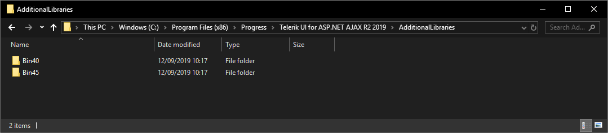
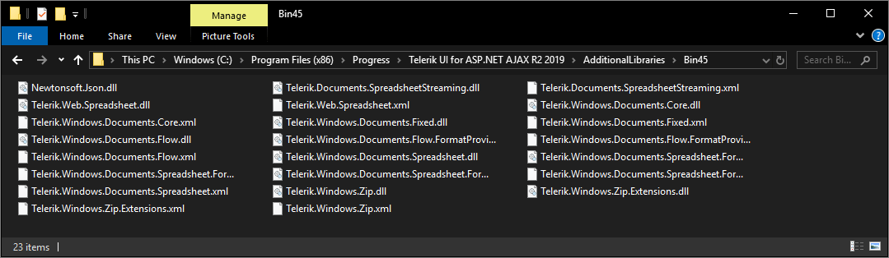

## Environment
<table>
	<tbody>
		<tr>
			<td>Product</td>
			<td>RadGrid for ASP.NET AJAX, Telerik Document Processing</td>
		</tr>
	</tbody>
</table>


## Description

RadGrid comes with a built-in functionality for exporting its content to PDF: [PDF Export](). This works great, however, in some cases, one would like to customize the PDF content further and change properties other than the RadGrid provides.

The answer is [RadSpreadProcessing - Telerik Document Processing](https://docs.telerik.com/devtools/document-processing/libraries/radspreadprocessing/overview)

## Solution

**Assembly References**

In order to use the model of the RadSpreadProcessing library in your project, you need to add references to the following assemblies ([RadSpreadProcessing- Assembly References](https://docs.telerik.com/devtools/document-processing/libraries/radspreadprocessing/getting-started#assembly-references)):

The assemblies for the the Telerik Document Processing can be found in the Additional Libraries Folder inside the Telerik installation directory:

Assemblies for .NET versions 4.0 and 4.5+



Assembly files




To describe different colors, shapes and other properties, RadSpreadProcessing depends on the listed below .NET assemblies, which you should also refer in your project:

- WindowsBase.dll
- PresentationCore.dll
- PresentationFramework.dll

These assemblies are included in the .NET framework installed on the computer.

**Grid Markup**

````ASP.NET
<telerik:RadGrid ID="RadGrid1" runat="server" AllowPaging="True" OnNeedDataSource="RadGrid1_NeedDataSource" OnItemCommand="RadGrid1_ItemCommand">
    <ExportSettings
        IgnorePaging="true"
        OpenInNewWindow="false">
        <Pdf
            BorderColor="Black"
            BorderStyle="Thin"
            ForceTextWrap="true"
            PageHeaderMargin="20"
            PageFooterMargin="20"
            PageTopMargin="50"
            PageLeftMargin="100"
            PageRightMargin="100"
            PageBottomMargin="50"
            PaperSize="A4">
            <PageHeader>
                <LeftCell TextAlign="Left" Text="Header Left Text" />
                <MiddleCell Text="Header Middle Text" />
                <RightCell Text="Header Right Text" TextAlign="Right" />
            </PageHeader>
            <PageFooter>
                <LeftCell TextAlign="Left" Text="Footer Left Text" />
                <MiddleCell Text="Footer Middle Text" />
                <RightCell Text="Footer Right Text" TextAlign="Right" />
            </PageFooter>
        </Pdf>
    </ExportSettings>
    <MasterTableView AutoGenerateColumns="False" DataKeyNames="OrderID" CommandItemDisplay="Top">
        <CommandItemSettings ShowExportToPdfButton="true" />
        <Columns>
            <telerik:GridBoundColumn DataField="OrderID" DataType="System.Int32" 
                FilterControlAltText="Filter OrderID column" HeaderText="OrderID"
                ReadOnly="True" SortExpression="OrderID" UniqueName="OrderID">
            </telerik:GridBoundColumn>
            <telerik:GridDateTimeColumn DataField="OrderDate" DataType="System.DateTime"
                FilterControlAltText="Filter OrderDate column" HeaderText="OrderDate"
                SortExpression="OrderDate" UniqueName="OrderDate">
            </telerik:GridDateTimeColumn>
            <telerik:GridNumericColumn DataField="Freight" DataType="System.Decimal"
                FilterControlAltText="Filter Freight column" HeaderText="Freight"
                SortExpression="Freight" UniqueName="Freight">
            </telerik:GridNumericColumn>
            <telerik:GridBoundColumn DataField="ShipName"
                FilterControlAltText="Filter ShipName column" HeaderText="ShipName"
                SortExpression="ShipName" UniqueName="ShipName">
            </telerik:GridBoundColumn>
            <telerik:GridBoundColumn DataField="ShipCountry"
                FilterControlAltText="Filter ShipCountry column" HeaderText="ShipCountry"
                SortExpression="ShipCountry" UniqueName="ShipCountry">
            </telerik:GridBoundColumn>
        </Columns>
    </MasterTableView>
</telerik:RadGrid>
````

**Code Behind**

````C#
using System;
using System.Data;
using System.Linq;
using System.Text;
using System.IO;
using Telerik.Web.UI;
using Telerik.Windows.Documents.Spreadsheet.Model;
using Telerik.Windows.Documents.Spreadsheet.FormatProviders.Pdf;
using Telerik.Windows.Documents.Spreadsheet.FormatProviders.OpenXml.Xlsx;
using Telerik.Windows.Documents.Spreadsheet.Model.Printing;
using Telerik.Windows.Documents.Spreadsheet.PropertySystem;
using Telerik.Windows.Documents.Spreadsheet.Theming;
using System.Windows.Media;

public partial class Default : System.Web.UI.Page
{
    protected void RadGrid1_NeedDataSource(object sender, GridNeedDataSourceEventArgs e)
    {
        RadGrid1.DataSource = OrdersTable();
    }

    private DataTable OrdersTable()
    {
        DataTable dt = new DataTable();

        dt.Columns.Add(new DataColumn("OrderID", typeof(int)));
        dt.Columns.Add(new DataColumn("OrderDate", typeof(DateTime)));
        dt.Columns.Add(new DataColumn("Freight", typeof(decimal)));
        dt.Columns.Add(new DataColumn("ShipName", typeof(string)));
        dt.Columns.Add(new DataColumn("ShipCountry", typeof(string)));

        dt.PrimaryKey = new DataColumn[] { dt.Columns["OrderID"] };

        for (int i = 0; i < 70; i++)
        {
            int index = i + 1;

            DataRow row = dt.NewRow();

            row["OrderID"] = index;
            row["OrderDate"] = new DateTime(DateTime.Now.Year, DateTime.Now.Month, DateTime.Now.Day, 0, 0, 0).AddHours(index);
            row["Freight"] = index * 0.1 + index * 0.01;
            row["ShipName"] = "Long Name For ShipName " + index;
            row["ShipCountry"] = "Quick Brown Fox from Country " + index + " Jumps Over The Lazy Dog " + index;

            dt.Rows.Add(row);
        }

        return dt;
    }

    private void ExportToPdfUsingDPL(RadGrid grid)
    {
        // Get the XLSX Output using the GenerateXlsxOutput() method
        string gridXlsxOutput = grid.MasterTableView.GenerateXlsxOutput();

        var GridPdfSettings = grid.ExportSettings.Pdf;

        // Create the XLSX provider that will export the XLSX output
        XlsxFormatProvider xlsxProvider = new XlsxFormatProvider();

        // Export the XLSX output to a WorkBook object
        Workbook gridWorkbook = xlsxProvider.Import(Encoding.Default.GetBytes(gridXlsxOutput));

        // Create a Theme for the Page
        string themeName = "GridExportXlsx";

        // Theme Color Scheme
        ThemeColorScheme colorScheme = new ThemeColorScheme(
           themeName, // Theme Name
           Colors.Black,     // background 1 
           Colors.Blue,      // text 1 
           Colors.Brown,     // background 2 
           Colors.Cyan,      // text 2 
           Colors.DarkGray,  // accent 1 
           Colors.Gray,      // accent 2 
           Colors.Green,     // accent 3 
           Colors.LightGray, // accent 4 
           Colors.Magenta,   // accent 5 
           Colors.Orange,    // accent 6 
           Colors.Purple,    // hyperlink 
           Colors.Red);      // followedHyperlink 

		// Theme Font Scheme
        ThemeFontScheme fontScheme = new ThemeFontScheme(
            themeName, // Theme name
            "Times New Roman",  // latinMajor 
            "Arial");           // latinMinor 

        // Create a Document Theme and pass the themename and scheemes to it
        DocumentTheme theme = new DocumentTheme(
            themeName, // theme name
            colorScheme, // Color Scheme
            fontScheme // Font Scheme
            );

        // Set the Workbook's theme to the Custom theme
        gridWorkbook.Theme = theme;

        // create a Style for the cells
        string styleName = "SomeName";

        CellStyle cellStyle = gridWorkbook.Styles.Add(styleName, CellStyleCategory.Custom);

        cellStyle.BeginUpdate();

        // Define borders for the CellStyle
        CellBorder border = new CellBorder(CellBorderStyle.Thin, new ThemableColor(ThemeColorType.Text2));
        cellStyle.LeftBorder = border;
        cellStyle.TopBorder = border;
        cellStyle.RightBorder = border;
        cellStyle.BottomBorder = border;

        ThemableColor patternColor = new ThemableColor(ThemeColorType.Accent5);
        ThemableColor backgroundColor = new ThemableColor(ThemeColorType.Accent1, ColorShadeType.Shade1);

        // Define background color for the cells
        IFill fill = new PatternFill(PatternType.ThinDiagonalStripe, patternColor, backgroundColor);
        cellStyle.Fill = fill;

        // Define text alignment for the cell
        cellStyle.HorizontalAlignment = RadHorizontalAlignment.Center;
        cellStyle.VerticalAlignment = RadVerticalAlignment.Center;

        cellStyle.EndUpdate();


        int columnsCount = grid.MasterTableView.RenderColumns.Where(x => x.Visible).Count();

        gridWorkbook.ActiveWorksheet.Cells[1, 0, grid.Items.Count + 1, columnsCount - 1].SetStyleName(styleName);

 		// Get reference to the Worksheet
        Worksheet worksheet = gridWorkbook.ActiveWorksheet;

        // Page Margins
        worksheet.WorksheetPageSetup.Margins = new PageMargins(
            GridPdfSettings.PageLeftMargin.Value,
            GridPdfSettings.PageTopMargin.Value,
            GridPdfSettings.PageRightMargin.Value,
            GridPdfSettings.PageBottomMargin.Value,
            GridPdfSettings.PageHeaderMargin.Value,
            GridPdfSettings.PageFooterMargin.Value
            );

        // Change Page Orientation
        worksheet.WorksheetPageSetup.PageOrientation = Telerik.Windows.Documents.Model.PageOrientation.Landscape;

        // Page Size
        switch (GridPdfSettings.PaperSize)
        {
            case GridPaperSize.Letter:
                worksheet.WorksheetPageSetup.PaperType = Telerik.Windows.Documents.Model.PaperTypes.Letter;
                break;
            case GridPaperSize.A4:
                worksheet.WorksheetPageSetup.PaperType = Telerik.Windows.Documents.Model.PaperTypes.A4;
                break;
            case GridPaperSize.A5:
                worksheet.WorksheetPageSetup.PaperType = Telerik.Windows.Documents.Model.PaperTypes.A5;
                break;
            default:
                worksheet.WorksheetPageSetup.PaperType = Telerik.Windows.Documents.Model.PaperTypes.A4;
                break;
        }

        HeaderFooterSettings settings = worksheet.WorksheetPageSetup.HeaderFooterSettings;

        // Add Headers if defined in the Markup
        var pageHeader = GridPdfSettings.PageHeader;
        settings.Header.LeftSection.Text = pageHeader.LeftCell.Text;
        settings.Header.CenterSection.Text = pageHeader.MiddleCell.Text;
        settings.Header.RightSection.Text = pageHeader.RightCell.Text;

        // Add Footer if defined in the Markup
        var pageFooter = GridPdfSettings.PageFooter;
        settings.Footer.LeftSection.Text = pageFooter.LeftCell.Text;
        settings.Footer.CenterSection.Text = pageFooter.MiddleCell.Text;
        settings.Footer.RightSection.Text = pageFooter.RightCell.Text;


        // AutoFit Columns if Grid Table Layout is Auto
        if (grid.MasterTableView.TableLayout == GridTableLayout.Auto)
        {
            ColumnSelection columnSelection = worksheet.Columns[1, 6];
            columnSelection.AutoFitWidth();
        }


        // Prepare the data to be exported
        byte[] data = null;
        using (MemoryStream ms = new MemoryStream())
        {
            PdfFormatProvider pdfProvider = new PdfFormatProvider();
            pdfProvider.Export(gridWorkbook, ms);
            data = ms.ToArray();
        }

        string downloadOrOpen = grid.ExportSettings.OpenInNewWindow ? "attachment" : "inline";

        // send the data in the response for download
        Response.ContentType = "application/pdf";
        Response.Headers.Remove("Content-Disposition");
        Response.AppendHeader("Content-Disposition", downloadOrOpen + "; filename=" + grid.ExportSettings.FileName + ".pdf");
        Response.BinaryWrite(data);
        Response.End();
    }

    protected void RadGrid1_ItemCommand(object sender, GridCommandEventArgs e)
    {
        if (e.CommandName == RadGrid.ExportToPdfCommandName)
        {
            e.Canceled = true;
            ExportToPdfUsingDPL((sender as RadGrid));
        }
    }
}
````
````VB
Imports System.Data
Imports System.IO
Imports Telerik.Web.UI
Imports Telerik.Windows.Documents.Spreadsheet.Model
Imports Telerik.Windows.Documents.Spreadsheet.FormatProviders.Pdf
Imports Telerik.Windows.Documents.Spreadsheet.FormatProviders.OpenXml.Xlsx
Imports Telerik.Windows.Documents.Spreadsheet.Model.Printing
Imports Telerik.Windows.Documents.Spreadsheet.PropertySystem
Imports Telerik.Windows.Documents.Spreadsheet.Theming
Imports System.Windows.Media

Partial Class Default2
    Inherits System.Web.UI.Page

    Protected Sub RadGrid1_NeedDataSource(ByVal sender As Object, ByVal e As GridNeedDataSourceEventArgs)
        RadGrid1.DataSource = OrdersTable()
    End Sub
    Private Function OrdersTable() As DataTable
        Dim dt As DataTable = New DataTable()
        dt.Columns.Add(New DataColumn("OrderID", GetType(Integer)))
        dt.Columns.Add(New DataColumn("OrderDate", GetType(DateTime)))
        dt.Columns.Add(New DataColumn("Freight", GetType(Decimal)))
        dt.Columns.Add(New DataColumn("ShipName", GetType(String)))
        dt.Columns.Add(New DataColumn("ShipCountry", GetType(String)))
        dt.PrimaryKey = New DataColumn() {dt.Columns("OrderID")}

        For i As Integer = 0 To 70 - 1
            Dim index As Integer = i + 1
            Dim row As DataRow = dt.NewRow()
            row("OrderID") = index
            row("OrderDate") = New DateTime(DateTime.Now.Year, DateTime.Now.Month, DateTime.Now.Day, 0, 0, 0).AddHours(index)
            row("Freight") = index * 0.1 + index * 0.01
            row("ShipName") = "Long Name For ShipName " & index
            row("ShipCountry") = "Quick Brown Fox from Country " & index & " Jumps Over The Lazy Dog " & index
            dt.Rows.Add(row)
        Next

        Return dt
    End Function

    Private Sub ExportToPdfUsingDPL(ByVal grid As RadGrid)
        'Get the XLSX Output using the GenerateXlsxOutput() method
        Dim gridXlsxOutput As String = grid.MasterTableView.GenerateXlsxOutput()

        Dim GridPdfSettings = grid.ExportSettings.Pdf

        'Create the XLSX provider that will export the XLSX output
        Dim xlsxProvider As XlsxFormatProvider = New XlsxFormatProvider()

        'Export the XLSX output to a WorkBook object
        Dim gridWorkbook As Workbook = xlsxProvider.Import(Encoding.[Default].GetBytes(gridXlsxOutput))

        'THEME
        'Theme name
        Dim themeName As String = "GridExportXlsx"

        'Theme Color Scheme
        Dim colorScheme As ThemeColorScheme = New ThemeColorScheme(themeName, Colors.Black, Colors.Blue, Colors.Brown, Colors.Cyan, Colors.DarkGray, Colors.Gray, Colors.Green, Colors.LightGray, Colors.Magenta, Colors.Orange, Colors.Purple, Colors.Red)

        'Theme Font Scheme
        Dim fontScheme As ThemeFontScheme = New ThemeFontScheme(themeName, "Times New Roman", "Arial")

        'Create a DocumentTheme object and pass the themename and scheemes to it
        Dim theme As DocumentTheme = New DocumentTheme(themeName, colorScheme, fontScheme)

        'Set the Workbook's theme to the Custom theme
        gridWorkbook.Theme = theme


        Dim styleName As String = "SomeName"

        Dim cellStyle As CellStyle = gridWorkbook.Styles.Add(styleName, CellStyleCategory.Custom)
        cellStyle.BeginUpdate()

        Dim border As CellBorder = New CellBorder(CellBorderStyle.Thin, New ThemableColor(ThemeColorType.Text2))
        cellStyle.LeftBorder = border
        cellStyle.TopBorder = border
        cellStyle.RightBorder = border
        cellStyle.BottomBorder = border

        Dim patternColor As ThemableColor = New ThemableColor(ThemeColorType.Accent5)

        'Dim backgroundColor As ThemableColor = New ThemableColor(ThemeColorType.Accent1, ColorShadeType.Shade1)
        Dim backgroundColor As ThemableColor = New ThemableColor(ThemeColorType.Accent1)

        Dim fill As IFill = New PatternFill(PatternType.ThinDiagonalStripe, patternColor, backgroundColor)
        cellStyle.Fill = fill
        cellStyle.HorizontalAlignment = RadHorizontalAlignment.Center
        cellStyle.VerticalAlignment = RadVerticalAlignment.Center
        cellStyle.EndUpdate()

        Dim columnsCount As Integer = grid.MasterTableView.RenderColumns.Where(Function(x) x.Visible).Count()
        gridWorkbook.ActiveWorksheet.Cells(1, 0, grid.Items.Count + 1, columnsCount - 1).SetStyleName(styleName)

        'Get reference to the Worksheet
        Dim worksheet As Worksheet = gridWorkbook.ActiveWorksheet

        worksheet.WorksheetPageSetup.Margins = New PageMargins(GridPdfSettings.PageLeftMargin.Value,
                                                               GridPdfSettings.PageTopMargin.Value,
                                                               GridPdfSettings.PageRightMargin.Value,
                                                               GridPdfSettings.PageBottomMargin.Value,
                                                               GridPdfSettings.PageHeaderMargin.Value,
                                                               GridPdfSettings.PageFooterMargin.Value)

        'Change Page Orientation
        worksheet.WorksheetPageSetup.PageOrientation = Telerik.Windows.Documents.Model.PageOrientation.Landscape

        'Page Size Based on the PDF settings defined in the Grid
        Select Case GridPdfSettings.PaperSize
            Case GridPaperSize.Letter
                worksheet.WorksheetPageSetup.PaperType = Telerik.Windows.Documents.Model.PaperTypes.Letter
            Case GridPaperSize.A4
                worksheet.WorksheetPageSetup.PaperType = Telerik.Windows.Documents.Model.PaperTypes.A4
            Case GridPaperSize.A5
                worksheet.WorksheetPageSetup.PaperType = Telerik.Windows.Documents.Model.PaperTypes.A5
            Case Else
                worksheet.WorksheetPageSetup.PaperType = Telerik.Windows.Documents.Model.PaperTypes.A4
        End Select

        Dim settings As HeaderFooterSettings = worksheet.WorksheetPageSetup.HeaderFooterSettings

        'Add Headers if defined in the Markup
        Dim pageHeader = GridPdfSettings.PageHeader
        settings.Header.LeftSection.Text = pageHeader.LeftCell.Text
        settings.Header.CenterSection.Text = pageHeader.MiddleCell.Text
        settings.Header.RightSection.Text = pageHeader.RightCell.Text

        'Add Footer if defined in the Markup
        Dim pageFooter = GridPdfSettings.PageFooter
        settings.Footer.LeftSection.Text = pageFooter.LeftCell.Text
        settings.Footer.CenterSection.Text = pageFooter.MiddleCell.Text
        settings.Footer.RightSection.Text = pageFooter.RightCell.Text

        'AutoFit Columns if Grid Table Layout is Auto
        If grid.MasterTableView.TableLayout = GridTableLayout.Auto Then
            Dim columnSelection As ColumnSelection = worksheet.Columns(1, 6)
            columnSelection.AutoFitWidth()
        End If

        'Prepare the data to be exported
        Dim data As Byte() = Nothing

        Using ms As MemoryStream = New MemoryStream()
            Dim pdfProvider As PdfFormatProvider = New PdfFormatProvider()
            pdfProvider.Export(gridWorkbook, ms)
            data = ms.ToArray()
        End Using

        Dim downloadOrOpen As String = If(grid.ExportSettings.OpenInNewWindow, "attachment", "inline")

        'send the data in the response for download
        Response.ContentType = "application/pdf"
        Response.Headers.Remove("Content-Disposition")
        Response.AppendHeader("Content-Disposition", downloadOrOpen & "; filename=" & grid.ExportSettings.FileName & ".pdf")
        Response.BinaryWrite(data)
        Response.[End]()
    End Sub

    Protected Sub RadGrid1_ItemCommand(ByVal sender As Object, ByVal e As GridCommandEventArgs)
        If e.CommandName = RadGrid.ExportToPdfCommandName Then
            e.Canceled = True
            ExportToPdfUsingDPL((TryCast(sender, RadGrid)))
        End If
    End Sub
End Class
````

## See Also

- [RadGrid PDF Export]()
- [GenerateXlsxOutput](https://docs.telerik.com/devtools/aspnet-ajax/api/server/Telerik.Web.UI.Grid.Export/TableViewExporter#generatexlsxoutput)
- [Grid - Export Multiple Grids](https://demos.telerik.com/aspnet-ajax/grid/examples/functionality/exporting/excel-export-multiple-grids/defaultcs.aspx)
- [RadSpreadProcessing OverView](https://docs.telerik.com/devtools/document-processing/libraries/radspreadprocessing/overview.html)
- [Cell Styles](https://docs.telerik.com/devtools/document-processing/libraries/radspreadprocessing/features/styling/cell-styles)
- [Document Themes](https://docs.telerik.com/devtools/document-processing/libraries/radspreadprocessing/features/styling/document-themes)
- [Using XlsxFormatProvider](https://docs.telerik.com/devtools/document-processing/libraries/radspreadprocessing/formats-and-conversion/xlsx/xlsxformatprovider)
- [Using PdfFormatProvider](https://docs.telerik.com/devtools/document-processing/libraries/radspreadprocessing/formats-and-conversion/pdf/pdfformatprovider)
