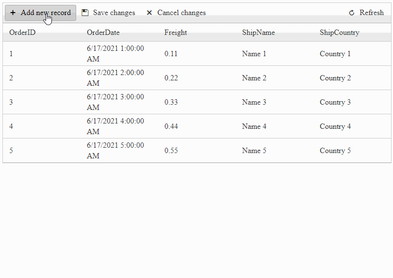

## Description

How to disable editing of cells in RadGrid with Batch editing (EditMode="**Batch**").

### Scenarios

- Disable editing of a specific cell in a row
- Disable editing of cells depending on a condition
- Disable editing of certain cells in multiple rows
- Disable editing of certain cells in certain rows

### DEMO



## Solution

When it comes to Batch editing (EditMode="**Batch**") the entire functionality is based on JavaScript and only the Client-Side events can be used. 

>noteServer-Events such as the ItemDataBound, ItemCommand, etc. do not work with Batch editing (EditMode="**Batch**").

### Step 1: Create the Grid

````XML
<telerik:RadGrid ID="RadGrid1" runat="server" AllowPaging="True" Width="800px" OnNeedDataSource="RadGrid1_NeedDataSource">
    <ClientSettings>
        <ClientEvents OnBatchEditOpening="OnBatchEditOpening" />
    </ClientSettings>
    <MasterTableView AutoGenerateColumns="False" ClientDataKeyNames="OrderID" DataKeyNames="OrderID" EditMode="Batch" CommandItemDisplay="Top">
        <Columns>
            <telerik:GridBoundColumn DataField="OrderID" DataType="System.Int32"
                FilterControlAltText="Filter OrderID column" HeaderText="OrderID"
                ReadOnly="True" SortExpression="OrderID" UniqueName="OrderID">
            </telerik:GridBoundColumn>
            <telerik:GridDateTimeColumn DataField="OrderDate" DataType="System.DateTime"
                FilterControlAltText="Filter OrderDate column" HeaderText="OrderDate"
                SortExpression="OrderDate" UniqueName="OrderDate">
            </telerik:GridDateTimeColumn>
            <telerik:GridNumericColumn DataField="Freight" DataType="System.Decimal"
                FilterControlAltText="Filter Freight column" HeaderText="Freight"
                SortExpression="Freight" UniqueName="Freight">
            </telerik:GridNumericColumn>
            <telerik:GridBoundColumn DataField="ShipName"
                FilterControlAltText="Filter ShipName column" HeaderText="ShipName"
                SortExpression="ShipName" UniqueName="ShipName">
            </telerik:GridBoundColumn>
            <telerik:GridBoundColumn DataField="ShipCountry"
                FilterControlAltText="Filter ShipCountry column" HeaderText="ShipCountry"
                SortExpression="ShipCountry" UniqueName="ShipCountry">
            </telerik:GridBoundColumn>
        </Columns>
    </MasterTableView>
</telerik:RadGrid>
````

### Step 2: Bind data to the Grid

You can bind data any way you prefer (e.g. SqlDataSource, using NeedDataSource on the server, or Binding through RadClientDataSource, etc). This example utilizes the NeedDataSource event with DataTables.

````C#
protected void RadGrid1_NeedDataSource(object sender, GridNeedDataSourceEventArgs e)
{
    (sender as RadGrid).DataSource = OrdersTable();
}

private DataTable OrdersTable()
{
    DataTable dt = new DataTable();

    dt.Columns.Add(new DataColumn("OrderID", typeof(int)));
    dt.Columns.Add(new DataColumn("OrderDate", typeof(DateTime)));
    dt.Columns.Add(new DataColumn("Freight", typeof(decimal)));
    dt.Columns.Add(new DataColumn("ShipName", typeof(string)));
    dt.Columns.Add(new DataColumn("ShipCountry", typeof(string)));

    dt.PrimaryKey = new DataColumn[] { dt.Columns["OrderID"] };

    for (int i = 0; i < 70; i++)
    {
        int index = i + 1;

        DataRow row = dt.NewRow();

        row["OrderID"] = index;
        row["OrderDate"] = new DateTime(DateTime.Now.Year, DateTime.Now.Month, DateTime.Now.Day, 0, 0, 0).AddHours(index);
        row["Freight"] = index * 0.1 + index * 0.01;
        row["ShipName"] = "Name " + index;
        row["ShipCountry"] = "Country " + index;

        dt.Rows.Add(row);
    }

    return dt;
}
````

### Step 3: Handle the Client-Side event of the Batch editing functionality

````JavaScript
// Event fires upon a cell is intering into edit mode
function OnBatchEditOpening(sender, args) {

    // get the unique name of the column
    var columnName = args.get_columnUniqueName();

    // get the currently edited row's ID
    var rowId = parseInt(args.get_row().id.split("__")[1]);

    // Setup a condition for the row ID

            
    if (rowId % 3 == 0) { // If condition 1 is met

        // if this row and the Freight column
        if (columnName == "Freight") {
            // cancel the Editing event
            args.set_cancel(true);
        }

    } else if (rowId % 2 == 0) { // If condition 2 is met
        // if this row and the ShipName column
        if (columnName == "ShipName") {
            // cancel the Editing event
            args.set_cancel(true);
        }
    }
    else { // If anything but condition 1 or 2
        // if this row and the ShipCountry column
        if (columnName == "ShipCountry") {
            // cancel the Editing event
            args.set_cancel(true);
        }
    }
}
````

### Step 4: Apply a red background for the cells that will be Read-Only (**OPTIONAL**)

Be sure to attach the OnRowCreated event handler to the Grid

````XML
<ClientSettings>
    <ClientEvents OnRowCreated="OnRowCreated" />
</ClientSettings>
````

````JavaScript
// This event is used to Apply Background color to the cells that will be Read-Only
function OnRowCreated(sender, args) {
    var rowId = parseInt(args.get_item().get_id().split('__')[1]);

    if (rowId > -1) return;

    if (rowId % 3 == 0) {
        $(args.get_item().get_cell("Freight")).css('background-color', 'indianred');
    } else if (rowId % 2 == 0) {
        $(args.get_item().get_cell("ShipName")).css('background-color', 'indianred');
    } else {
        $(args.get_item().get_cell("ShipCountry")).css('background-color', 'indianred');
    }
}
````

### Documentation & Resources

- [RadGrid Batch Editing Templates and Specifics](https://www.telerik.com/support/kb/aspnet-ajax/grid/details/radgrid-batch-editing-templates-and-specifics)
- [Batch Editing Client-side API]()
- [Working With Templates]()
- [Client-Side Programming]()
- [Get Client-side Reference to a Control Object]()

## See Also

- [RadGrid Batch Editing Templates and Specifics](https://www.telerik.com/support/kb/aspnet-ajax/grid/details/radgrid-batch-editing-templates-and-specifics)
- [Batch Editing Client-side API]()
- [Working With Templates]()
- [Client-Side Programming]()
- [Get Client-side Reference to a Control Object]()
 
