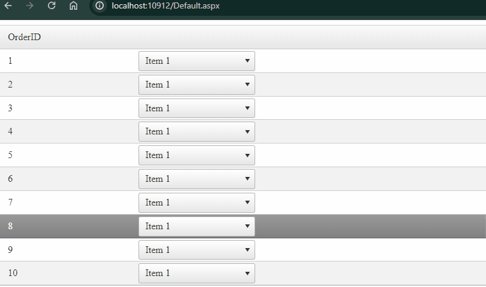

## Environment
| Product   | RadGrid for ASP.NET AJAX |
|-----------|------------------------------|

## DESCRIPTION



Sometimes, one might have a DropDownTree inside a Grid, which has the [EnablePostBackOnRowClick]() property set to `true`, but experience a weird behavior, that causes the DropDownTree to close immediately after clciking on it.

## SOLUTION

To fix this, you can employ a function to the [OnClientDropDownOpening]() event of the DropDownList, that gets the instance of the Grid and disables the postback when the DropDownList is being opened:  

````ASP.NET
<telerik:RadGrid ID="RadGrid1" runat="server" OnNeedDataSource="RadGrid1_NeedDataSource">
    <MasterTableView AutoGenerateColumns="false">
        <Columns>
            <telerik:GridTemplateColumn>
                <ItemTemplate>
                    <telerik:RadDropDownList OnClientDropDownOpening="stopPostback" ID="RadDropDownList1" runat="server" AutoPostBack="True">
                        <Items>
                            <telerik:DropDownListItem Text="Item 1" />
                            <telerik:DropDownListItem Text="Item 2" />
                        </Items>
                    </telerik:RadDropDownList>
                </ItemTemplate>
            </telerik:GridTemplateColumn>
        </Columns>
    </MasterTableView>
    <ClientSettings EnablePostBackOnRowClick="true">
        <Selecting AllowRowSelect="True"></Selecting>
    </ClientSettings>
</telerik:RadGrid>
````
````JavaScript
function stopPostback(sender, args) {
    var grid = $find("<%= RadGrid1.ClientID %>");
    grid.ClientSettings.EnablePostBackOnRowClick = false;
}
````

Alternatevely, you could also use an approach that overrides the built-in method and prevents calling the RowClick if the click was initiated on the DropDownList, like this:

````JavaScript
(function () {
    try {
        var $T = Telerik.Web.UI;
        var _gridSelection_click = $T.GridSelection.prototype._click;
        var $ = $ || jQuery || $telerik.$;

        $T.GridSelection.prototype._click = function (e) {
            // if the clicked element belongs to the DropDownList
            if ($(e.target).closest('.RadDropDownList').length > 0) {
                // exit the function
                return;
            }
            // call the original function
            _gridSelection_click.call(this, e);
        }
    } catch (e) {
        // Try catch just to handle the error when the Grid is not loaded on the page.
    }
})()
````


  