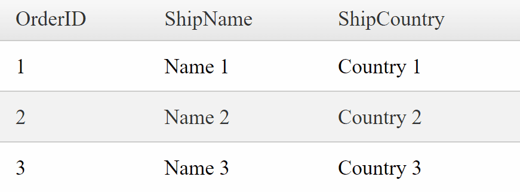

## Environment

<table>
	<tbody>
		<tr>
			<td>Product</td>
			<td>Telerik WebForms Grid for ASP.NET AJAX</td>
		</tr>
	</tbody>
</table>

## DESCRIPTION

Sometimes, you might want to disable the **EnablePostBackOnRowClick** property when clicking on a cell, which is located in a specific column. 



## SOLUTION

To do that, you can utilize the [`OnCellSelecting`]() event, and in it, check for the unique name of the column of the currently clicked cell.

````JavaScript
function onCellSelecting(sender, args) {
    var columnName = args.get_column().get_uniqueName();

    if (columnName == "OrderID") { 
        sender.ClientSettings.EnablePostBackOnRowClick = false;
        args.set_cancel(true);
    }
    else {
        sender.ClientSettings.EnablePostBackOnRowClick = true;
    }
}
````

````ASP.NET
<telerik:RadGrid ID="RadGrid1" runat="server" AllowPaging="True" Width="400px" OnNeedDataSource="RadGrid1_NeedDataSource">
    <MasterTableView AutoGenerateColumns="False" DataKeyNames="OrderID">
        <Columns>
            <telerik:GridBoundColumn DataField="OrderID" DataType="System.Int32"
                FilterControlAltText="Filter OrderID column" HeaderText="OrderID"
                ReadOnly="True" SortExpression="OrderID" UniqueName="OrderID">
            </telerik:GridBoundColumn>
            <telerik:GridBoundColumn DataField="ShipName"
                FilterControlAltText="Filter ShipName column" HeaderText="ShipName"
                SortExpression="ShipName" UniqueName="ShipName">
            </telerik:GridBoundColumn>
            <telerik:GridBoundColumn DataField="ShipCountry"
                FilterControlAltText="Filter ShipCountry column" HeaderText="ShipCountry"
                SortExpression="ShipCountry" UniqueName="ShipCountry">
            </telerik:GridBoundColumn>
        </Columns>
    </MasterTableView>
    <ClientSettings EnablePostBackOnRowClick="true">
        <Selecting CellSelectionMode="SingleCell"/>
        <ClientEvents OnCellSelecting="onCellSelecting" />
    </ClientSettings>
</telerik:RadGrid>
````

 
