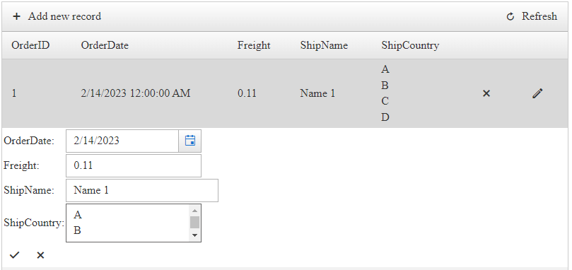

## DESCRIPTION

Instructions to display "line breaks" and "carriage returns" coming from a Multi line TextBox or TextArea in new lines.



One common issue whereby the text is entered with line breaks/carriage return in the grid while inserting/editing, the data is shown in a single line with no line breaks or carriage return.

## SOLUTION

This is a known behavior as multi line TextBoxes or TextAreas use line breaks "**\n**" and carriage returns "**\r**" to display text in new lines within the element, however, those are not interpreted the same way outside of those elements.

In order to display the text in new lines, the line breaks "**\n**" and carriage returns "**\r**" have to be converted to HTML `<BR>` tags.

An easy way to achieve that is by using GridTemplateColumns.

Add a WebForms Control (e.g. Label) to the `<ItemTemplate>` and bind its **Text** property to the respective field.
The EditItemTemplate may contain a TextBox set to multi lines or a TextArea.

````ASP.NET
<telerik:GridTemplateColumn DataField="ShipCountry"
    FilterControlAltText="Filter ShipCountry column" HeaderText="ShipCountry"
    SortExpression="ShipCountry" UniqueName="ShipCountry">
    <ItemTemplate>
        <asp:Label ID="Label1" runat="server" Text='<%# Eval("ShipCountry") %>'></asp:Label>
    </ItemTemplate>
    <EditItemTemplate>
        <telerik:RadTextBox ID="RadTextBox1" runat="server" TextMode="MultiLine" Text='<%# Bind("ShipCountry") %>'></telerik:RadTextBox>
    </EditItemTemplate>
</telerik:GridTemplateColumn>
````

In the [ItemDataBound event]() of the Grid, set a condition that will check for the GridDataItem and accesses the Label in it. After that, get the Label's text, and replace the line breaks "**\n**" and carriage returns "**\r**" with `<BR>` tags.

````C#
protected void RadGrid1_ItemDataBound(object sender, GridItemEventArgs e)
{
    if (e.Item is GridDataItem)
    {
        GridDataItem dataItem = (GridDataItem)e.Item;
        // Access the label
        Label myLbl = dataItem.FindControl("Label1") as Label;
        // get the label's text
        string lblText = myLbl.Text;
        // replace the "\r\n" values with HTML BR tags
        myLbl.Text = lblText.Replace("\r\n", "<br/>");
    }
}
````
````VB
Protected Sub RadGrid1_ItemDataBound(ByVal sender As Object, ByVal e As GridItemEventArgs)
    If TypeOf e.Item Is GridDataItem Then
        Dim dataItem As GridDataItem = CType(e.Item, GridDataItem)
        'Access the label
        Dim myLbl As Label = TryCast(dataItem.FindControl("Label1"), Label)
        'get the label's text
        Dim lblText As String = myLbl.Text
        'replace the "\r\n" values with HTML BR tags
        myLbl.Text = lblText.Replace(vbCrLf, "<br/>")
    End If
End Sub
````
 
