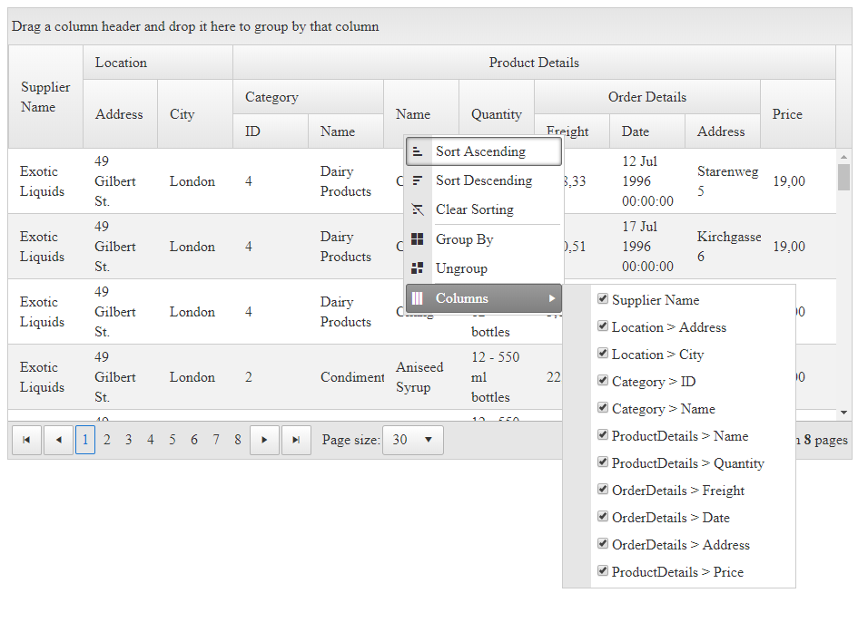

## Environment

<table>
	<tbody>
		<tr>
			<td>Product</td>
			<td>Telerik WebForms Grid for ASP.NET AJAX</td>
		</tr>
	</tbody>
</table>

## DESCRIPTION

When you have a grid with multilevel headers, you may have columns that have the same header text. In such a case, it may be hard for the user to distinguish them in the header context menu when choosing which to hide or show.

In such cases, you may want to add the parent group name to the text of the header menu item. RadGrid does not have a built-in feature to allow this, but through inspecting the data, objects and the DOM, you can discover some of the data you need and modify the elements. 



## SOLUTION

There are two ways to do this - on the client, and on the server.

Sample client-side function that you need to hook to the OnHeaderMenuShowing event:

````JavaScript
function OnHeaderMenuShowing(sender, args) {
    if (!sender.__columnsRenamed) {
        //get the items in the Columns submenu
        var columnListItems = args.get_menu().findItemByText("Columns").get_items();
        for (var i = 0; i < columnListItems.get_count(); i++) {
            //get the labels in each of the menu items as we will modify their content actually
            $telerik.$(columnListItems.getItem(i).get_element()).find("span label").each(function (index, elem) {
                //get the list of grid columns so we can use their data for comparison
                var gridCols = $find("<%=RadGrid1.ClientID%>").get_masterTableView().get_columns();
                        for (var i = 0; i < gridCols.length; i++) {
                            //the label gives us information about the UniqueName of the column
                            //we will compare it with the actual unique name of the column so wecan get its parent group name
                            if (elem.getAttribute("for").split("_ctl00")[1] == gridCols[i]._data.UniqueName) {
                                if (gridCols[i]._data.ColumnGroupName) {
                                    //if the column is part of a group, include the group name in the menu text
                                    elem.innerText = gridCols[i]._data.ColumnGroupName + " > " + gridCols[i].get_element().innerText;
                                }
                            }
                        }
                    });
                }
                //we need to do this once only
                sender.__columnsRenamed = true;
    }
}
````

Sample server-side solution that does the same:

````C#
protected void Page_Init(object sender, EventArgs e)
{
    RadGrid1.HeaderContextMenu.ItemCreated += new Telerik.Web.UI.RadMenuEventHandler(HeaderContextMenu_ItemCreated);
}

protected void HeaderContextMenu_ItemCreated(object sender, Telerik.Web.UI.RadMenuEventArgs e)
{
    //the values of the items for the column names contain the UniqueIDs of the grid menu and then the unique name of the column
    if (e.Item.Value.IndexOf("_ctl00|") > -1 )
    {
        //after checking which menu items we need, we take the column unique name and reference the column from the grid object through it
        GridColumn col = RadGrid1.MasterTableView.GetColumnSafe(e.Item.Value.Split('|')[1]);
        if (!string.IsNullOrEmpty(col.ColumnGroupName))
        {
            //if the column is in a group - change the text of the checkbox in the menu item to contain that group
            (e.Item.Controls[0] as CheckBox).Text = string.Format("{0} > {1}", col.ColumnGroupName, col.HeaderText);
        }
    }
}
````

````ASP.NET
<telerik:RadGrid RenderMode="Lightweight" ID="RadGrid1" runat="server" ShowGroupPanel="true" AllowSorting="true"
    DataSourceID="SqlDataSource1" AllowPaging="true" PageSize="30" AutoGenerateColumns="false" Width="100%">
    <ClientSettings AllowColumnsReorder="true" AllowDragToGroup="true" ReorderColumnsOnClient="true">
        <Scrolling AllowScroll="true" UseStaticHeaders="true"></Scrolling>
        <Resizing AllowColumnResize="true" EnableRealTimeResize="true" />
        <%--needed for the client-side solution--%>
        <ClientEvents OnHeaderMenuShowing="OnHeaderMenuShowing" />
    </ClientSettings>
    <GroupingSettings ShowUnGroupButton="true"></GroupingSettings>
    <MasterTableView EnableHeaderContextMenu="true">
        <ColumnGroups>
            <telerik:GridColumnGroup HeaderText="Product Details" Name="ProductDetails" HeaderStyle-HorizontalAlign="Center">
            </telerik:GridColumnGroup>
            <telerik:GridColumnGroup HeaderText="Location" Name="Location">
            </telerik:GridColumnGroup>
            <telerik:GridColumnGroup HeaderText="Category" Name="Category" ParentGroupName="ProductDetails">
            </telerik:GridColumnGroup>
            <telerik:GridColumnGroup HeaderText="Order Details" Name="OrderDetails" ParentGroupName="ProductDetails"
                HeaderStyle-HorizontalAlign="Center">
            </telerik:GridColumnGroup>
        </ColumnGroups>
        <Columns>
            <telerik:GridBoundColumn UniqueName="SupplierName" DataField="SupplierName" HeaderText="Supplier Name">
            </telerik:GridBoundColumn>
            <telerik:GridBoundColumn UniqueName="Address" DataField="Address" ColumnGroupName="Location"
                HeaderText="Address">
            </telerik:GridBoundColumn>
            <telerik:GridBoundColumn UniqueName="City" DataField="City" ColumnGroupName="Location"
                HeaderText="City">
            </telerik:GridBoundColumn>
            <telerik:GridNumericColumn UniqueName="ID" DataField="ID" ColumnGroupName="Category"
                HeaderText="ID">
            </telerik:GridNumericColumn>
            <telerik:GridBoundColumn UniqueName="CategoryName" DataField="CategoryName" ColumnGroupName="Category"
                HeaderText="Name">
            </telerik:GridBoundColumn>
            <telerik:GridBoundColumn UniqueName="ProductName" DataField="ProductName" ColumnGroupName="ProductDetails"
                HeaderText="Name">
            </telerik:GridBoundColumn>
            <telerik:GridBoundColumn UniqueName="Quantity" DataField="Quantity" ColumnGroupName="ProductDetails"
                HeaderText="Quantity">
            </telerik:GridBoundColumn>
            <telerik:GridNumericColumn UniqueName="Freight" DataField="Freight" ColumnGroupName="OrderDetails"
                HeaderText="Freight">
            </telerik:GridNumericColumn>
            <telerik:GridDateTimeColumn UniqueName="OrderDate" DataField="OrderDate" ColumnGroupName="OrderDetails"
                HeaderText="Date">
            </telerik:GridDateTimeColumn>
            <telerik:GridBoundColumn UniqueName="OrderAddress" DataField="OrderAddress" ColumnGroupName="OrderDetails"
                HeaderText="Address">
            </telerik:GridBoundColumn>
            <telerik:GridNumericColumn UniqueName="Price" DataField="Price" ColumnGroupName="ProductDetails"
                HeaderText="Price">
            </telerik:GridNumericColumn>
        </Columns>
    </MasterTableView>
</telerik:RadGrid>
<asp:SqlDataSource ID="SqlDataSource1" ConnectionString="<%$ ConnectionStrings:NorthwindConnectionString %>"
    ProviderName="System.Data.SqlClient" SelectCommand="SELECT pdc.ProductID as ProductID, s.CompanyName as SupplierName, pdc.CategoryID as ID, pdc.CategoryName as CategoryName,
        pdc.ProductName as ProductName, pdc.QuantityPerUnit as Quantity, o.Freight as Freight, o.OrderDate as OrderDate,
        o.ShipAddress as OrderAddress, pdc.UnitPrice as Price, s.City as City, s.Address as Address
FROM Suppliers s
INNER JOIN (SELECT p.ProductID as ProductID, p.SupplierID as SupplierID, p.ProductName as ProductName,
                   p.QuantityPerUnit as QuantityPerUnit, p.UnitPrice  as UnitPrice, od.OrderID as OrderID, c.CategoryID as CategoryID, c.CategoryName as CategoryName
            FROM Products p
            INNER JOIN [Order Details] od ON p.ProductID = od.ProductID INNER JOIN Categories c on c.CategoryID=p.CategoryID
            WHERE od.OrderID in
                (SELECT TOP(3) od1.OrderID
                 FROM [Order Details] od1
                 WHERE od1.ProductID=od.ProductID)
           ) pdc on pdc.SupplierID=s.SupplierID
INNER JOIN Orders o on o.OrderID=pdc.OrderID
ORDER BY pdc.ProductID"
    runat="server"></asp:SqlDataSource>
````

 
   