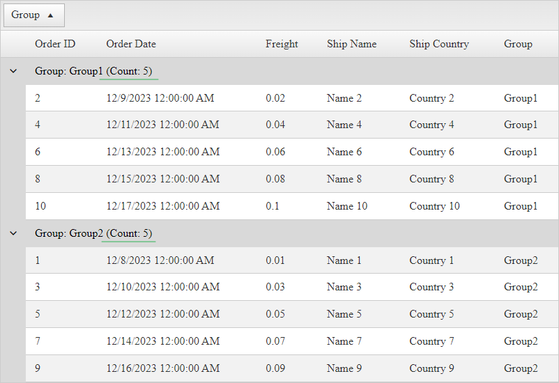

## Environment

| Property | Value |
| --- | --- |
| Product | RadGrid for ASP.NET AJAX |

## Description

I want to display the number of records in a group header when 'Auto generate columns' is enabled in RadGrid for ASP.NET AJAX. I don't know the field names in advance, so I need a solution that dynamically counts the records for each group.



## Solution

By default, the GroupHeaders in RadGrid for ASP.NET AJAX displays the Field name of the Grouped column and the value the items are grouped by within each group. 

If you specifically need to display the count in the group header, you can do this in the [ItemDataBound event]() of the grid and implement custom logic. 

Here's an example:

1. Handle the [ItemDataBound event]() event of the RadGrid.
2. Check if the item being bound is a `GridGroupHeaderItem`.
3. Extract the group-related information from the header text.
4. Query the database or DataTable object to count the items based on the group value.
5. Display the count in the group header cell.

````C#
protected void RadGrid1_ItemDataBound(object sender, GridItemEventArgs e)
{
    if (e.Item is GridGroupHeaderItem)
    {
        GridGroupHeaderItem groupHeaderItem = (GridGroupHeaderItem)e.Item;
        string groupText = groupHeaderItem.DataCell.Text;

        string groupField = groupText.Substring(0, groupText.IndexOf(':')).Trim();
        string groupValue = groupText.Substring(groupText.IndexOf(":") + 1).Trim();

        int groupItemsCount = OrdersTable().Select(string.Format("{0}='{1}'", groupField, groupValue)).Count();

        groupHeaderItem.DataCell.Text = string.Format("{0}: {1} (Count: {2})", groupField, groupValue, groupItemsCount);
    }
}
````
````VB
Protected Sub RadGrid1_ItemDataBound(ByVal sender As Object, ByVal e As GridItemEventArgs)

    If TypeOf e.Item Is GridGroupHeaderItem Then

        Dim groupHeaderItem As GridGroupHeaderItem = CType(e.Item, GridGroupHeaderItem)
        Dim groupText As String = groupHeaderItem.DataCell.Text
        Dim groupField As String = groupText.Substring(0, groupText.IndexOf(":"c)).Trim()
        Dim groupValue As String = groupText.Substring(groupText.IndexOf(":") + 1).Trim()
        Dim groupItemsCount As Integer = OrdersTable().[Select](String.Format("{0}='{1}'", groupField, groupValue)).Count()
    
        groupHeaderItem.DataCell.Text = String.Format("{0}: {1} (Count: {2})", groupField, groupValue, groupItemsCount)
    End If

End Sub
````

## Notes

- Replace `OrdersTable()` with your own logic to query the database or DataTable and retrieve the count of items for each group.
- This solution works with both  'Auto generate' or 'Declared column' in RadGrid for ASP.NET AJAX.
- Customize the code based on your specific requirements and data structure.

