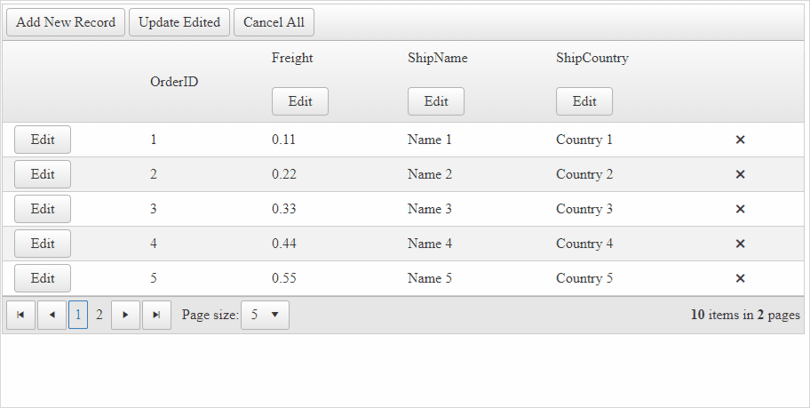

## Environment

<table>
	<tbody>
		<tr>
			<td>Product</td>
			<td>Telerik WebForms Grid for ASP.NET AJAX</td>
		</tr>
	</tbody>
</table>

## Description

By default, **InPlace** editing will only allow you to edit the current row, but with some adjustments it can be configured to also edit all the records in a column



## Solution

To achieve the desired behavior, we'll use a **TemplateColumn**, in which a button will reside. The button will be used to toggle the inplace column editing.

````ASP.NET
<%--Enable AJAX for all control by wrapping the controls in a Panel and add the panel to the AjaxSettings of RadAjaxManager--%>
<telerik:RadAjaxManager ID="RadAjaxManager1" runat="server" DefaultLoadingPanelID="RadAjaxLoadingPanel1">
    <AjaxSettings>
        <telerik:AjaxSetting AjaxControlID="Panel1">
            <UpdatedControls>
                <telerik:AjaxUpdatedControl ControlID="Panel1" />
            </UpdatedControls>
        </telerik:AjaxSetting>
    </AjaxSettings>
</telerik:RadAjaxManager>
<telerik:RadAjaxLoadingPanel ID="RadAjaxLoadingPanel1" runat="server" Skin="Default"></telerik:RadAjaxLoadingPanel>

<asp:Panel ID="Panel1" runat="server">
    <telerik:RadGrid ID="RadGrid1" runat="server" AllowPaging="True" AutoGenerateColumns="false" PageSize="5"
        AllowMultiRowEdit="true"
        OnNeedDataSource="RadGrid1_NeedDataSource"
        OnItemCommand="RadGrid1_ItemCommand"
        OnInsertCommand="RadGrid1_InsertCommand"
        OnUpdateCommand="RadGrid1_UpdateCommand"
        OnDeleteCommand="RadGrid1_DeleteCommand">
        <MasterTableView
            CommandItemDisplay="Top"
            DataKeyNames="OrderID"
            InsertItemDisplay="Top"
            InsertItemPageIndexAction="ShowItemOnLastPage"
            EditMode="InPlace"
            RetainExpandStateOnRebind="true">
            <CommandItemTemplate>
                <telerik:RadButton ID="insertbtn" runat="server" Text="Add New Record" CommandName="InitInsert"></telerik:RadButton>
                <telerik:RadButton ID="updateBtn" runat="server" Text="Update Edited" CommandName="UpdateEdited"></telerik:RadButton>
                <telerik:RadButton ID="cancelBtn" runat="server" Text="Cancel All" CommandName="CancelAll"></telerik:RadButton>
            </CommandItemTemplate>
            <Columns>
                <telerik:GridTemplateColumn>
                    <ItemTemplate>
                        <telerik:RadButton ID="RadButton6" runat="server" Text="Edit" CommandName="Edit"></telerik:RadButton>
                    </ItemTemplate>
                    <EditItemTemplate>
                        <telerik:RadButton ID="RadButton7" runat="server" Text='<%# Container.OwnerTableView.IsItemInserted?"Insert":"Update" %>'
                            CommandName='<%# Container.OwnerTableView.IsItemInserted?"PerformInsert":"Update" %>'>
                        </telerik:RadButton>
                        <telerik:RadButton ID="RadButton8" runat="server" Text="Cancel" CommandName="Cancel"></telerik:RadButton>
                    </EditItemTemplate>
                </telerik:GridTemplateColumn>

                <telerik:GridBoundColumn DataField="OrderID" DataType="System.Int32"
                    FilterControlAltText="Filter OrderID column" HeaderText="OrderID"
                    ReadOnly="True" SortExpression="OrderID" UniqueName="OrderID">
                </telerik:GridBoundColumn>

                <telerik:GridTemplateColumn DataField="Freight" DataType="System.Decimal" ReadOnly="True"
                    FilterControlAltText="Filter Freight column" HeaderText="Freight"
                    SortExpression="Freight" UniqueName="Freight">
                    <HeaderTemplate>
                        <asp:Label ID="LabelFreight" runat="server" Text="Freight"></asp:Label>
                        <br />
                        <br />
                        <telerik:RadButton ID="RadButton3" runat="server" Text="Edit" CommandName="EditColumn" CommandArgument="Freight"></telerik:RadButton>
                    </HeaderTemplate>
                    <ItemTemplate>
                        <%# Eval("Freight") %>
                    </ItemTemplate>
                    <EditItemTemplate>
                        <telerik:RadNumericTextBox ID="RadNumericTextBox2" runat="server" DbValue='<%# Bind("Freight") %>'></telerik:RadNumericTextBox>
                    </EditItemTemplate>
                </telerik:GridTemplateColumn>

                <telerik:GridTemplateColumn DataField="ShipName"
                    FilterControlAltText="Filter ShipName column" HeaderText="ShipName" ReadOnly="True"
                    SortExpression="ShipName" UniqueName="ShipName">
                    <HeaderTemplate>
                        <asp:Label ID="LabelShipName" runat="server" Text="ShipName"></asp:Label>
                        <br />
                        <br />
                        <telerik:RadButton ID="RadButton4" runat="server" Text="Edit" CommandName="EditColumn" CommandArgument="ShipName"></telerik:RadButton>
                    </HeaderTemplate>
                    <ItemTemplate>
                        <%# Eval("ShipName") %>
                    </ItemTemplate>
                    <EditItemTemplate>
                        <telerik:RadTextBox ID="RadTextBox1" runat="server" Text='<%# Bind("ShipName") %>'></telerik:RadTextBox>
                    </EditItemTemplate>
                </telerik:GridTemplateColumn>

                <telerik:GridTemplateColumn DataField="ShipCountry"
                    FilterControlAltText="Filter ShipCountry column" HeaderText="ShipCountry" ReadOnly="True"
                    SortExpression="ShipCountry" UniqueName="ShipCountry">
                    <HeaderTemplate>
                        <asp:Label ID="LabelShipCountry" runat="server" Text="ShipCountry"></asp:Label>
                        <br />
                        <br />
                        <telerik:RadButton ID="RadButton5" runat="server" Text="Edit" CommandName="EditColumn" CommandArgument="ShipCountry"></telerik:RadButton>
                    </HeaderTemplate>
                    <ItemTemplate>
                        <%# Eval("ShipCountry") %>
                    </ItemTemplate>
                    <EditItemTemplate>
                        <telerik:RadTextBox ID="RadTextBox2" runat="server" Text='<%# Bind("ShipCountry") %>'></telerik:RadTextBox>
                    </EditItemTemplate>
                </telerik:GridTemplateColumn>
                <telerik:GridButtonColumn Text="Delete" CommandName="Delete"></telerik:GridButtonColumn>
            </Columns>
        </MasterTableView>
    </telerik:RadGrid>
    <br />
    <br />
    <asp:Label ID="Label1" runat="server" Text="Action:" Visible="false"></asp:Label>
</asp:Panel>
````

````C#
public DataTable SessionDataSource
{
    get
    {
        string sessionKey = "SessionDataSource";

        if (Session[sessionKey] == null || !IsPostBack)
        {
            Session[sessionKey] = OrdersTable();
        }
        return (DataTable)Session[sessionKey];
    }
}

// READ (data binding)
protected void RadGrid1_NeedDataSource(object sender, GridNeedDataSourceEventArgs e)
{
    RadGrid1.DataSource = SessionDataSource;
}

// CREATE (Add New Record)
protected void RadGrid1_InsertCommand(object sender, GridCommandEventArgs e)
{
    GridEditableItem editedItem = e.Item as GridEditableItem;

    DataRow newRow = SessionDataSource.NewRow();

    //As this example demonstrates only in-memory editing, a new primary key value should be generated
    //This should not be applied when updating directly the database
    DataRow[] allValues = SessionDataSource.Select("OrderID = MAX(OrderID)");

    if (allValues.Length > 0)
    {
        newRow["OrderID"] = int.Parse(allValues[0]["OrderID"].ToString()) + 1;
    }
    else
    {
        newRow["OrderID"] = 1; //the table is empty;
    }

    //Set new values
    Hashtable newValues = new Hashtable();
    //The GridTableView will fill the values from all editable columns in the hash
    e.Item.OwnerTableView.ExtractValuesFromItem(newValues, editedItem);

    try
    {
        foreach (DictionaryEntry entry in newValues)
        {
            newRow[(string)entry.Key] = entry.Value;
        }
    }
    catch (Exception ex)
    {
        Label1.Text += string.Format("<br />Unable to insert into Orders. Reason: {0}", ex.Message);
        e.Canceled = true;
        return;
    }

    SessionDataSource.Rows.Add(newRow);
    //Code for updating the database ca go here...
    Label1.Text += string.Format("<br />Order {0} inserted", newRow["OrderID"]);
}

// UPDATE
protected void RadGrid1_UpdateCommand(object sender, GridCommandEventArgs e)
{
    GridEditableItem editedItem = e.Item as GridEditableItem;

    if (!UpdateRow(editedItem))
    {
        e.Canceled = true;
    }
}
private bool UpdateRow(GridEditableItem editableItem)
{
    //Locate the changed row in the DataSource
    DataRow[] changedRows = SessionDataSource.Select(string.Format("OrderID = {0}", editableItem.GetDataKeyValue("OrderID")));

    if (changedRows.Length != 1)
    {
        this.Label1.Text += "Unable to locate the Order for updating.";
        return false;
    }

    //Update new values
    Hashtable newValues = new Hashtable();
    editableItem.OwnerTableView.ExtractValuesFromItem(newValues, editableItem);
    changedRows[0].BeginEdit();
    try
    {
        foreach (DictionaryEntry entry in newValues)
        {
            changedRows[0][(string)entry.Key] = entry.Value;
        }
        changedRows[0].EndEdit();
    }
    catch (Exception ex)
    {
        changedRows[0].CancelEdit();
        Label1.Text += string.Format("Unable to update Orders. Reason: {0}", ex.Message);
        return false;
    }

    return true;
}

// DELETE
protected void RadGrid1_DeleteCommand(object sender, GridCommandEventArgs e)
{
    GridDataItem dataItem = e.Item as GridDataItem;
    string ID = dataItem.GetDataKeyValue("OrderID").ToString();

    if (SessionDataSource.Rows.Find(ID) != null)
    {
        SessionDataSource.Rows.Find(ID).Delete();
    }
}

private DataTable OrdersTable()
{
    DataTable dt = new DataTable();

    dt.Columns.Add(new DataColumn("OrderID", typeof(int)));
    dt.Columns.Add(new DataColumn("OrderDate", typeof(DateTime)));
    dt.Columns.Add(new DataColumn("Freight", typeof(decimal)));
    dt.Columns.Add(new DataColumn("ShipName", typeof(string)));
    dt.Columns.Add(new DataColumn("ShipCountry", typeof(string)));
    dt.Columns.Add(new DataColumn("IsChecked", typeof(bool)));

    dt.PrimaryKey = new DataColumn[] { dt.Columns["OrderID"] };

    for (int i = 0; i < 10; i++)
    {
        int index = i + 1;

        DataRow row = dt.NewRow();

        row["OrderID"] = index;
        row["OrderDate"] = new DateTime(DateTime.Now.Year, DateTime.Now.Month, DateTime.Now.Day, 0, 0, 0).AddHours(index);
        row["Freight"] = index * 0.1 + index * 0.01;
        row["ShipName"] = "Name " + index;
        row["ShipCountry"] = "Country " + index;
        row["IsChecked"] = i % 3 == 0;

        dt.Rows.Add(row);
    }

    return dt;
}

protected void RadGrid1_ItemCommand(object sender, GridCommandEventArgs e)
{
    switch (e.CommandName)
    {
        case RadGrid.InitInsertCommandName:
        case RadGrid.EditCommandName:
            MakeColumnsReadOnly(false);
            break;

        case RadGrid.CancelCommandName:
        case RadGrid.CancelAllCommandName:
            MakeColumnsReadOnly(true);
            break;

        case "EditColumn":
            MakeColumnsReadOnly(true);

            string ColumnName = e.CommandArgument.ToString();

            if (ColumnName != "OrderID")
                ((GridTemplateColumn)RadGrid1.MasterTableView.GetColumn(ColumnName)).ReadOnly = false;

            foreach (GridItem item in RadGrid1.MasterTableView.Items)
            {
                if (item is GridEditableItem)
                {
                    GridEditableItem editableItem = item as GridDataItem;
                    editableItem.Edit = true;
                }
            }
            RadGrid1.Rebind();
            break;
    }
}

private void MakeColumnsReadOnly(bool readOnly = false)
{
    foreach (GridTemplateColumn column in RadGrid1.MasterTableView.RenderColumns.OfType<GridTemplateColumn>())
    {
        if (column.UniqueName != "OrderID")
            column.ReadOnly = readOnly;
    }
}
````
````VB
Public ReadOnly Property SessionDataSource As DataTable
    Get
        Dim sessionKey As String = "SessionDataSource"

        If Session(sessionKey) Is Nothing OrElse Not IsPostBack Then
            Session(sessionKey) = OrdersTable()
        End If

        Return CType(Session(sessionKey), DataTable)
    End Get
End Property

Protected Sub RadGrid1_NeedDataSource(ByVal sender As Object, ByVal e As GridNeedDataSourceEventArgs)
    RadGrid1.DataSource = SessionDataSource
End Sub

Protected Sub RadGrid1_InsertCommand(ByVal sender As Object, ByVal e As GridCommandEventArgs)
    Dim editedItem As GridEditableItem = TryCast(e.Item, GridEditableItem)
    Dim newRow As DataRow = SessionDataSource.NewRow()
    Dim allValues As DataRow() = SessionDataSource.[Select]("OrderID = MAX(OrderID)")

    If allValues.Length > 0 Then
        newRow("OrderID") = Integer.Parse(allValues(0)("OrderID").ToString()) + 1
    Else
        newRow("OrderID") = 1
    End If

    Dim newValues As Hashtable = New Hashtable()
    e.Item.OwnerTableView.ExtractValuesFromItem(newValues, editedItem)

    Try

        For Each entry As DictionaryEntry In newValues
            newRow(CStr(entry.Key)) = entry.Value
        Next

    Catch ex As Exception
        Label1.Text += String.Format("<br />Unable to insert into Orders. Reason: {0}", ex.Message)
        e.Canceled = True
        Return
    End Try

    SessionDataSource.Rows.Add(newRow)
    Label1.Text += String.Format("<br />Order {0} inserted", newRow("OrderID"))
End Sub

Protected Sub RadGrid1_UpdateCommand(ByVal sender As Object, ByVal e As GridCommandEventArgs)
    Dim editedItem As GridEditableItem = TryCast(e.Item, GridEditableItem)

    If Not UpdateRow(editedItem) Then
        e.Canceled = True
    End If
End Sub

Private Function UpdateRow(ByVal editableItem As GridEditableItem) As Boolean
    Dim changedRows As DataRow() = SessionDataSource.[Select](String.Format("OrderID = {0}", editableItem.GetDataKeyValue("OrderID")))

    If changedRows.Length <> 1 Then
        Me.Label1.Text += "Unable to locate the Order for updating."
        Return False
    End If

    Dim newValues As Hashtable = New Hashtable()
    editableItem.OwnerTableView.ExtractValuesFromItem(newValues, editableItem)
    changedRows(0).BeginEdit()

    Try

        For Each entry As DictionaryEntry In newValues
            changedRows(0)(CStr(entry.Key)) = entry.Value
        Next

        changedRows(0).EndEdit()
    Catch ex As Exception
        changedRows(0).CancelEdit()
        Label1.Text += String.Format("Unable to update Orders. Reason: {0}", ex.Message)
        Return False
    End Try

    Return True
End Function

Protected Sub RadGrid1_DeleteCommand(ByVal sender As Object, ByVal e As GridCommandEventArgs)
    Dim dataItem As GridDataItem = TryCast(e.Item, GridDataItem)
    Dim ID As String = dataItem.GetDataKeyValue("OrderID").ToString()

    If SessionDataSource.Rows.Find(ID) IsNot Nothing Then
        SessionDataSource.Rows.Find(ID).Delete()
    End If
End Sub

Private Function OrdersTable() As DataTable
    Dim dt As DataTable = New DataTable()
    dt.Columns.Add(New DataColumn("OrderID", GetType(Integer)))
    dt.Columns.Add(New DataColumn("OrderDate", GetType(DateTime)))
    dt.Columns.Add(New DataColumn("Freight", GetType(Decimal)))
    dt.Columns.Add(New DataColumn("ShipName", GetType(String)))
    dt.Columns.Add(New DataColumn("ShipCountry", GetType(String)))
    dt.Columns.Add(New DataColumn("IsChecked", GetType(Boolean)))
    dt.PrimaryKey = New DataColumn() {dt.Columns("OrderID")}

    For i As Integer = 0 To 10 - 1
        Dim index As Integer = i + 1
        Dim row As DataRow = dt.NewRow()
        row("OrderID") = index
        row("OrderDate") = New DateTime(DateTime.Now.Year, DateTime.Now.Month, DateTime.Now.Day, 0, 0, 0).AddHours(index)
        row("Freight") = index * 0.1 + index * 0.01
        row("ShipName") = "Name " & index
        row("ShipCountry") = "Country " & index
        row("IsChecked") = i Mod 3 = 0
        dt.Rows.Add(row)
    Next

    Return dt
End Function

Protected Sub RadGrid1_ItemCommand(ByVal sender As Object, ByVal e As GridCommandEventArgs)
    Select Case e.CommandName
        Case RadGrid.InitInsertCommandName, RadGrid.EditCommandName
            MakeColumnsReadOnly(False)
        Case RadGrid.CancelCommandName, RadGrid.CancelAllCommandName
            MakeColumnsReadOnly(True)
        Case "EditColumn"
            MakeColumnsReadOnly(True)
            Dim ColumnName As String = e.CommandArgument.ToString()
            If ColumnName <> "OrderID" Then
                TryCast(RadGrid1.MasterTableView.GetColumn(ColumnName), GridTemplateColumn).[ReadOnly] = False
            End If

            For Each item As GridItem In RadGrid1.MasterTableView.Items

                If TypeOf item Is GridEditableItem Then
                    Dim editableItem As GridEditableItem = TryCast(item, GridDataItem)
                    editableItem.Edit = True
                End If
            Next

            RadGrid1.Rebind()
    End Select
End Sub

Private Sub MakeColumnsReadOnly(ByVal Optional [readOnly] As Boolean = False)
    For Each column As GridTemplateColumn In RadGrid1.MasterTableView.RenderColumns.OfType(Of GridTemplateColumn)()
        If column.UniqueName <> "OrderID" Then column.[ReadOnly] = [readOnly]
    Next
End Sub
````
 
 
 