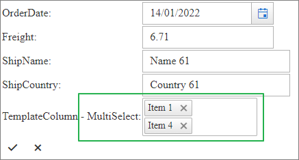
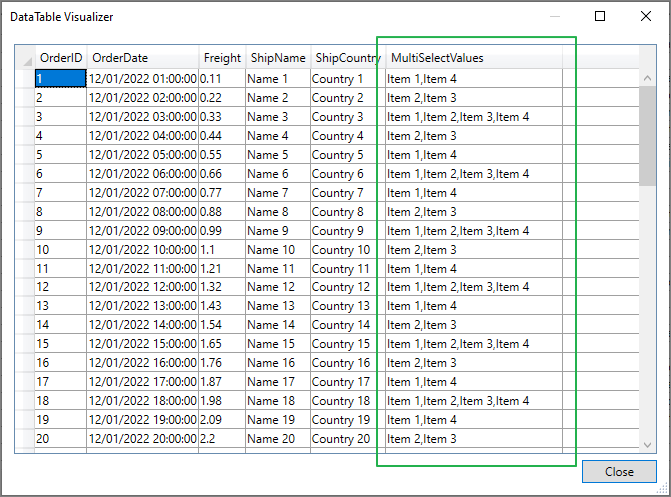
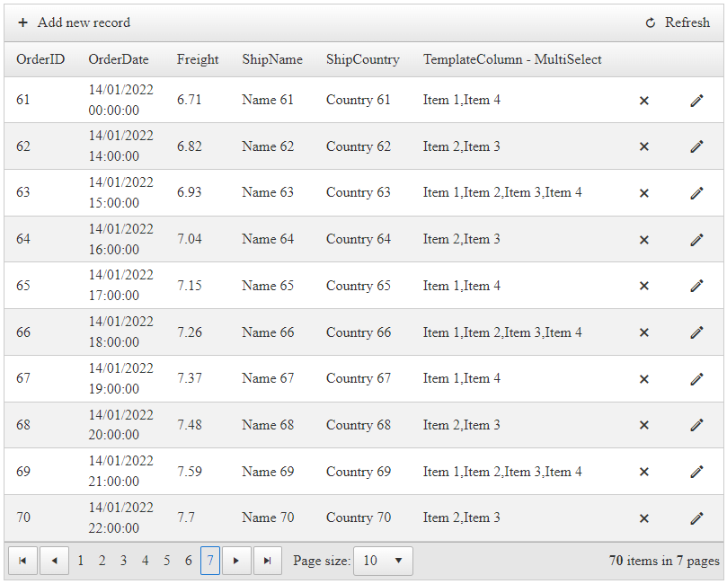
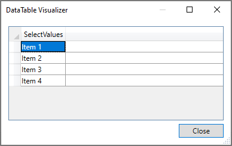
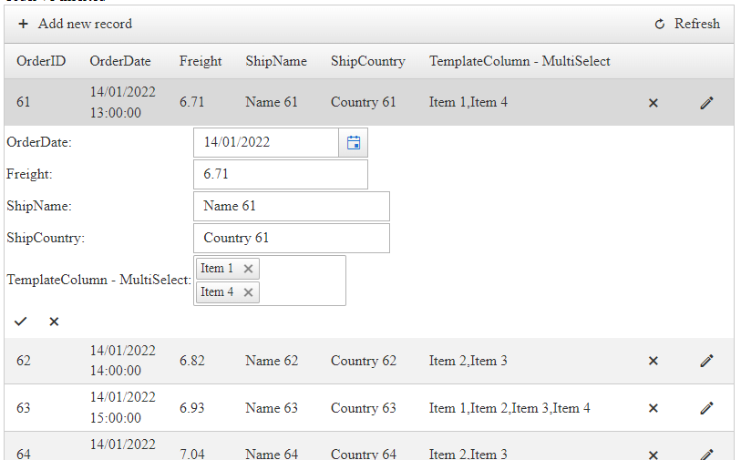

## Description

Need a MultiSelect to edit Grid records in the EditForms?



Editing *RadGrid* columns using **RadMultiSelect** component would not work using the same approach as with the DropDown Components like *asp:DropDownList*, *RadDropDownList*, and *RadComboBox*.

Unlike the usual DropDown components (e.g. DropDownList, RadDropDownList, and RadComboBox) the **RadMultiSelect** can have multiple values, and so the Grid records for this column must also have multiple values.

## Solution

Since RadGrid cannot support binding the cells separately to collections like arrays, lists, etc, you will need to create a field in the data source which will represent a string with values separated by commas.

>caption Example Grid DataSource



Once this data source is bound to RadGrid, it would look like capture below

>caption Example RadGrid



After that create a GridTemplateColumn with a RadMultiSelect in its EditItemTemplate.

To bind data to the MultiSelect, use its OnDataBinding Server-Side event.

````ASP.NET
<telerik:GridTemplateColumn DataField="MultiSelectValues" UniqueName="MultiSelectValues" HeaderText="TemplateColumn - MultiSelect" >
    <HeaderStyle Width="300px" />
    <ItemTemplate>
        <%# Eval("MultiSelectValues") %>
    </ItemTemplate>

    <EditItemTemplate>
        <telerik:RadMultiSelect ID="RadMultiSelect1" runat="server" OnDataBinding="RadMultiSelect1_DataBinding"></telerik:RadMultiSelect>
    </EditItemTemplate>
</telerik:GridTemplateColumn>
````

Create a DataSource for the MultiSelect

>caption Example MultiSelect DataSource



Assign a data source to the MultiSelect in its DataBinding event handler.

````C#
protected void RadMultiSelect1_DataBinding(object sender, EventArgs e)
{
    var dt = new DataTable();

    dt.Columns.Add("SelectValues");

    for (int i = 0; i < 4; i++)
    {
        var row = dt.NewRow();
        var index = i + 1;
        row["SelectValues"] = "Item " + index;
        dt.Rows.Add(row);
    }

    var multiSelect = (RadMultiSelect)sender;

    multiSelect.DataSource = dt;
    multiSelect.DataTextField = "SelectValues";
    multiSelect.DataValueField = "SelectValues";
}
````
````VB
Protected Sub RadMultiSelect1_DataBinding(ByVal sender As Object, ByVal e As EventArgs)
    Dim dt = New DataTable()
    dt.Columns.Add("SelectValues")

    For i As Integer = 0 To 4 - 1
        Dim row = dt.NewRow()
        Dim index = i + 1
        row("SelectValues") = "Item " & index
        dt.Rows.Add(row)
    Next

    Dim multiSelect = CType(sender, RadMultiSelect)
    multiSelect.DataSource = dt
    multiSelect.DataTextField = "SelectValues"
    multiSelect.DataValueField = "SelectValues"
End Sub
````

Once both the Grid and the MultiSelect have their data source assigned, the next step would be to associate the MultiSelect with the Grid cell values.

To do that, you will need to use the OnItemDataBound event of the Grid, parse the cell value by splitting the string by the coma character.

Once you have an array or list of items, assign those values to the MultiSelect control.

````C#
protected void RadGrid1_ItemDataBound(object sender, GridItemEventArgs e)
{
    // When Editing
    if (e.Item.IsInEditMode)
    {
        // Access the Edit item
        var editableItem = e.Item as GridEditableItem;

        // Access the MultiSelect
        var multiSelect = editableItem.FindControl("RadMultiSelect1") as RadMultiSelect;

        // Check if Inserting or Updating
        if (e.Item is GridEditFormInsertItem || e.Item is GridDataInsertItem)
        {
            // When Inserting
        }
        else
        {
            // When Editing, get the DataItem (row values) of the EditItem
            var dataItem = (editableItem.DataItem as DataRowView);

            // Parse and split the MultiSelectValues into a List of Strings
            var multiSelectValues = dataItem["MultiSelectValues"].ToString().Split(',').Select(item => item.Trim()).ToList();
            // Set the List of Values as Value for the MultiSelect
            multiSelect.Value = multiSelectValues;
        }
    }
}
````
````VB
Protected Sub RadGrid1_ItemDataBound(ByVal sender As Object, ByVal e As GridItemEventArgs)
    'When Editing
    If e.Item.IsInEditMode Then
        'Access the Edit item
        Dim editableItem = TryCast(e.Item, GridEditableItem)
        'Access the MultiSelect
        Dim multiSelect = TryCast(editableItem.FindControl("RadMultiSelect1"), RadMultiSelect)

        'Check if Inserting or Updating
        If TypeOf e.Item Is GridEditFormInsertItem OrElse TypeOf e.Item Is GridDataInsertItem Then
            'When Inserting
        Else
            'When Editing, get the DataItem (row values) of the EditItem
            Dim dataItem = (TryCast(editableItem.DataItem, DataRowView))
            'Parse and split the MultiSelectValues into a List of Strings
            Dim multiSelectValues = dataItem("MultiSelectValues").ToString().Split(","c).[Select](Function(item) item.Trim()).ToList()
            'Set the List of Values as Value for the MultiSelect
            multiSelect.Value = multiSelectValues
        End If
    End If
End Sub
````

By setting the cell values to MultiSelect, those items will be preselected when Editing the item




In order to Insert/Update the values from the MultiSelect, you will need to handle the Insert/Update commands manually. 

Example when Inserting and Updating

````C#
protected void RadGrid1_InsertCommand(object sender, GridCommandEventArgs e)
{
	// Access the Editable Item
    GridEditableItem editedItem = e.Item as GridEditableItem;

    //Create a Hashtable
    Hashtable newValues = new Hashtable();
	
    //The GridTableView will fill the hashtable with values from all editable columns (except the MultiSelect)
    e.Item.OwnerTableView.ExtractValuesFromItem(newValues, editedItem);

	// Access the MultiSelect
    var multiSelect = editedItem.FindControl("RadMultiSelect1") as RadMultiSelect;
	
	// Get the values of RadMultiSelect
    var selectValuesArray = multiSelect.Value.ToArray();

	// Turn the array into a string with coma separated items
    newValues["MultiSelectValues"] = string.Join(",", selectValuesArray);

	// Handle the rest of the Insert
}

protected void RadGrid1_UpdateCommand(object sender, GridCommandEventArgs e) {
    // Same as in InsertCommand
}
````
````VB
    Protected Sub RadGrid1_InsertCommand(ByVal sender As Object, ByVal e As GridCommandEventArgs)
        'Access the Editable Item
        Dim editedItem As GridEditableItem = TryCast(e.Item, GridEditableItem)

        'Create a Hashtable
        Dim newValues As Hashtable = New Hashtable()

        'The GridTableView will fill the hashtable with values from all editable columns (except for Template Column that has the MultiSelect)
        e.Item.OwnerTableView.ExtractValuesFromItem(newValues, editedItem)

        'Access the MultiSelect
        Dim multiSelect = TryCast(editedItem.FindControl("RadMultiSelect1"), RadMultiSelect)

        'Get the values of RadMultiSelect
        Dim selectValuesArray = multiSelect.Value.ToArray()

        'Turn the array into a string with coma separated items
        newValues("MultiSelectValues") = String.Join(",", selectValuesArray)

        'Handle the rest of the Insert
    End Sub

    Protected Sub RadGrid1_UpdateCommand(ByVal sender As Object, ByVal e As GridCommandEventArgs)
        'Same as in InsertCommand
    End Sub
````

For more details about the operations used in the article, you can check out the links below:

- [RadMultiSelect - Server Side Data Binding]()
- [RadGrid - ItemDataBound event]()
- [RadGrid - GridTemplateColumn](#gridtemplatecolumn)
- [RadGrid - Accessing Values and Controls]()
- [RadGrid - Updating Values Using InPlace and EditForms Modes]()
- [RadGrid - Updating Values Using UserControl and FormTemplate]()
- [RadGrid - Inserting Values Using InPlace and EditForms Modes]()
- [RadGrid - Inserting Values Using UserControl/FormTemplate]()
- [RadGrid - Batch Editing Server-side API]()

