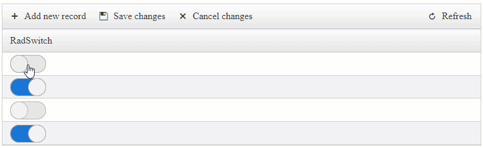

## Environment

<table>
  <tr>
    <td>Product</td>
    <td>Telerik WebForms Grid for ASP.NET AJAX</td>
  </tr>
</table>

## Description

How can I edit the Switches directly in Batch Edit Mode similarly to the example from the [Editing CheckBoxes directly in Batch Edit Mode]() article?



## Solution

The `EditMode="Batch"` is a Client-side Editing functionality where everything is handled on the Client-side. For more details, you can refer to the following articles:
- [BatchEditing Overview]() functionality.
- [BatchEditing Client-Side APIs]().
- [BatchEditing Templates and Specifics]()


The BatchEditing functionality supports basic components such as CheckBox, TextBox out of the box. When working with Controls, such as the Telerik WebForms Switch the editing functionality needs to be overridden, see [Working With Templates]().


- Create the Template Column and add a Switch component both in the `ItemTemplate` and `EditItemTemplate` containers. 
- Attach the [OnClientClicking]() Client-side event to the Switch Component located in the `ItemTemplate` container.
- Bind the `Checked` property to the data source field or your choice by using the `Eval()` expression.
- Attach the following Client-side events to the Grid that will handle the BatchEditing for the Switch:
  - [OnBatchEditGetCellValue]()
  - [OnBatchEditSetCellValue]()
  - [OnBatchEditGetEditorValue]()
  - [OnBatchEditSetEditorValue]()

Markup

````ASP.NET
<telerik:RadGrid ID="RadGrid1" runat="server" OnNeedDataSource="RadGrid1_NeedDataSource" OnBatchEditCommand="RadGrid1_BatchEditCommand">
    <MasterTableView AutoGenerateColumns="False" EditMode="Batch">
        <Columns>
            <telerik:GridTemplateColumn UniqueName="IsActive" DataField="IsActive" HeaderText="RadSwitch">
                <ItemTemplate>
                    <telerik:RadSwitch ID="DisplaySwitch" runat="server" AutoPostBack="false" Checked='<%# Eval("IsActive") %>' OnClientClicking="OnClientClicking" Enabled="false"></telerik:RadSwitch>
                </ItemTemplate>
                <EditItemTemplate>
                    <telerik:RadSwitch ID="EditorSwitch" runat="server" AutoPostBack="false"></telerik:RadSwitch>
                </EditItemTemplate>
            </telerik:GridTemplateColumn>
        </Columns>
    </MasterTableView>
    <ClientSettings>
        <ClientEvents OnBatchEditGetCellValue="GetCellValue" />
        <ClientEvents OnBatchEditSetCellValue="SetCellValue" />
        <ClientEvents OnBatchEditGetEditorValue="GetEditorValue" />
        <ClientEvents OnBatchEditSetEditorValue="SetEditorValue" />
    </ClientSettings>
</telerik:RadGrid>
````

- Override the Batch Editing events to handle the Switch component

````JavaScript
function GetCellValue(sender, args) {
    if (args.get_columnUniqueName() == "IsActive") {
        args.set_cancel(true);
        var container = args.get_container();
        var displaySwitch = $telerik.findControl(container, "DisplaySwitch");
        args.set_value(displaySwitch.get_checked());
    }
}
function SetCellValue(sender, args) {
    if (args.get_columnUniqueName() == "IsActive") {
        args.set_cancel(true);
        var container = args.get_container();
        var displaySwitch = $telerik.findControl(container, "DisplaySwitch");
        displaySwitch.set_checked(args.get_value());
    }
}
function GetEditorValue(sender, args) {
    if (args.get_columnUniqueName() == "IsActive") {
        args.set_cancel(true);
        var container = args.get_container();
        var editorSwitch = $telerik.findControl(container, "EditorSwitch");
        args.set_value(editorSwitch.get_checked());
    }
}
function SetEditorValue(sender, args) {
    if (args.get_columnUniqueName() == "IsActive") {
        args.set_cancel(true);
        var container = args.get_container();
        var editorSwitch = $telerik.findControl(container, "EditorSwitch");
        editorSwitch.set_checked(args.get_value());
    }
}
````

- Finally, In the [OnClientClicking]() Client-side event of the Switch, cancel the event in order to prevent changing the checked state (the BatchEditing will take care of that) and using the BatchEditing APIs to change the cell value to the new checked state value.

````JavaScript
function OnClientClicking(sender, args) {
    args.set_cancel(true);

    var displaySwitch = sender;
    var grid = $find("<%= RadGrid1.ClientID %>");
    var batchManager = grid.get_batchEditingManager();
    var parentCell = $telerik.$(displaySwitch.get_element()).closest("td")[0];

    var valueToSet = !displaySwitch.get_checked();

    batchManager.changeCellValue(parentCell, valueToSet);
}
````

 