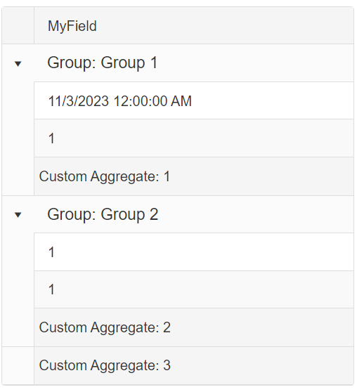

## Description

Sometimes one might want to exclude specific rows from being aggregated.



This will require using custom aggregation. 

## Solution

1. Set the `Aggregate` property of the Column to **Custom**.
1. Bind the `OnCustomAggregate` event to the Grid.
1. In the event handler, you can calculate the values you want and update the footer accordingly 

Example

````ASPX
<telerik:RadGrid
    ID="RadGrid1"
    runat="server"
    AllowPaging="True"
    Width="800px"
    OnNeedDataSource="RadGrid1_NeedDataSource"
    OnCustomAggregate="RadGrid1_CustomAggregate"
    MasterTableView-ShowGroupFooter="true"
    ShowGroupPanel="true"
    ShowFooter="true">
    <ClientSettings AllowDragToGroup="true">
    </ClientSettings>
    <GroupingSettings ShowUnGroupButton="true" />
    <MasterTableView AutoGenerateColumns="false">
        <GroupByExpressions>
            <telerik:GridGroupByExpression>
                <GroupByFields>
                    <telerik:GridGroupByField FieldName="Group" />
                </GroupByFields>

                <SelectFields>
                    <telerik:GridGroupByField FieldName="Group" />
                </SelectFields>
            </telerik:GridGroupByExpression>
        </GroupByExpressions>
        <Columns>
            <telerik:GridBoundColumn DataField="MyField" HeaderText="MyField" DataType="System.String" Aggregate="Custom" />
            <telerik:GridBoundColumn DataField="Group" HeaderText="Group" />
        </Columns>
    </MasterTableView>
</telerik:RadGrid>
````

````C#
	private DataTable OrdersTable()
	{
		DataTable dt = new DataTable();

		dt.Columns.Add(new DataColumn("MyField", typeof(string)));
		dt.Columns.Add(new DataColumn("Group", typeof(string)));

		for (int i = 0; i < 10; i++)
		{
			int index = i + 1;

			DataRow row = dt.NewRow();

			row["Group"] = index % 2 == 0 ? "Group 1" : "Group 2";

			if (index == 2)
			{
				row["MyField"] = DateTime.Now.Date.ToString();
			}
			else
			{
				row["MyField"] = 1;
			}

			dt.Rows.Add(row);
		}

		return dt;
	}

	protected void RadGrid1_NeedDataSource(object sender, GridNeedDataSourceEventArgs e)
	{
		RadGrid grid = sender as RadGrid;
		DataTable sourceData = OrdersTable();
		grid.DataSource = sourceData;
	}

	protected void RadGrid1_CustomAggregate(object sender, GridCustomAggregateEventArgs e)
	{
		if (e.Column.UniqueName == "MyField")
		{
			if (e.Item is GridGroupFooterItem) // Custom Aggregate for the items within the Group
			{
				GridGroupFooterItem groupFooterItem = (GridGroupFooterItem)e.Item;
				GridGroupHeaderItem groupHeaderItem = groupFooterItem.GroupHeaderItem;

				GridItem[] groupChildItems = groupHeaderItem.GetChildItems();

				decimal counter = 0;

				for (int i = 0; i < groupChildItems.Length; i++)
				{
					GridDataItem dataItem = groupChildItems[i] as GridDataItem;

					if (dataItem != null)
					{
						decimal numericValue = 0;

						if (decimal.TryParse(DataBinder.Eval(dataItem.DataItem, "MyField").ToString(), out numericValue))
						{
							counter += numericValue;
						}
					}
				}
				e.Result = counter;
			}
			else if (e.Item is GridFooterItem) // Custom Aggregate for all items in the Grid
			{
				double sum = 0;

				DataTable dt = RadGrid1.DataSource as DataTable;

				foreach (DataRow row in dt.Rows)
				{
					double numericValue;

					if (double.TryParse(row["MyField"].ToString(), out numericValue))
					{
						sum += numericValue;
					}
				}
				e.Result = sum;
			}
		}
	}
````
````VB
Class SurroundingClass
    Private Function OrdersTable() As DataTable
        Dim dt As DataTable = New DataTable()
        
        dt.Columns.Add(New DataColumn("MyField", GetType(String)))
        dt.Columns.Add(New DataColumn("Group", GetType(String)))

        For i As Integer = 0 To 10 - 1
            Dim index As Integer = i + 1
            Dim row As DataRow = dt.NewRow()

            row("Group") = If(index Mod 2 = 0, "Group 1", "Group 2")

            If index = 2 Then
                row("MyField") = DateTime.Now.Date.ToString()
            Else
                row("MyField") = 1
            End If

            dt.Rows.Add(row)
        Next

        Return dt
    End Function

    Protected Sub RadGrid1_NeedDataSource(sender As Object, e As GridNeedDataSourceEventArgs)
        Dim grid As RadGrid = TryCast(sender, RadGrid)
        Dim sourceData As DataTable = OrdersTable()
        grid.DataSource = sourceData
    End Sub

    Protected Sub RadGrid1_CustomAggregate(ByVal sender As Object, ByVal e As GridCustomAggregateEventArgs)
        If e.Column.UniqueName = "MyField" Then

            If TypeOf e.Item Is GridGroupFooterItem Then
                Dim groupFooterItem As GridGroupFooterItem = CType(e.Item, GridGroupFooterItem)
                Dim groupHeaderItem As GridGroupHeaderItem = groupFooterItem.GroupHeaderItem
                Dim groupChildItems As GridItem() = groupHeaderItem.GetChildItems()
                Dim counter As Decimal = 0

                For i As Integer = 0 To groupChildItems.Length - 1
                    Dim dataItem As GridDataItem = TryCast(groupChildItems(i), GridDataItem)

                    If dataItem IsNot Nothing Then
                        Dim numericValue As Decimal = 0

                        If Decimal.TryParse(DataBinder.Eval(dataItem.DataItem, "MyField").ToString(), numericValue) Then
                            counter += numericValue
                        End If
                    End If
                Next

                e.Result = counter
            ElseIf TypeOf e.Item Is GridFooterItem Then
                Dim sum As Double = 0
                Dim dt As DataTable = TryCast(RadGrid1.DataSource, DataTable)

                For Each row As DataRow In dt.Rows
                    Dim numericValue As Double

                    If Double.TryParse(row("MyField").ToString(), numericValue) Then
                        sum += numericValue
                    End If
                Next

                e.Result = sum
            End If
        End If
    End Sub
End Class
````
 