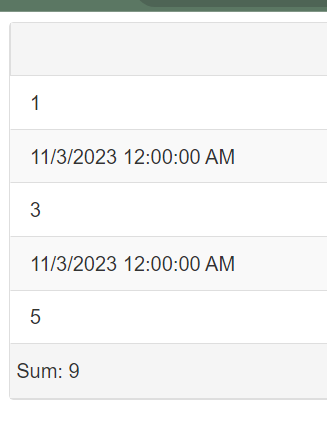

## Environment
<table>
	<tbody>
		<tr>
            		<td>Version</td>
            		<td>2023.3.1010</td> 
		</tr>
		<tr>
			<td>Product</td>
			<td>RadGrid for ASP.NET AJAX</td>
		</tr>
	</tbody>
</table>

## Description

This example demonstrates how to exclude a row from a column with custom aggregation. The below code snippet uses rows of numeric and DateTime values and has its `Aggregate` property set to 'custom': 

## End result 



## Solution

````ASPX
<telerik:RadGrid
    ID="RadGrid1"
    runat="server"
    AllowPaging="True"
    Width="800px"
    OnNeedDataSource="RadGrid1_NeedDataSource"
    ShowFooter="true">
    <MasterTableView AutoGenerateColumns="False">
        <Columns>
            <telerik:GridBoundColumn 
				DataField="MyField" 
				DataType="System.String"
				Aggregate="Custom">
            </telerik:GridBoundColumn>
        </Columns>
    </MasterTableView>
</telerik:RadGrid>
````
````C#
	private DataTable OrdersTable() // Creating a collumn with rows of numeric and DateTime values
    {
        DataTable dt = new DataTable();

        dt.Columns.Add(new DataColumn("MyField", typeof(string)));

        for (int i = 0; i < 5; i++)
        {
            int index = i + 1;

            DataRow row = dt.NewRow();

            if (index == 2 || index == 4)
            {
                row["MyField"] = DateTime.Now.Date.ToString();
            }
            else
            {
                row["MyField"] = index.ToString();
            }

            dt.Rows.Add(row);
        }

        return dt; // This will return a test grid with one column with 5 rows, 2 of which are dates
    }

    protected void RadGrid1_NeedDataSource(object sender, GridNeedDataSourceEventArgs e)
    {
        RadGrid grid = sender as RadGrid;
        DataTable sourceData = OrdersTable();
        grid.DataSource = sourceData;

        double sum = 0;

        foreach (DataRow row in sourceData.Rows)
        {
            double numericValue;
            
            if (double.TryParse(row["MyField"].ToString(), out numericValue)) // If the value in the row is a number, add it to the aggregated sum.
            {
                sum += Convert.ToDouble(row["MyField"]);
            }
        }

        grid.MasterTableView.GetColumn("MyField").FooterText = "Sum: " + sum.ToString();
    }
````
````VB
    Private Function OrdersTable() As DataTable
        Dim dt As DataTable = New DataTable()
        dt.Columns.Add(New DataColumn("MyField", GetType(String)))

        For i As Integer = 0 To 5 - 1
            Dim index As Integer = i + 1
            Dim row As DataRow = dt.NewRow()

            If index = 2 OrElse index = 4 Then
                row("MyField") = DateTime.Now.Date.ToString()
            Else
                row("MyField") = index.ToString()
            End If

            dt.Rows.Add(row)
        Next

        Return dt
    End Function

    Protected Sub RadGrid1_NeedDataSource(ByVal sender As Object, ByVal e As GridNeedDataSourceEventArgs)
        Dim grid As RadGrid = TryCast(sender, RadGrid)
        Dim sourceData As DataTable = OrdersTable()
        grid.DataSource = sourceData
        Dim sum As Double = 0

        For Each row As DataRow In sourceData.Rows
            Dim numericValue As Double

            If Double.TryParse(row("MyField").ToString(), numericValue) Then
                sum += Convert.ToDouble(row("MyField"))
            End If
        Next

        grid.MasterTableView.GetColumn("MyField").FooterText = "Sum: " & sum.ToString()
    End Sub
````


## See Also

*   [Aligning Items in Group](https://docs.telerik.com/devtools/aspnet-ajax/controls/grid/how-to/Grouping/aligning-items-in-groupheader)
