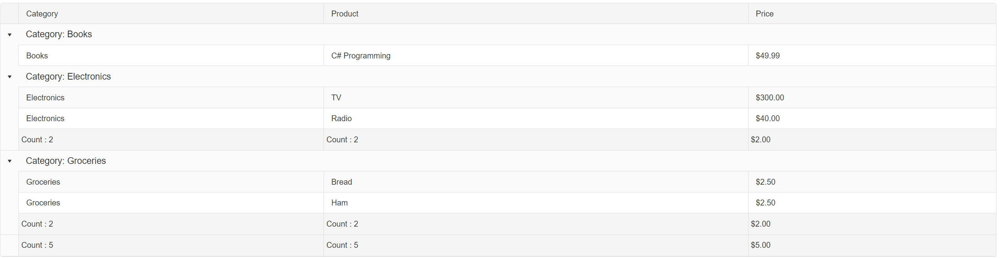

## Description

Sometimes one might want to exclude a group footer when the associated group has only one item.



## Solution

1. On the **ItemDataBound** event handler, check for how many child items are there in a certain group.
1. If there is only one child item, add the **hidden** CSS class.

Example

````C#
protected void RadGrid1_ItemDataBound(object sender, GridItemEventArgs e)
{
    if (e.Item is GridGroupFooterItem)
    {
        GridGroupFooterItem groupFooterItem = (GridGroupFooterItem)e.Item;  // Get a reference to the footer item
        GridGroupHeaderItem groupHeaderItem = groupFooterItem.GroupHeaderItem; // Get a reference to the header item
        GridItem[] groupItems = groupHeaderItem.GetChildItems(); // Get the children elements of each grouped items

        if (groupItems.Count() < 2)
            groupFooterItem.CssClass = "hidden";
    }
}
````

````CSS
<style>
    .RadGrid .rgMasterTable .rgFooter.hidden {
        display: none;
    }
</style>
````
 