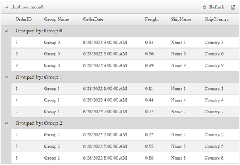
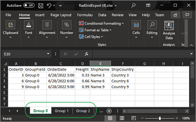

## DESCRIPTION

Export Groups into separate Worksheets when Exporting the RadGrid to Excel (Xlsx).

RadGrid by default exports its data into a single Excel Worksheet. 

You can, however, bypass the the built-in Export functionality and build the Excel Document manually. 

>caption RadGrid with Grouping enabled



>caption Groups exported to Separate Worksheets




## SOLUTION

Cancel the Grid's built-in Export event, and using Telerik [Document Processing Libraries (DPL)](https://docs.telerik.com/devtools/document-processing/introduction) you can build the Excel document manually by looping through the Grid's Groups and creating separate Worksheets for each.


### Step 1

Reference the [required Assemblies for the Excel (Xlsx) Export](#required-assemblies).

### Step 2

Add the following `using` / `Import` statements

````C#
using System.Data;
using System.Linq;
using System.Collections.Generic;
using System.IO;
using Telerik.Web.UI;
using Telerik.Windows.Documents.Spreadsheet.FormatProviders;
using Telerik.Windows.Documents.Spreadsheet.FormatProviders.OpenXml.Xlsx;
using xlsx = Telerik.Windows.Documents.Spreadsheet.Model;
````
````VB
Imports System.Data
Imports System.Linq
Imports System.Collections.Generic
Imports System.IO
Imports Telerik.Web.UI
Imports Telerik.Windows.Documents.Spreadsheet.FormatProviders
Imports Telerik.Windows.Documents.Spreadsheet.FormatProviders.OpenXml.Xlsx
Imports xlsx = Telerik.Windows.Documents.Spreadsheet.Model
````

### Step 3

Add the following RadGrid definition to the page

````ASP.NET
<telerik:RadGrid ID="RadGrid1" runat="server" AllowPaging="True" Width="800px" OnNeedDataSource="RadGrid1_NeedDataSource" OnItemCommand="RadGrid1_ItemCommand">
    <ExportSettings ExportOnlyData="true" HideStructureColumns="true" IgnorePaging="true">
        <Excel Format="Xlsx" />
    </ExportSettings>
    <MasterTableView AutoGenerateColumns="False" DataKeyNames="OrderID" CommandItemDisplay="Top" CommandItemSettings-ShowExportToExcelButton="true">
        <GroupByExpressions>
            <telerik:GridGroupByExpression>
                <GroupByFields>
                    <telerik:GridGroupByField FieldName="GroupField" />
                </GroupByFields>
                <SelectFields>
                    <telerik:GridGroupByField FieldName="GroupField" HeaderText="Grouped by" />
                </SelectFields>
            </telerik:GridGroupByExpression>
        </GroupByExpressions>
        <Columns>
            <telerik:GridBoundColumn DataField="OrderID" DataType="System.Int32"
                FilterControlAltText="Filter OrderID column" HeaderText="OrderID"
                ReadOnly="True" SortExpression="OrderID" UniqueName="OrderID">
            </telerik:GridBoundColumn>
            <telerik:GridBoundColumn DataField="GroupField" HeaderText="Group Name"></telerik:GridBoundColumn>
            <telerik:GridDateTimeColumn DataField="OrderDate" DataType="System.DateTime"
                FilterControlAltText="Filter OrderDate column" HeaderText="OrderDate"
                SortExpression="OrderDate" UniqueName="OrderDate">
            </telerik:GridDateTimeColumn>
            <telerik:GridNumericColumn DataField="Freight" DataType="System.Decimal"
                FilterControlAltText="Filter Freight column" HeaderText="Freight"
                SortExpression="Freight" UniqueName="Freight">
            </telerik:GridNumericColumn>
            <telerik:GridBoundColumn DataField="ShipName"
                FilterControlAltText="Filter ShipName column" HeaderText="ShipName"
                SortExpression="ShipName" UniqueName="ShipName">
            </telerik:GridBoundColumn>
            <telerik:GridBoundColumn DataField="ShipCountry"
                FilterControlAltText="Filter ShipCountry column" HeaderText="ShipCountry"
                SortExpression="ShipCountry" UniqueName="ShipCountry">
            </telerik:GridBoundColumn>
        </Columns>
    </MasterTableView>
</telerik:RadGrid>
````

### Step 4

Handle the Data Binding

````C#
protected void RadGrid1_NeedDataSource(object sender, GridNeedDataSourceEventArgs e)
{
    (sender as RadGrid).DataSource = OrdersTable();
}

private DataTable OrdersTable()
{
    DataTable dt = new DataTable();

    dt.Columns.Add(new DataColumn("OrderID", typeof(int)));
    dt.Columns.Add(new DataColumn("OrderDate", typeof(DateTime)));
    dt.Columns.Add(new DataColumn("Freight", typeof(decimal)));
    dt.Columns.Add(new DataColumn("ShipName", typeof(string)));
    dt.Columns.Add(new DataColumn("ShipCountry", typeof(string)));
    dt.Columns.Add(new DataColumn("GroupField", typeof(string)));

    dt.PrimaryKey = new DataColumn[] { dt.Columns["OrderID"] };

    for (int i = 0; i < 9; i++)
    {
        int index = i + 1;

        DataRow row = dt.NewRow();

        row["OrderID"] = index;
        row["OrderDate"] = DateTime.Now.Date.AddDays(index);
        row["Freight"] = index * 0.1 + index * 0.01;
        row["ShipName"] = "Name " + index;
        row["ShipCountry"] = "Country " + index;
        row["GroupField"] = "Group " + index % 3;

        dt.Rows.Add(row);
    }
    return dt;
}
````
````VB
Protected Sub RadGrid1_NeedDataSource(ByVal sender As Object, ByVal e As GridNeedDataSourceEventArgs)
    CType(sender, RadGrid).DataSource = OrdersTable()
End Sub

Private Function OrdersTable() As DataTable
    Dim dt As DataTable = New DataTable()

    dt.Columns.Add(New DataColumn("OrderID", GetType(Integer)))
    dt.Columns.Add(New DataColumn("OrderDate", GetType(DateTime)))
    dt.Columns.Add(New DataColumn("Freight", GetType(Decimal)))
    dt.Columns.Add(New DataColumn("ShipName", GetType(String)))
    dt.Columns.Add(New DataColumn("ShipCountry", GetType(String)))
    dt.Columns.Add(New DataColumn("GroupField", GetType(String)))

    dt.PrimaryKey = New DataColumn() {dt.Columns("OrderID")}

    For i As Integer = 0 To 9 - 1
        Dim index As Integer = i + 1
        Dim row As DataRow = dt.NewRow()
        row("OrderID") = index
        row("OrderDate") = DateTime.Now.Date.AddDays(index)
        row("Freight") = index * 0.1 + index * 0.01
        row("ShipName") = "Name " & index
        row("ShipCountry") = "Country " & index
        row("GroupField") = "Group " & index Mod 3
        dt.Rows.Add(row)
    Next

    Return dt
End Function
````

### Step 5

Build an excel document manually using the DPL. 

Within the ItemCommand event capture the ExportToExcel command, and looping through the Grid Groups. For each Group create a new Worksheet and fill it with data.

At the end of the logic, there are couple of helper functions that will trigger the Download automatically.

````C#
protected void RadGrid1_ItemCommand(object sender, GridCommandEventArgs e)
{
    RadGrid grid = (RadGrid)sender;

    if (e.CommandName == RadGrid.ExportToExcelCommandName && grid.ExportSettings.Excel.Format == GridExcelExportFormat.Xlsx)
    {
        // Cancel the original event
        e.Canceled = true;

        // Disable Paging, so all Group across all pages will be available
        grid.AllowPaging = false;
        // Refresh the changes
        grid.Rebind();

        // Create a Workbook object
        xlsx.Workbook myWorkbook = new xlsx.Workbook();

        // Get all the Group Headers
        GridItem[] groupHeaderItems = grid.MasterTableView.GetItems(GridItemType.GroupHeader);

        // Get all the Column unoqueNames
        List<string> columnUniqueNames = grid.MasterTableView.RenderColumns.OfType<IGridDataColumn>().Select(col => (col as GridColumn).UniqueName).ToList();

        foreach (GridGroupHeaderItem groupHeaderItem in groupHeaderItems)
        {
            // Create Worksheet object for the Workbook
            xlsx.Worksheet myWorksheet = myWorkbook.Worksheets.Add();

            // Parse the Group Header Text to fetch the Group Value
            string groupValue = groupHeaderItem.DataCell.Text.Split(':')[1].Trim();

            // Name the Worksheet by the Group value
            // Name must not exceed 33 characters & must not contain special characters
            myWorksheet.Name = groupValue;

            // Get the List of Group Items
            List<GridDataItem> groupItems = groupHeaderItem.GetChildItems().Select(item => (GridDataItem)item).ToList();

            // Create the Column Headers for the Current Sheet
            // Loop through the Column Unique Names
            for (int colIndex = 0; colIndex < columnUniqueNames.Count; colIndex++)
            {
                // Mark the cell for the Column Header
                xlsx.CellSelection headerCell = myWorksheet.Cells[0, colIndex];
                // Set the Cell value
                headerCell.SetValue(columnUniqueNames[colIndex]);
            }


            // Loop through the Group Items
            for (int rowIndex = 0; rowIndex < groupItems.Count; ++rowIndex)
            {
                // Loop through the Column Unique Names
                for (int colIndex = 0; colIndex < columnUniqueNames.Count; colIndex++)
                {
                    // Get reference to the GridDataItem
                    GridDataItem groupItem = groupItems[rowIndex];

                    // Get the Column name
                    string columnUniqueName = columnUniqueNames[colIndex];

                    // Fetch the text from the GridDataItem cell by Column UniqueName
                    string cellText = groupItem[columnUniqueName].Text;

                    // Create a CellSelection
                    xlsx.CellSelection dataCell = myWorksheet.Cells[rowIndex + 1, colIndex];

                    // Set the Cell Value
                    dataCell.SetValue(cellText);
                }
            }
        }

        // Once the Workbook object is ready, export it manually.
        DownloadXlsxFile(WorkbookToByteArray(myWorkbook), grid.ExportSettings.FileName);

        //Note: None of changes made above will affect the Grid because the Headers are cleared upon exporting and so the Response will not update the Grid at the end of the PostBack. There is no need to turn paging back or re-set any of the properties.
    }
}

#region Helper Functions
private byte[] WorkbookToByteArray(xlsx.Workbook workbook)
{
    byte[] output = null;

    var thread = new System.Threading.Thread(() =>
    {
        IWorkbookFormatProvider formatProvider = new XlsxFormatProvider();
        using (MemoryStream ms = new MemoryStream())
        {
            formatProvider.Export(workbook, ms);
            output = ms.ToArray();
        }
    });

    thread.SetApartmentState(System.Threading.ApartmentState.STA);

    thread.Start();
    thread.Join();

    return output;
}

private void DownloadXlsxFile(byte[] output, string fileName, bool shouldOpenInNewWindow = true)
{
    var contentType = "application/vnd.openxmlformats-officedocument.spreadsheetml.sheet";
    var fileExtension = ".xlsx";

    Response.Clear();
    Response.Buffer = true;

    Response.ContentType = contentType;
    Response.ContentEncoding = System.Text.Encoding.UTF8;

    Response.Charset = "";

    if (Request.Browser.Browser.IndexOf("IE") > -1 || Request.Browser.Browser.IndexOf("InternetExplorer") > -1)
    {
        fileName = System.Web.HttpUtility.UrlEncode(fileName, System.Text.Encoding.UTF8);
    }

    var responseFileName = fileName + (fileName.EndsWith(fileExtension) ? string.Empty : fileExtension);
    //sanitize input file name
    responseFileName = responseFileName.Replace("\n", " ").Replace("\r", " ");

    if (shouldOpenInNewWindow)
    {
        Response.AddHeader("Content-Disposition", "attachment;filename=\"" + responseFileName + "\"");
    }
    else
    {
        Response.AddHeader("Content-Disposition", "inline;filename=\"" + responseFileName + "\"");
    }
    Response.BinaryWrite(output);
    Response.End();
}
#endregion
````
````VB
Protected Sub RadGrid1_ItemCommand(ByVal sender As Object, ByVal e As GridCommandEventArgs)
    Dim grid As RadGrid = CType(sender, RadGrid)

    If e.CommandName = RadGrid.ExportToExcelCommandName AndAlso grid.ExportSettings.Excel.Format = GridExcelExportFormat.Xlsx Then
        'Cancel the original event
        e.Canceled = True

        'Disable Paging, so all Group across all pages will be available
        grid.AllowPaging = False

        'Refresh the changes
        grid.Rebind()

        'Create a Workbook object
        Dim myWorkbook As xlsx.Workbook = New xlsx.Workbook()

        '
        Dim groupHeaderItems As GridItem() = grid.MasterTableView.GetItems(GridItemType.GroupHeader)

        'Get all the Column unoqueNames
        Dim columnUniqueNames As List(Of String) = grid.MasterTableView.RenderColumns.OfType(Of IGridDataColumn)().[Select](Function(col) (TryCast(col, GridColumn)).UniqueName).ToList()

        For Each groupHeaderItem As GridGroupHeaderItem In groupHeaderItems
            'Create Worksheet object for the Workbook
            Dim myWorksheet As xlsx.Worksheet = myWorkbook.Worksheets.Add()

            'Parse the Group Header Text to fetch the Group Value
            Dim groupValue As String = groupHeaderItem.DataCell.Text.Split(":"c)(1).Trim()

            'Name the Worksheet by the Group value
            'Name must Not exceed 33 characters & must Not contain special characters
            myWorksheet.Name = groupValue

            'Get the List of Group Items
            Dim groupItems As List(Of GridDataItem) = groupHeaderItem.GetChildItems().[Select](Function(item) CType(item, GridDataItem)).ToList()

            'Create the Column Headers for the Current Sheet
            'Loop through the Column Unique Names
            For colIndex As Integer = 0 To columnUniqueNames.Count - 1
                'Mark the cell for the Column Header
                Dim headerCell As xlsx.CellSelection = myWorksheet.Cells(0, colIndex)
                'Set the Cell value
                headerCell.SetValue(columnUniqueNames(colIndex))
            Next

            'Loop through the Group Items
            For rowIndex As Integer = 0 To groupItems.Count - 1
                'Loop through the Column Unique Names
                For colIndex As Integer = 0 To columnUniqueNames.Count - 1
                    'Get reference to the GridDataItem
                    Dim groupItem As GridDataItem = groupItems(rowIndex)

                    'Get the Column name
                    Dim columnUniqueName As String = columnUniqueNames(colIndex)

                    'Fetch the text from the GridDataItem cell by Column UniqueName
                    Dim cellText As String = groupItem(columnUniqueName).Text

                    'Create a CellSelection
                    Dim dataCell As xlsx.CellSelection = myWorksheet.Cells(rowIndex + 1, colIndex)

                    'Set the Cell Value
                    dataCell.SetValue(cellText)
                Next
            Next
        Next

        'Once the Workbook object is ready, export it manually.
        DownloadXlsxFile(WorkbookToByteArray(myWorkbook), grid.ExportSettings.FileName)

        'Note: None of changes made above will affect the Grid because the Headers are cleared upon exporting and so the Response will not update the Grid at the end of the PostBack. There is no need to turn paging back or re-set any of the properties.
    End If
End Sub

Private Function WorkbookToByteArray(ByVal workbook As xlsx.Workbook) As Byte()
    Dim output As Byte() = Nothing
    Dim thread = New System.Threading.Thread(Sub()
                                                    Dim formatProvider As IWorkbookFormatProvider = New XlsxFormatProvider()

                                                    Using ms As MemoryStream = New MemoryStream()
                                                        formatProvider.Export(workbook, ms)
                                                        output = ms.ToArray()
                                                    End Using
                                                End Sub)
    thread.SetApartmentState(System.Threading.ApartmentState.STA)
    thread.Start()
    thread.Join()
    Return output
End Function

Private Sub DownloadXlsxFile(ByVal output As Byte(), ByVal fileName As String, ByVal Optional shouldOpenInNewWindow As Boolean = True)
    Dim contentType = "application/vnd.openxmlformats-officedocument.spreadsheetml.sheet"
    Dim fileExtension = ".xlsx"
    Response.Clear()
    Response.Buffer = True
    Response.ContentType = contentType
    Response.ContentEncoding = System.Text.Encoding.UTF8
    Response.Charset = ""

    If Request.Browser.Browser.IndexOf("IE") > -1 OrElse Request.Browser.Browser.IndexOf("InternetExplorer") > -1 Then
        fileName = System.Web.HttpUtility.UrlEncode(fileName, System.Text.Encoding.UTF8)
    End If

    Dim responseFileName = fileName & (If(fileName.EndsWith(fileExtension), String.Empty, fileExtension))
    responseFileName = responseFileName.Replace(vbLf, " ").Replace(vbCr, " ")

    If shouldOpenInNewWindow Then
        Response.AddHeader("Content-Disposition", "attachment;filename=""" & responseFileName & """")
    Else
        Response.AddHeader("Content-Disposition", "inline;filename=""" & responseFileName & """")
    End If

    Response.BinaryWrite(output)
    Response.End()
End Sub
````
 
For more details, check out the following Help articles:


- [Excel-Xlsx (OOXML) Export]()
- [Integration with Telerik Document Processing Libraries (DPL)]()
- [ItemCommand Event]()
- [Document Processing Libraries (DPL)](https://docs.telerik.com/devtools/document-processing/introduction)

## SEE ALSO

- [Excel-Xlsx (OOXML) Export]()
- [Integration with Telerik Document Processing Libraries (DPL)]()
- [ItemCommand Event]()
- [Document Processing Libraries (DPL)](https://docs.telerik.com/devtools/document-processing/introduction)
 

