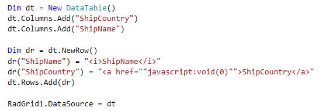
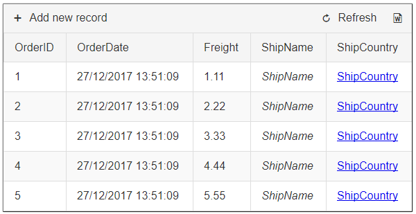
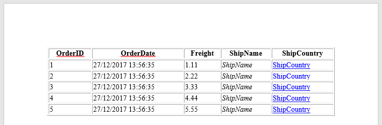
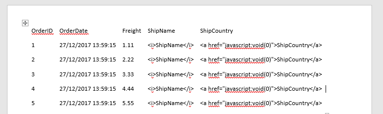
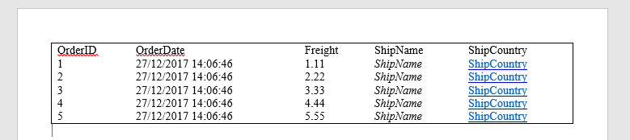
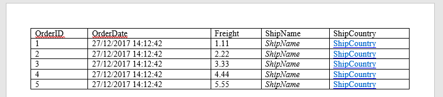

## Environment

<table>
	<tbody>
		<tr>
			<td>Product</td>
			<td>Telerik WebForms Grid for ASP.NET AJAX</td>
		</tr>
	</tbody>
</table>

## Description

There are cases when the data bound to RadGrid contains html tags, which is rendered as expected on the page.

Example datatable with data containing HTML tags:



Data renderd on the page:



There would be no issues if the exporting was done into Html based Word document (.doc). All it takes is to define Html for the export format (Export Settings -> Word Format -> Html.)

````ASP.NET
<ExportSettings>
    <Word Format="Html" />
</ExportSettings>
````



In our case, however, XML Based Word Document (.docx) is the required format. Changing the Word Format to Docx, in the exported file, Html tags will be returned as string



## Solution

Export the grid using HTML for Word Format, convert the Html to Docx using our Document Processing Libraries and then return the result in the Page response for download.

Set the Word format to HTML

````ASP.NET
<ExportSettings>
    <Word Format="Html" />
</ExportSettings>
````

Covnert the output to Docx using the [GridExporting]() event.

````C#
protected void RadGrid1_GridExporting(object sender, GridExportingArgs e)
{
    if ((e.ExportType == ExportType.Word))
    {
        RadFlowDocument document = new RadFlowDocument(); // Create a RadFlowDocument object

        HtmlFormatProvider htmlProvider = new HtmlFormatProvider(); // Importing the HTML output from the grid into the htmlProvider
        document = htmlProvider.Import(e.ExportOutput);

        byte[] data = null;

        foreach (Section section in document.EnumerateChildrenOfType<Section>()) 
        {
            section.Rotate(PageOrientation.Landscape); // Changing the page orientation of all sections in a document
        } 

        using (MemoryStream ms = new MemoryStream()) // Export the final document (docx) into the MemoryStream
        {
            DocxFormatProvider docxProvider = new DocxFormatProvider();
            docxProvider.Export(document, ms);
            data = ms.ToArray(); // Get the byte data of the document
        }

        Response.ContentType = "application/vnd.openxmlformats-officedocument.wordprocessingml.document"; // Send the data in the response for download
        Response.Headers.Remove("Content-Disposition");
        Response.AppendHeader("Content-Disposition", "attachment; filename=" + RadGrid1.ExportSettings.FileName + ".docx");
        Response.BinaryWrite(data);
        Response.End();
    }
}
````
````VB
Protected Sub RadGrid1_GridExporting(sender As Object, e As GridExportingArgs)
    If (e.ExportType = ExportType.Word) Then
        '' Create a RadFlowDocument object
        Dim document As RadFlowDocument = New RadFlowDocument()

        '' Importing the HTML output from the grid into the htmlProvider
        Dim htmlProvider As HtmlFormatProvider = New HtmlFormatProvider()
        document = htmlProvider.Import(e.ExportOutput)

        Dim data As Byte() = Nothing

        '' Changing the page orientation of all sections in a document
        For Each section As Section In document.EnumerateChildrenOfType(Of Section)()
            section.Rotate(PageOrientation.Landscape)
        Next

        '' export the final document (docx) into the MemoryStream
        Using ms As New MemoryStream()
            Dim docxProvider As DocxFormatProvider = New DocxFormatProvider()
            docxProvider.Export(document, ms)
            data = ms.ToArray() '' get the byte data of the document
        End Using

        '' send the data in the response for download
        Response.ContentType = "application/vnd.openxmlformats-officedocument.wordprocessingml.document"
        Response.Headers.Remove("Content-Disposition")
        Response.AppendHeader("Content-Disposition", "attachment; filename=" & RadGrid1.ExportSettings.FileName & ".docx")
        Response.BinaryWrite(data)
        Response.End()
    End If
End Sub
````

Result



One more thing to adjust in here. Note, the cell borders are not present in the picture above. To overcome that, apply the desired style to the cells inside the PreRender event of RadGrid.

````C#
protected void RadGrid1_PreRender(object sender, EventArgs e)
{
    if (RadGrid1.IsExporting)
    {
        foreach (TableHeaderCell headerCell in RadGrid1.MasterTableView.GetItems(GridItemType.Header)[0].Cells) // Setting borders for the Header Cells
        {
            headerCell.Style["border"] = "1px solid";
        }
        
        foreach (GridDataItem dataItem in RadGrid1.Items) // Setting borders for the data cells
        {
            foreach (GridTableCell cell in dataItem.Cells) 
            {
                cell.Style["border"] = "1px solid";
            }
        }
    }
}
````
````VB
Protected Sub RadGrid1_PreRender(sender As Object, e As EventArgs)
    If RadGrid1.IsExporting Then
        '' Setting borders for the Header Cells
        For Each headerCell As TableHeaderCell In RadGrid1.MasterTableView.GetItems(GridItemType.Header)(0).Cells
            headerCell.Style("border") = "1px solid"
        Next
        '' Setting borders for the data cells
        For Each dataItem As GridDataItem In RadGrid1.Items
            For Each cell As GridTableCell In dataItem.Cells
                cell.Style("border") = "1px solid"
            Next
        Next
    End If
End Sub
````

Final result



 
  
   
    