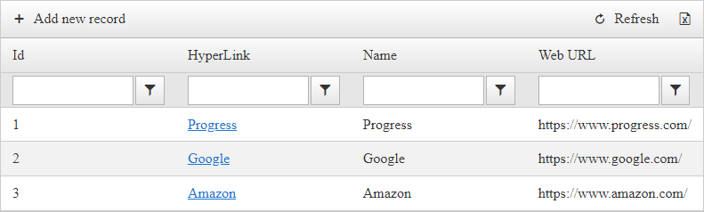
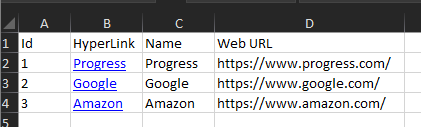

## Description

>caption Example RadGrid



>caption Example Exported Excel (XLSX) File



When it comes to exporting HTML content to Excel, only the [HTML-Based]() exporting supports it out of the box.

The built-in functionality to export to [XLSX (OpenXML)]() will only export data, meaning that the content of Template Columns will not be included by default, see [Export Template Columns](#export-template-columns).

This article will show how to Export Hyperlinks to XLSX (OpenXML) Excel using the [Telerik Document Processing Libraries (DPL)](https://docs.telerik.com/devtools/document-processing/introduction).

## Solution

You will need to access the Excel Document Output generated by the Grid (see [Generate Export Output](#generate-export-output)), and using the APIs provided by the [Telerik Document Processing Libraries (DPL)](https://docs.telerik.com/devtools/document-processing/introduction), you can loop through the cells and rows of the Workbook and create Excel (XLSX) compatible Hyperlink for the affected cells.


#### RadGrid Markup Definition

````ASP.NET
<telerik:RadGrid ID="RadGrid1" runat="server" AllowFilteringByColumn="true" AllowPaging="True" Width="400px" OnNeedDataSource="RadGrid1_NeedDataSource" OnItemCommand="RadGrid1_ItemCommand">
    <ExportSettings HideStructureColumns="true">
        <Excel Format="Xlsx" />
    </ExportSettings>
    <MasterTableView AutoGenerateColumns="False" DataKeyNames="Id" CommandItemDisplay="Top">
        <CommandItemSettings ShowExportToExcelButton="true" />
        <Columns>
            <telerik:GridBoundColumn DataField="Id" UniqueName="Id" HeaderText="Id" ReadOnly="true"></telerik:GridBoundColumn>
            <telerik:GridTemplateColumn UniqueName="MyColumn" HeaderText="HyperLink">
                <ItemTemplate>
                    <asp:HyperLink ID="HyperLink1" runat="server" NavigateUrl='<%# Eval("WebUrl") %>' Target="_blank" Text='<%# Eval("Name") %>'></asp:HyperLink>
                </ItemTemplate>
            </telerik:GridTemplateColumn>
            <telerik:GridBoundColumn DataField="Name" HeaderText="Name" UniqueName="Name"></telerik:GridBoundColumn>
            <telerik:GridBoundColumn DataField="WebUrl" HeaderText="Web URL" UniqueName="WebUrl"></telerik:GridBoundColumn>
        </Columns>
    </MasterTableView>
</telerik:RadGrid>
````

#### NeedDataSource Event

The event used to bind data to RadGrid

````C#
protected void RadGrid1_NeedDataSource(object sender, GridNeedDataSourceEventArgs e)
{
    var listOfItems = new List<MyItem>();

    listOfItems.Add(new MyItem() { Id = 1, Name = "Progress", WebUrl = "https://www.progress.com/" });
    listOfItems.Add(new MyItem() { Id = 2, Name = "Google", WebUrl = "https://www.google.com/" });
    listOfItems.Add(new MyItem() { Id = 3, Name = "Amazon", WebUrl = "https://www.amazon.com/" });

    (sender as RadGrid).DataSource = listOfItems;
}
public class MyItem
{
    public int Id { get; set; }
    public string Name { get; set; }
    public string WebUrl { get; set; }
}
````

#### Using Namespaces

````C#
using System;
using System.Web.UI.WebControls;
using Telerik.Web.UI;
using System.Linq;
using System.IO;
using System.Collections.Generic;
using xlsx = Telerik.Windows.Documents.Spreadsheet.Model;
using Telerik.Windows.Documents.Spreadsheet.FormatProviders;
using Telerik.Windows.Documents.Spreadsheet.FormatProviders.OpenXml.Xlsx;
````

#### ItemCommand Event 

This event is used to manipulate the export output

````C#
protected void RadGrid1_ItemCommand(object sender, GridCommandEventArgs e)
{
    var grid = (RadGrid)sender;
    // If exporting to excel and the Excel Format is XLSX
    if (e.CommandName == RadGrid.ExportToExcelCommandName && grid.ExportSettings.Excel.Format == GridExcelExportFormat.Xlsx)
    {
        // Cancel the original event.
        e.Canceled = true;

        // Generate a Workbook object with the Grid's structure
        xlsx.Workbook workbook = grid.MasterTableView.GenerateXlsxOutput<xlsx.Workbook>() as xlsx.Workbook;
        // Access the worksheet
        xlsx.Worksheet worksheet = workbook.Worksheets[0];
        // Access the used cells
        xlsx.CellRange usedCells = worksheet.UsedCellRange;
        // Number of columns used in the Worksheet
        int colCount = usedCells.ColumnCount;
        // Number of rows used in the Worksheet
        int rowCount = usedCells.RowCount;

        // If the CommandItem is displayed on the top
        if (grid.MasterTableView.CommandItemDisplay == GridCommandItemDisplay.Top || grid.MasterTableView.CommandItemDisplay == GridCommandItemDisplay.TopAndBottom)
        {
            // Remove the first empty line from the Worksheet
            worksheet.Rows[0, 0].Remove();
        }

        // If Filtering is enabled
        if (grid.MasterTableView.AllowFilteringByColumn)
        {
            // Remove the Empty line below the Column Headers
            worksheet.Rows[1, 1].Remove();
        }

        int rowOffset = 0;

        // If the header is shown, create an offset
        if (grid.ShowHeader)
            rowOffset += 1;

        // Get the Template Columns' Index/Position in RadGrid
        var colIndex = (grid.MasterTableView.GetColumn("MyColumn") as GridColumn).OrderIndex;

        // Discount the first two columns (GridExpandCollapseColumn & GridRowIndicatorColumn)
        colIndex -= 2; 

        // Loop through the Grid items
        for (int i = 0; i < grid.MasterTableView.Items.Count; i++)
        {
            // Apply the Offset to exclude the Header row
            int affectedRowIndex = i + rowOffset;
            // Access the Grid item
            GridDataItem dataItem = grid.MasterTableView.Items[i];
                
            // Access the HyperLink control in the Grid row
            HyperLink myHyperLink = dataItem["MyColumn"].FindControl("HyperLink1") as HyperLink;


            // Select the Cell in Worksheet that will have a Hyperlink
            xlsx.CellSelection affectedCell = worksheet.Cells[affectedRowIndex, colIndex];
            // Create an Excel HyperLink based on the Hyperlink control from the Grid row
            xlsx.HyperlinkInfo webAddres = xlsx.HyperlinkInfo.CreateHyperlink(myHyperLink.NavigateUrl, myHyperLink.Text);
            // Add the Excel HyperLink to the selected Worksheet cell
            worksheet.Hyperlinks.Add(affectedCell.CellRanges.First(), webAddres);
            // Set the Selected Worksheet Cell's Text
            affectedCell.SetValue(myHyperLink.Text);
                
        }

        // Once done manipulating the Workbook, convert it to Byte array and download it
        // See "Helper Functions" section below for more info about the Download Function.
        DownloadXlsxFile(WorkbookToByteArray(workbook), grid.ExportSettings.FileName);
    }
}
````

#### Helper functions
````C#
// Function to Convert Workbook object to byte array
private byte[] WorkbookToByteArray(xlsx.Workbook workbook)
{
    byte[] output = null;

    var thread = new System.Threading.Thread(() =>
    {
        IWorkbookFormatProvider formatProvider = new XlsxFormatProvider();
        using (MemoryStream ms = new MemoryStream())
        {
            formatProvider.Export(workbook, ms);
            output = ms.ToArray();
        }
    });

    thread.SetApartmentState(System.Threading.ApartmentState.STA);

    thread.Start();
    thread.Join();

    return output;
}
// Function to download the byte array as XLSX File
private void DownloadXlsxFile(byte[] output, string fileName, bool shouldOpenInNewWindow = true)
{
    var contentType = "application/vnd.openxmlformats-officedocument.spreadsheetml.sheet";
    var fileExtension = ".xlsx";

    Response.Clear();
    Response.Buffer = true;

    Response.ContentType = contentType;
    Response.ContentEncoding = System.Text.Encoding.UTF8;

    Response.Charset = "";

    if (Request.Browser.Browser.IndexOf("IE") > -1 || Request.Browser.Browser.IndexOf("InternetExplorer") > -1)
    {
        fileName = System.Web.HttpUtility.UrlEncode(fileName, System.Text.Encoding.UTF8);
    }

    var responseFileName = fileName + (fileName.EndsWith(fileExtension) ? string.Empty : fileExtension);
    //sanitize input file name
    responseFileName = responseFileName.Replace("\n", " ").Replace("\r", " ");

    if (shouldOpenInNewWindow)
    {
        Response.AddHeader("Content-Disposition", "attachment;filename=\"" + responseFileName + "\"");
    }
    else
    {
        Response.AddHeader("Content-Disposition", "inline;filename=\"" + responseFileName + "\"");
    }
    Response.BinaryWrite(output);
    Response.End();
}
````

## See Also

- [Telerik Document Processing Libraries (DPL)](https://docs.telerik.com/devtools/document-processing/introduction)
- [Insert and Remove Rows and Columns - DPL](https://docs.telerik.com/devtools/document-processing/libraries/radspreadprocessing/working-with-rows-and-columns/insert-and-remove#remove-rows)
- [Hyperlink - DPL](https://docs.telerik.com/devtools/document-processing/libraries/radspreadprocessing/features/hyperlink)

