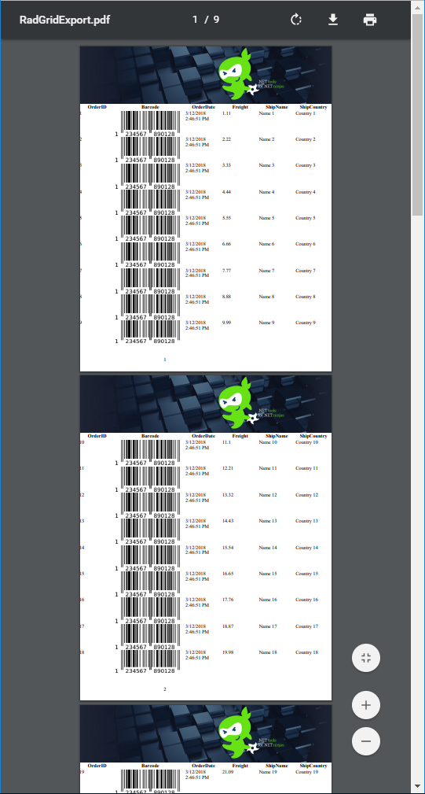
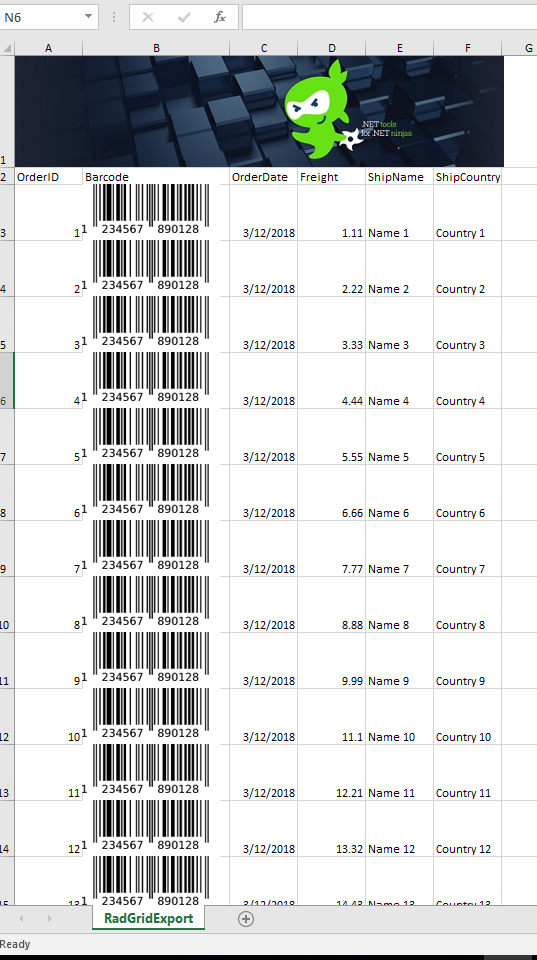

## Environment

| Product | Telerik WebForms Grid for ASP.NET AJAX |
| --- | --- |
| Version | all |

## Description

Code sample that demonstrates Exporting Grid with an Image as Header for both PDF and Excel.




Did you know that the **CommandItemTemplate** of RadGrid can also be exported if the ***ExportSettings-ExportOnlyData*** property is set to **False**, and that it can be used to build a header for the exported files? Since setting Headers/Footers for the exported document is limited, this could be a viable workaround to export your company logo, banner as header.

## Solution

### Export Image as Header for PDF

This sample is using the approach from the [Grid - Export to PDF demo](https://demos.telerik.com/aspnet-ajax/grid/examples/functionality/exporting/pdf-export/defaultcs.aspx) except that it spans the header until the edges without margin/padding.

Settings for the PDF Page (I've defined the properties in the markup, but it can be set in the code behind as well)

````ASP.NET
<ExportSettings>
    <Pdf PageTopMargin="-2" PageLeftMargin="-1" PageRightMargin="-1" PageWidth="200mm"></Pdf>
</ExportSettings>
````

Markup - CommandItemTemplate containing an Image

````ASP.NET
<CommandItemTemplate>
    <asp:Image ID="Image1" runat="server" ImageUrl="Img/cropped_banner.jpg"></asp:Image>
</CommandItemTemplate>
````

Of course, the **CommandItem** does not have to be visible at all times, you can use the following approach to only show it during the export event.

````ASP.NET
<MasterTableView ... CommandItemDisplay='<%# (RadGrid1.IsExporting) ? GridCommandItemDisplay.Top : GridCommandItemDisplay.None %>'>
````

Finally, the code behind that will span the image over the CommandItem cells.

````C#
protected void RadGrid1_ItemCreated(object sender, GridItemEventArgs e)
{
    if (RadGrid1.IsExporting && e.Item is GridCommandItem)
    {
        e.Item.PrepareItemStyle();  //needed to span the image over the CommandItem cells
    }
}
````
````VB
Protected Sub RadGrid1_ItemCreated(ByVal sender As Object, ByVal e As GridItemEventArgs)
    If RadGrid1.IsExporting AndAlso TypeOf e.Item Is GridCommandItem Then
        e.Item.PrepareItemStyle() 'needed to span the image over the CommandItem cells 
    End If
End Sub
````

It is now ready to be exported (the sample uses a button, but it's not limited to)

````C#
protected void RadButton1_Click(object sender, EventArgs e)
{
    RadGrid1.ExportToPdf();
}
````
````VB
Protected Sub RadButton1_Click(ByVal sender As Object, ByVal e As EventArgs)
    RadGrid1.ExportToPdf()
End Sub
````

### Export Image as Header for Excel

For excel, we will change the approach a little bit, and we'll follow the Image Support section of the Export Infrastructure article to add the image.

Markup - Set the Excel Format to Biff.

````ASP.NET
<ExportSettings>
    <Excel Format="Biff" /> // works with Biff and Xlsx formats
</ExportSettings>
````

Image applied inside the InfrastructureExporting event handler

````C#
protected void RadGrid1_InfrastructureExporting(object sender, GridInfrastructureExportingEventArgs e)
{
    var table = e.ExportStructure.Tables[0]; // get a reference to the export structure of RadGrid
    table.Rows[1].Height = 132; // Apply height to the first row
    table.InsertImage(table.Cells[1, 1], "Img/small_banner.jpg"); // Inserts the image to the first cell in the first row
}
````
````VB
Protected Sub RadGrid1_InfrastructureExporting(ByVal sender As Object, ByVal e As GridInfrastructureExportingEventArgs)
    Dim table = e.ExportStructure.Tables(0) 'get a reference to the export structure of RadGrid 
    table.Rows(1).Height = 132 'Apply height to the first row 
    table.InsertImage(table.Cells(1, 1), "Img/small_banner.jpg") 'Inserts the image to the first cell in the first row 
End Sub
````

To apply additional style to RadGrid before it gets exported, you can do that in the PreRender event handler

````C#
protected void RadGrid1_PreRender(object sender, EventArgs e)
{
    if (RadGrid1.IsExporting)
    {
        foreach (GridDataItem item in RadGrid1.Items)
        {
            item.Height = Unit.Pixel(66); // we'll apply some height to DataItems as we're exporting some pictures and we want them to fit the cell in the excel file
        }
    }
}
````
````VB
Protected Sub RadGrid1_PreRender(ByVal sender As Object, ByVal e As EventArgs)
    If RadGrid1.IsExporting Then
        For Each item As GridDataItem In RadGrid1.Items
            item.Height = Unit.Pixel(66) 'we'll apply some height to DataItems as we're exporting some pictures and we want them to fit the cell in the excel file 
        Next
    End If
End Sub
````

And then export.

````C#
protected void RadButton2_Click(object sender, EventArgs e)
{
    RadGrid1.ExportToExcel();
}
````
````VB
Protected Sub RadButton2_Click(ByVal sender As Object, ByVal e As EventArgs)
    RadGrid1.ExportToExcel()
End Sub
````

**DOWNLOAD** the sample project: [grid-export-to-pdf-excel-image-header.zip](files/grid-export-to-pdf-excel-image-header.zip)

  
