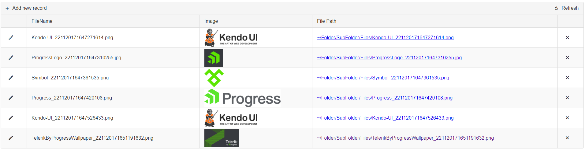

## Environment 

<table>
	<tbody>
		<tr>
			<td>Product</td>
			<td>Telerik WebForms Grid for ASP.NET AJAX</td>
		</tr>
	</tbody>
</table>

## Description

An example code to get the file path to the uploaded file using Async Upload inside RadGrid, supports **Insert**, **Update** and **Delete** features.

 

## Solution

This scenario contains a RadGrid control that has data bound to it using Declarative DataSource and is using Form Template Edit Form. The FormTemplate contains a RadAsyncUpload control together with an Insert/Update button.

````ASP.NET
<telerik:RadGrid RenderMode="Lightweight" ID="RadGrid1" Width="100%"
    runat="server" AutoGenerateColumns="False" AllowSorting="True" PageSize="3"
    DataSourceID="SqlDataSource1"
    OnInsertCommand="RadGrid1_InsertCommand"
    OnUpdateCommand="RadGrid1_UpdateCommand"
    OnDeleteCommand="RadGrid1_DeleteCommand">
    <MasterTableView AutoGenerateColumns="false" CommandItemDisplay="Top" DataSourceID="SqlDataSource1" DataKeyNames="FileID,FilePath,FileName">
        <Columns>
            <telerik:GridEditCommandColumn UniqueName="EditColumn"></telerik:GridEditCommandColumn>
            <telerik:GridBoundColumn DataField="FileName" ReadOnly="True"
                FilterControlAltText="Filter FileName column" HeaderText="FileName"
                SortExpression="FileName" UniqueName="FileName">
            </telerik:GridBoundColumn>
            <telerik:GridBoundColumn DataField="FileID" DataType="System.Int32"
                FilterControlAltText="Filter FileID column" HeaderText="FileID"
                ReadOnly="True" SortExpression="FileID" UniqueName="FileID" Display="false">
            </telerik:GridBoundColumn>
            <telerik:GridImageColumn UniqueName="ImageColumn" HeaderText="Image" DataImageUrlFields="FilePath">
            </telerik:GridImageColumn>
            <telerik:GridHyperLinkColumn SortExpression="FilePath" DataTextFormatString="{0}"
                DataNavigateUrlFields="FilePath" UniqueName="FilePath"
                HeaderText="File Path" DataTextField="FilePath">
            </telerik:GridHyperLinkColumn>
            <telerik:GridButtonColumn CommandName="Delete" ButtonType="FontIconButton"></telerik:GridButtonColumn>
        </Columns>
        <EditFormSettings EditFormType="Template">
            <FormTemplate>
                <telerik:RadAsyncUpload TargetFolder="Files" OnFileUploaded="RadAsyncUpload1_FileUploaded" ID="RadAsyncUpload1" runat="server">
                </telerik:RadAsyncUpload>
                <asp:Button ID="Button1" runat="server" Text='<%# Container is IGridInsertItem ? "Insert" : "Update"  %>' CommandName='<%# Container is IGridInsertItem ? "PerformInsert" : "Update"  %>' />
            </FormTemplate>
        </EditFormSettings>
    </MasterTableView>
    <ClientSettings>
    </ClientSettings>
</telerik:RadGrid>

<asp:SqlDataSource ID="SqlDataSource1" runat="server" ConnectionString="<%$ ConnectionStrings:ConnectionString %>" SelectCommand="SELECT * FROM [PickupFiles]"></asp:SqlDataSource>
````

In order to prevent overwriting files with the same name, save the file with the name containing a timestamp. This can be done using the FileUploaded event of RadAsyncUplaod. The new file name has been saved in a property for future use.

````C#
protected void RadAsyncUpload1_FileUploaded(object sender, FileUploadedEventArgs e)
{
    if ((sender as RadAsyncUpload).UploadedFiles.Count > 0)
    {
        newFileName = e.File.GetNameWithoutExtension() + User.Identity.Name.Replace("\\", String.Empty) + "_" + DateTime.Now.ToString("ddMMyyyyHHmmssffff") + e.File.GetExtension();
        e.File.SaveAs(Path.Combine(Server.MapPath("Files"), newFileName));
    }
}

// Insert Command
protected void RadGrid1_InsertCommand(object sender, GridCommandEventArgs e)
{
    // reference the AsyncUpload
    RadAsyncUpload upload = e.Item.FindControl("RadAsyncUpload1") as RadAsyncUpload;
    if (upload.UploadedFiles.Count > 0) // Verify if it has files uploaded
    {
        string updateQuery = "INSERT INTO PickupFiles (FilePath, FileName) VALUES(@FilePath, @FileName)"; // Prepare the update query

        using (SqlConnection conn = new SqlConnection(ConfigurationManager.ConnectionStrings["ConnectionString"].ConnectionString))
        {
            using (SqlCommand comm = new SqlCommand(updateQuery, conn))
            {
                string FullPathToApplication = Request.PhysicalApplicationPath;
                string FullPathToFiles = Server.MapPath("Files/" + newFileName).Replace(FullPathToApplication, string.Empty).Replace("\\", "/");

                comm.Parameters.Add(new SqlParameter("FilePath", "~/" + FullPathToFiles.ToString()));
                comm.Parameters.Add(new SqlParameter("FileName", newFileName));

                conn.Open();
                comm.ExecuteNonQuery();
            }
        }
    }
}

// Update Command
protected void RadGrid1_UpdateCommand(object sender, GridCommandEventArgs e)
{
    // Get reference to the old filePath
    string oldFilePath = Server.MapPath((string)(e.Item as GridEditableItem).GetDataKeyValue("FilePath"));

    if (!string.IsNullOrEmpty(newFileName))
    {
        string updateQuery = "UPDATE PickupFiles SET FilePath=@FilePath, FileName=@FileName WHERE FileID=@FileID";

        using (SqlConnection conn = new SqlConnection(ConfigurationManager.ConnectionStrings["ConnectionString"].ConnectionString))
        {
            using (SqlCommand comm = new SqlCommand(updateQuery, conn))
            {
                string FullPathToApplication = Request.PhysicalApplicationPath;
                string FullPathToFiles = "~/" + Server.MapPath("Files/" + newFileName).Replace(FullPathToApplication, string.Empty).Replace("\\", "/");

                comm.Parameters.Add(new SqlParameter("FileID", (e.Item as GridEditableItem).GetDataKeyValue("FileID")));
                comm.Parameters.Add(new SqlParameter("FilePath", FullPathToFiles));
                comm.Parameters.Add(new SqlParameter("FileName", newFileName));

                conn.Open();
                comm.ExecuteNonQuery();
            }
        }

        // If update was successfull, delete the old file
        if (File.Exists(oldFilePath))
            File.Delete(oldFilePath);
    }
}

// Delete Command
protected void RadGrid1_DeleteCommand(object sender, GridCommandEventArgs e)
{
    string filePath = Server.MapPath((string)(e.Item as GridDataItem).GetDataKeyValue("FilePath"));

    if (File.Exists(filePath))
        File.Delete(filePath);

    string updateQuery = "DELETE FROM PickupFiles WHERE FileID = @FileID";

    using (SqlConnection conn = new SqlConnection(ConfigurationManager.ConnectionStrings["ConnectionString"].ConnectionString))
    {
        using (SqlCommand comm = new SqlCommand(updateQuery, conn))
        {
            comm.Parameters.Add(new SqlParameter("FileID", (e.Item as GridDataItem).GetDataKeyValue("FileID")));

            conn.Open();
            comm.ExecuteNonQuery();
        }
    }
}
````

[Download sample](files/grid-get-file-path-to-the-uploaded-file-and-store-it-into-the-database.zip) 

 
 