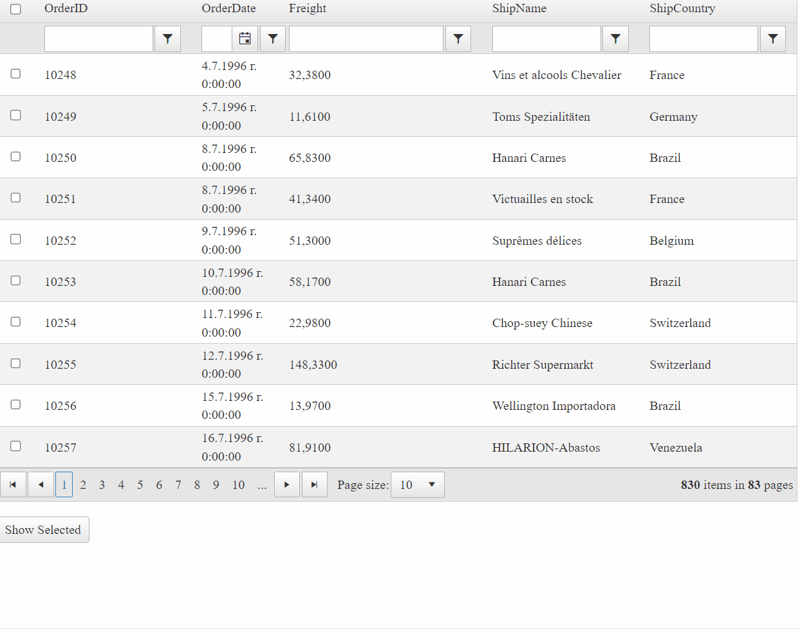

## Environment

<table>
	<tbody>
		<tr>
			<td>Product</td>
			<td>Telerik WebForms Grid for ASP.NET AJAX</td>
		</tr>
	</tbody>
</table>

## DESCRIPTION

This articles demonstrates how to persist selected rows through rebind operations, such as **paging**, **sorting**, **filtering**, **grouping**, etc. In addition to that, it gives a clear example how to pass the selected items' ID collection to the server using a `HiddenField`. 



## SOLUTION

To achieve the desired result, we can utilze the following code snippet, that stores a reference to each checked row, and then displays all the selected rows ID's when a button is clicked.

When the button is pressed, you can loop through all of the **Grid** records and execute their custom logic for the selected items, even if the items' count has been modified by filtering, deleting, etc.

````ASP.NET
<telerik:RadAjaxManager ID="RadAjaxManager1" runat="server">
    <AjaxSettings>
        <telerik:AjaxSetting AjaxControlID="RadGrid1">
            <UpdatedControls>
                <telerik:AjaxUpdatedControl ControlID="RadGrid1" />
            </UpdatedControls>
        </telerik:AjaxSetting>
        <telerik:AjaxSetting AjaxControlID="Button1">
            <UpdatedControls>
                <telerik:AjaxUpdatedControl ControlID="RadGrid1" />
                <telerik:AjaxUpdatedControl ControlID="Label1" />
            </UpdatedControls>
        </telerik:AjaxSetting>
    </AjaxSettings>
</telerik:RadAjaxManager>

<telerik:RadGrid ID="RadGrid1" runat="server" AllowPaging="True" CellSpacing="0"
    AllowMultiRowSelection="true" DataSourceID="SqlDataSource1" GridLines="None"
    Width="800px" AllowFilteringByColumn="True" AllowSorting="True">
    <ClientSettings>
        <Selecting AllowRowSelect="True" />
        <ClientEvents OnRowCreated="onRowCreated" OnRowSelected="onRowSelected" OnRowDeselected="onRowDeselected"
            OnGridCreated="gridCreated" />
    </ClientSettings>
    <MasterTableView AutoGenerateColumns="False" DataKeyNames="OrderID"
        ClientDataKeyNames="OrderID">
        <Columns>
            <telerik:GridClientSelectColumn UniqueName="SelectColumn">
            </telerik:GridClientSelectColumn>
            <telerik:GridBoundColumn DataField="OrderID" DataType="System.Int32" FilterControlAltText="Filter OrderID column"
                HeaderText="OrderID" ReadOnly="True" SortExpression="OrderID" UniqueName="OrderID">
            </telerik:GridBoundColumn>
            <telerik:GridDateTimeColumn DataField="OrderDate" DataType="System.DateTime" FilterControlAltText="Filter OrderDate column"
                HeaderText="OrderDate" SortExpression="OrderDate" UniqueName="OrderDate">
            </telerik:GridDateTimeColumn>
            <telerik:GridNumericColumn DataField="Freight" DataType="System.Decimal" FilterControlAltText="Filter Freight column"
                HeaderText="Freight" SortExpression="Freight" UniqueName="Freight">
            </telerik:GridNumericColumn>
            <telerik:GridBoundColumn DataField="ShipName" FilterControlAltText="Filter ShipName column"
                HeaderText="ShipName" SortExpression="ShipName" UniqueName="ShipName">
            </telerik:GridBoundColumn>
            <telerik:GridBoundColumn DataField="ShipCountry" FilterControlAltText="Filter ShipCountry column"
                HeaderText="ShipCountry" SortExpression="ShipCountry" UniqueName="ShipCountry">
            </telerik:GridBoundColumn>
        </Columns>
    </MasterTableView>
</telerik:RadGrid>
<asp:SqlDataSource ID="SqlDataSource1" runat="server" ConnectionString="<%$ ConnectionStrings:NorthWind %>"
    SelectCommand="SELECT [OrderID], [OrderDate], [Freight], [ShipName], [ShipCountry] FROM [Orders]"></asp:SqlDataSource>
<br />
<telerik:RadButton ID="Button1" runat="server" Text="Show Selected"
    OnClick="Button1_Click" AutoPostBack="true" OnClientClicked="saveSelected" />
<asp:HiddenField ID="HiddenField1" runat="server" Value="" />
<asp:Label ID="Label1" runat="server" Text=""></asp:Label>
````

````C#
protected void Button1_Click(object sender, EventArgs e)
{
    RadGrid1.AllowPaging = false;
    RadGrid1.Rebind();

    HashSet<string> selectedKeys = new HashSet<string>(HiddenField1.Value.Split(new char[] { ',' }, StringSplitOptions.RemoveEmptyEntries));
    List<string> selectedVisible = new List<string>();

    foreach (GridDataItem dataItem in RadGrid1.MasterTableView.Items)
    {
        if (selectedKeys.Contains(dataItem.GetDataKeyValue("OrderID").ToString()))
        {
            selectedVisible.Add(dataItem.GetDataKeyValue("OrderID").ToString());
        }
    }

    Label1.Text = "<b>Currently selected:</b><br/>" + string.Join("<br/>", selectedVisible.ToArray());
    RadGrid1.AllowPaging = true;
    RadGrid1.Rebind();
}
````
````VB
Protected Sub Button1_Click(sender As Object, e As System.EventArgs) Handles Button1.Click
    RadGrid1.AllowPaging = False
    RadGrid1.Rebind()

    Dim selectedKeys As New HashSet(Of String)(HiddenField1.Value.Split(New Char() {","c}, StringSplitOptions.RemoveEmptyEntries))
    Dim selectedVisible As New List(Of String)()

    For Each dataItem As GridDataItem In RadGrid1.MasterTableView.Items
        If selectedKeys.Contains(dataItem.GetDataKeyValue("OrderID").ToString()) Then
            selectedVisible.Add(dataItem.GetDataKeyValue("OrderID").ToString())
        End If
    Next

    Label1.Text = "<b>Currently selected:</b><br/>" + String.Join("<br/>", selectedVisible.ToArray())
    RadGrid1.AllowPaging = True
    RadGrid1.Rebind()
End Sub
````

````JavaScript
var selected = {};

if (!Object.keys) {
    Object.keys = function (obj) {
        var keys = [], k;
        for (k in obj) {
            if (Object.prototype.hasOwnProperty.call(obj, k)) {
                keys.push(k);
            }
        }
        return keys;
    };
}

function onRowSelected(sender, args) {
    var orderID = args.getDataKeyValue("OrderID");
    if (!selected[orderID]) {
        selected[orderID] = true;
    }
}

function onRowDeselected(sender, args) {
    var orderID = args.getDataKeyValue("OrderID");
    if (selected[orderID]) {
        delete selected[orderID];
    }
}

function onRowCreated(sender, args) {
    var orderID = args.getDataKeyValue("OrderID");
    if (selected[orderID]) {
        args.get_gridDataItem().set_selected(true);
    }
}

function gridCreated(sender, eventArgs) {
    var masterTable = sender.get_masterTableView(),
        headerCheckBox = $telerik.$(masterTable.HeaderRow).find(":checkbox")[0];

    if (headerCheckBox) {
        headerCheckBox.checked = masterTable.get_selectedItems().length == masterTable.get_dataItems().length;
    }
}

function saveSelected() {
    $get("<%= HiddenField1.ClientID %>").value = Object.keys(selected).join();
}
````
 
